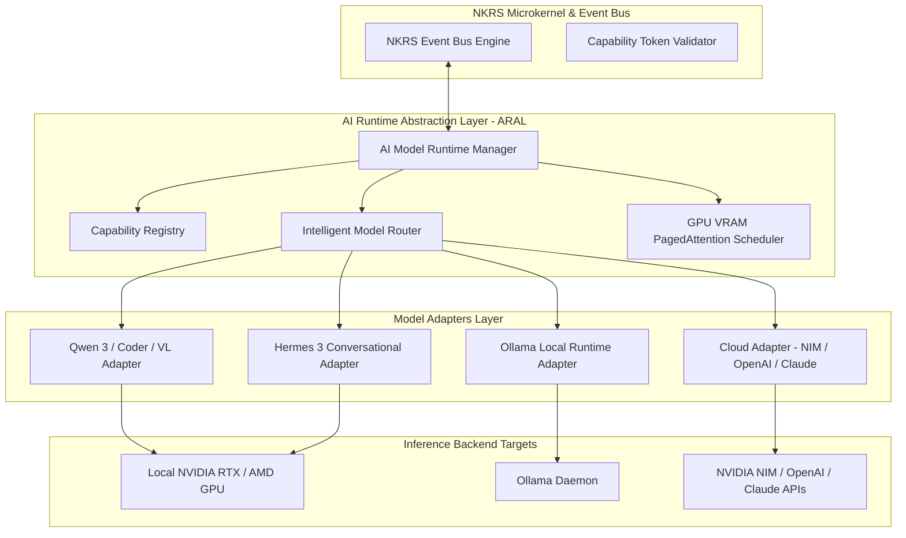

# NAINA OS — AI Model Runtime & Intelligence Layer Specification
**Document Identifier:** NOS-MODEL-001  
**Title:** AI Model Runtime & Intelligence Layer Architecture Specification  
**Version:** 1.0  
**Status:** Approved Engineering Specification  
**Classification:** Open Source Systems Standard  
**Authors:** Chief Systems Architect, AI Infrastructure Leads & Cognitive Systems Group  

---

## Document Revision History

| Date | Revision | Author | Description of Changes |
| :--- | :--- | :--- | :--- |
| **2026-07-31** | `1.0` | Chief Systems Architect | Initial Engineering Release of NOS-MODEL-001 Specification |
| **2026-07-30** | `0.9` | AI Engineering Group | Complete draft of ARAL Adapters, Model Router, Qwen/Hermes Runtimes |

---

## SECTION 1: AI Runtime Philosophy & Model Independence

### 1.1 Decoupled Model Runtime Mandate
The **AI Model Runtime & Intelligence Layer** manages all AI inference operations across local GPUs, CPUs, and cloud providers.

Under strict NAINA OS architectural guidelines:
- **The Kernel MUST NEVER directly depend on any specific AI model**.
- **Every model integrates through the AI Runtime Abstraction Layer (ARAL)** via standardized model adapters.
- **Models remain 100% replaceable**; changing or upgrading a model requires zero changes to the microkernel core.
- **OpenClaw is NOT a model**—it belongs to the Computer Use Engine (CUE).
- **Hermes is NOT the system persona**—it is simply one conversational AI model adapter backend.

```
                     NAINA OS KERNEL & EVENT BUS
                                  │
                                  ▼
                   AI Model Runtime Manager (ARAL)
                                  │
      ┌───────────────────────────┼───────────────────────────┐
      ▼                           ▼                           ▼
Capability Registry        Intelligent Router          GPU VRAM Scheduler
      │                           │                           │
      └───────────────────────────┼───────────────────────────┘
                                  │
      ┌───────────────────────────┼───────────────────────────┐
      ▼                           ▼                           ▼
Qwen Model Adapter          Hermes Model Adapter        Cloud API Adapter
  (Local Ollama / vLLM)       (Conversational AI)         (NVIDIA NIM / OpenAI)
```

---

## SECTION 2: System Architecture & Subsystem Topology



---

## SECTION 3: Capability Registry & Model Taxonomy

Every model registers its supported capabilities with the AI Runtime upon initialization:

```
CAP_CONVERSATION | CAP_REASONING  | CAP_PLANNING    | CAP_CODING
CAP_VISION       | CAP_SPEECH     | CAP_EMBEDDINGS  | CAP_OCR
CAP_TRANSLATION  | CAP_SUMMARIZE  | CAP_TOOL_CALLING| CAP_JSON_OUTPUT
CAP_STREAMING    | CAP_MEMORY_RET | CAP_LONG_CONTEXT
```

### Model Capability Matrix

| Model Identifier | Provider Type | Registered Capabilities | Recommended Workload |
| :--- | :--- | :--- | :--- |
| **Qwen 2.5-72B / 3** | Local / Ollama | `REASONING`, `PLANNING`, `CODING`, `JSON_OUTPUT` | Complex Reasoning & Task Planning |
| **Qwen 2.5-Coder 14B**| Local / Ollama | `CODING`, `TOOL_CALLING`, `STREAMING` | Rapid Code Refactoring & Linter Fixes |
| **Qwen 2.5-VL 7B** | Local / TensorRT| `VISION`, `OCR`, `DESKTOP_SPATIAL` | Desktop Screenshot & UI Coordinate BBox |
| **Hermes 3 70B** | Local / Ollama | `CONVERSATION`, `LONG_CONTEXT`, `EMPATHY` | NAINA Voice Companion & Persona Chat |
| **NVIDIA NIM Cloud** | Hybrid Cloud | `REASONING`, `LONG_CONTEXT`, `HIGH_SPEED` | Enterprise Fallback & Heavy Computations |

---

## SECTION 4: Model Adapter Interface (ARAL Contracts)

### 4.1 Python `IModelAdapter` Interface

```python
# ARAL Universal Model Adapter Interface (Python 3.11+)
from abc import ABC, abstractmethod
from typing import AsyncGenerator, Dict, Any, List, Optional
from pydantic import BaseModel

class ModelMetrics(BaseModel):
    tokens_per_second: float
    time_to_first_token_ms: float
    prompt_tokens: int
    completion_tokens: int
    vram_used_mb: float

class IModelAdapter(ABC):
    @abstractmethod
    async def initialize(self) -> bool: ...

    @abstractmethod
    async def chat(self, prompt: str, system_prompt: str = "") -> str: ...

    @abstractmethod
    async def stream(self, prompt: str) -> AsyncGenerator[str, None]: ...

    @abstractmethod
    async def embed(self, text: str) -> List[float]: ...

    @abstractmethod
    async def vision(self, image_bytes: bytes, prompt: str) -> str: ...

    @abstractmethod
    async def metrics(self) -> ModelMetrics: ...
```

---

## SECTION 5: Intelligent Model Router

The **Model Router** evaluates 5 variables before assigning a task to an inference backend:

$$\text{Route Score} = w_1 \cdot \text{CapabilityMatch} + w_2 \cdot \text{LatencySLA} + w_3 \cdot \text{VRAMAvailability} - w_4 \cdot \text{PrivacyRisk}$$

### Multi-Tier Fallback Cascade Topology:

```
[Target Task Request]
         │
         ▼
[1. Primary Local GPU Model (e.g., Qwen 2.5 72B)] ──(OOM / Timeout)──> [2. Quantized Local Model (Qwen 14B Q4)]
                                                                               │
[4. Offline Queue / Fail] <──(No Internet)── [3. Cloud API Fallback (NVIDIA NIM / OpenAI)] <──┘
```

---

## SECTION 6 & 7: Ollama & Qwen Local Runtimes

- **Ollama Local Engine**: Manages local GGUF models, dynamic VRAM loading, and process lifecycle (`ollama run qwen2.5:72b`).
- **Qwen Workload Optimizations**:
  - **Qwen-VL**: Accelerated via TensorRT-LLM for sub-400ms visual bounding box calculations.
  - **Qwen-Coder**: Bound to VS Code linter pipelines for instant background code fixes.

---

## SECTION 8 & 9: Hermes & Cloud Runtimes

- **Hermes Conversational Runtime**: Specialized adapter providing high-EQ instruction following, long-context conversation memory, and natural persona voice responses.
- **Cloud Runtime Adapters**: NVIDIA NIM, OpenAI GPT-4o, and Anthropic Claude integrated via air-gapped capability token proxies with rate-limiting and retry logic.

---

## SECTION 10: Reasoning & Cognition Pipeline

```
[User Input] ──> [MKIE Memory Retrieval] ──> [CARF Goal Planning]
                                                     │
[User Response] <── [Reflective Self-Evaluation] <── [Model Reasoning Inference] <──┘
```

---

## SECTION 11 & 12: Performance & Security Matrix

- **Performance SLA**:
  - Time to First Token (TTFT): `< 220 ms` (Local GPU)
  - Streaming Generation Speed: `> 45 tokens/sec`
  - VRAM Idle Unload Threshold: `300 seconds`
- **Security & Zero Telemetry**: Local model execution generates zero telemetry; Cloud API requests redact sensitive user PII automatically.

---

## SECTION 13 & 14: Quality Assurance & Future Roadmap

- **Benchmarking Suite**: Validates model accuracy against HumanEval (Coding), ScreenSpot (UI Vision), and GSM8K (Reasoning).
- **Future AI Roadmap**: On-device NPU acceleration, distributed multi-GPU model partitioning, and edge robotics model integration.

---

## ARCHITECTURE DECISION RECORDS (ADRs)

### ADR-027: AI Runtime Abstraction Layer (ARAL) for Universal Model Independence
- **Status**: Approved.
- **Decision**: Standardize on the ARAL interface to completely decouple the microkernel from AI models, allowing seamless hot-swapping of local and cloud models.

### ADR-028: Multi-Tier Model Cascading & Adaptive Fallback Routing
- **Status**: Approved.
- **Decision**: Implement automatic fallback cascading from high-precision local models to quantized local models to cloud APIs during VRAM OOM or timeout events.

### ADR-029: GPU VRAM PagedAttention & Offloading Manager
- **Status**: Approved.
- **Decision**: Use PagedAttention VRAM allocation to allow concurrent execution of Qwen-VL and Hermes models without exceeding 16 GB VRAM bounds.

---
*End of NOS-MODEL-001 — AI Model Runtime & Intelligence Layer Specification (v1.0)*
