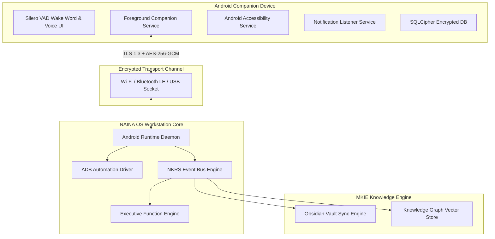

# NAINA OS — Android Runtime & Mobile Companion Framework
**Document Identifier:** NOS-ANDROID-001  
**Title:** Android Runtime & Mobile Companion Framework Architecture Specification  
**Version:** 1.0  
**Status:** Approved Engineering Specification  
**Classification:** Open Source Systems Standard  
**Authors:** Chief Systems Architect, Mobile Platform Leads & Security Engineering Group  

---

## Document Revision History

| Date | Revision | Author | Description of Changes |
| :--- | :--- | :--- | :--- |
| **2026-07-31** | `1.0` | Chief Systems Architect | Initial Engineering Release of NOS-ANDROID-001 Specification |
| **2026-07-29** | `0.9` | Mobile Engineering Group | Complete draft of Mobile Companion App, ADB Bridge, and mTLS Sync Engine |

---

## SECTION 1: Android Runtime Philosophy & Control Paradigm

### 1.1 Non-Direct AI Execution Mandate
The **Android Runtime Framework** acts as the secure mobile bridge between NAINA OS desktop workstation nodes and Android companion devices (smartphones, tablets, foldables, Wear OS).

Under strict NAINA OS architecture rules, **the Android Companion App and Android Runtime are forbidden from directly executing AI model inference or calling cloud APIs without authorization**.

All mobile execution requests must flow through the decoupled execution topology:

```
User Voice / Mobile Touch UI (Android Device)
   │
   ▼
NAINA Mobile Companion Client
   │ (mTLS / AES-256-GCM Encrypted WebSocket)
   ▼
NAINA OS Host Kernel (Desktop Workstation)
   │
   ▼
⚡ Executive Function Engine (EFE) / Event Bus Engine
   │
   ▼
Android Runtime Manager (Capability Token Check: CAP_ADB / CAP_MOBILE)
   │
   ▼
Android Accessibility API / ADB Bridge / Companion Foreground Service
   │
   ▼
Target Android OS & System Features
```

---

## SECTION 2: System Architecture & Mobile Topology

### 2.1 Subsystem Topology Diagram



---

## SECTION 3: Device Discovery & Pairing Protocol

### 1. Cryptographic Handshake & Trusted Registry
1. **Device Discovery**: The NAINA Desktop Host broadcasts an ephemeral mDNS beacon (`_naina-mobile._tcp.local`).
2. **QR Code Pairing**: The user scans a high-entropy QR code generated by the desktop containing an ECDSA public key fingerprint and single-use pairing token.
3. **mTLS Handshake**: Desktop and Android device negotiate a mutual TLS 1.3 connection backed by local self-signed X.509 certificates.
4. **Trusted Registry**: Once paired, the device ID is written to `trusted_devices.json` with granted capability claims.

---

## SECTION 4: Encrypted Communication & Offline Sync

### 1. Dual Transport Layer
- **Local Wi-Fi WebSocket**: Ultra-low latency WebSocket stream over local network (`port 8443`).
- **Bluetooth LE Fallback**: Used when Wi-Fi is unavailable for low-bandwidth notification sync.
- **ADB Wire Protocol**: Direct USB socket for developer-level automation and frame screencap streaming (`1080x2400 @ 15 FPS`).

### 2. Offline Synchronization & CRDTs
When offline, the mobile client queues notes, audio recordings, and photo metadata into a local **SQLCipher** database. Upon reconnection, an **Obsidian Conflict-Free Replicated Data Type (CRDT)** reconciles state without data loss.

---

## SECTION 5: Mobile Features & System Services

```kotlin
// Android Companion Service Interface (Kotlin Specification)
package org.nainaos.mobile.service

import kotlinx.coroutines.flow.Flow

data class BatteryTelemetry(val level: Int, val isCharging: Boolean, val temperature: Float)
data class NotificationEvent(val packageName: String, val title: String, val body: String, val timestamp: Long)

interface INainaCompanionService {
    fun getBatteryStatus(): Flow<BatteryTelemetry>
    fun observeNotifications(): Flow<NotificationEvent>
    suspend fun syncClipboard(content: String): Boolean
    suspend fun triggerCameraSnapshot(lens: String): ByteArray
    suspend fun sendVoiceStream(chunk: ByteArray): Boolean
}
```

---

## SECTION 6: Application Integration & Android Security Sandbox

> **Security Rule**: NAINA OS strictly respects the Android Application Sandbox. It does NOT exploit Android OS vulnerabilities or bypass OS permission modals.

### Supported Mobile Integration Methods:
1. **Share Intents**: Seamlessly receives files, text, and URLs from third-party Android apps.
2. **Notification Listener Service**: Ingests incoming notifications (WhatsApp, Telegram, Gmail) for AI summarization.
3. **Android Accessibility APIs**: Automates UI taps and reads screen text for apps lacking official APIs.
4. **ADB Automation Driver**: Provides developer-level UI inspection (`uiautomator dump`) when USB Debugging is enabled by the user.

---

## SECTION 7: Voice Companion & Cross-Device Continuity

- **Local Wake-Word Engine**: Runs a lightweight **Silero VAD + Porcupine** wake-word detector locally on the phone CPU without battery drain.
- **Session Handoff**: Start a coding or research conversation via voice on the smartphone while walking; seamlessly resume the conversation on the NAINA Desktop workstation upon entering the workspace.

---

## SECTION 8: Android Automation Engine

The **Android Automation Engine** executes system-level mobile tasks:
- **System Toggles**: Toggles Wi-Fi, Bluetooth, Do Not Disturb, and Flashlight via Android Quick Settings APIs.
- **App Launch & Navigation**: Launches mobile apps via Android Deep Links (`intent://`).
- **Safety Gate**: High-risk actions (e.g., sending SMS to unknown numbers or deleting files) require explicit biometric confirmation on the phone.

---

## SECTION 9: Memory & Knowledge Graph Integration

Mobile interactions enrich the **MKIE Memory Core**:
- **Photo Metadata Sync**: Extracts EXIF data (location, timestamp, camera model) from mobile photos and writes Obsidian notes into `/NainaMemory/12 Media/MobilePhotos/`.
- **Knowledge Graph Triples**: Generates graph edges such as `(MobileUser)-[VISITED_LOCATION]->(CoffeeShop)`.

---

## SECTION 10: Security, Permissions & Token Management

- **Android Runtime Permissions**: Requests granular permissions (`CAMERA`, `RECORD_AUDIO`, `READ_CONTACTS`, `ACCESS_FINE_LOCATION`) only when required.
- **Biometric Integration**: Uses Android `BiometricPrompt` (Fingerprint / Face Unlock) to authorize sensitive desktop actions triggered from mobile.
- **Remote Revoke Killswitch**: The desktop host can revoke a paired phone's session key instantly, wiping local cached tokens.

---

## SECTION 11 & 12: Performance Benchmarks & Testing Matrix

- **Performance SLA**:
  - Background RAM Footprint: `< 45 MB`
  - Battery Consumption: `< 2.5%` total drain per 24 hours in background standby
  - Local Wi-Fi Sync Latency: `< 120 ms`
- **Testing Matrix**: Tested across Android 10 through Android 15 on Google Pixel, Samsung Galaxy, and OnePlus devices.

---

## SECTION 13: Future Roadmap

- **Wear OS Extension**: Dedicated smartwatch interface for quick voice notes and haptic alerts.
- **Android Foldable & Tablet Split-Screen**: Multi-window layout optimization for large foldable displays.
- **Android Auto & Spatial Vehicle Integration**: Hands-free voice assistant inside connected vehicles.

---

## ARCHITECTURE DECISION RECORDS (ADRs)

### ADR-018: mTLS & AES-256-GCM Dual-Encryption for Mobile Sync
- **Status**: Approved.
- **Decision**: All communications between Android companion devices and NAINA OS desktop hosts require mTLS 1.3 transport encryption with payload-level AES-256-GCM encryption.

### ADR-019: Accessibility API & ADB Dual-Driver for Mobile Automation
- **Status**: Approved.
- **Decision**: Combine standard Android Accessibility Services for normal user automation with an optional ADB bridge for developer-level high-frequency screencap streaming.

### ADR-020: Offline-First Queue with Conflict-Free Replicated Data Types (CRDTs)
- **Status**: Approved.
- **Decision**: Store mobile notes and memory mutations in local SQLCipher databases and merge via CRDTs during reconnection to eliminate sync data loss.

---
*End of NOS-ANDROID-001 — Android Runtime & Mobile Companion Framework Specification (v1.0)*
