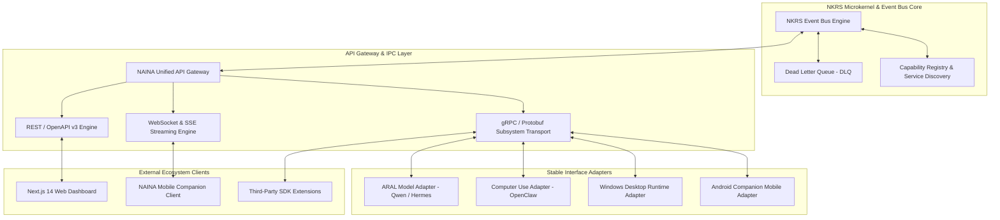

# NAINA OS — Unified API, Event Bus & Communication Framework
**Document Identifier:** NOS-API-001  
**Title:** Unified API, Event Bus & Communication Framework Architecture Specification  
**Version:** 1.0  
**Status:** Approved Engineering Specification  
**Classification:** Open Source Systems Standard  
**Authors:** Chief Systems Architect, Infrastructure Leads & Distributed Systems Group  

---

## Document Revision History

| Date | Revision | Author | Description of Changes |
| :--- | :--- | :--- | :--- |
| **2026-07-31** | `1.0` | Chief Systems Architect | Initial Engineering Release of NOS-API-001 Specification |
| **2026-07-30** | `0.9` | Infrastructure Group | Complete draft of Event Bus, API Gateway, and Master Event Catalog |

---

## SECTION 1: Communication Philosophy & Architectural Principles

### 1.1 Loose Coupling & Event-Driven Decoupling
The **Unified API, Event Bus & Communication Framework** serves as the central nervous system of NAINA OS. 

Under strict NAINA OS architectural guidelines:
- **The Microkernel NEVER communicates directly** with external AI models (Qwen, Hermes), external runtimes (OpenClaw, Playwright), or platform drivers (Win32, Android ADB).
- **All interactions pass through the NKRS Event Bus and API Gateway**.
- **Model, Language, & Platform Agnostic**: Subsystems communicate using standardized gRPC, WebSockets, and Protobuf/JSON payloads regardless of implementation language.

```
                  ┌─────────────────────────────────────────┐
                  │ NKRS Event Bus (Nervous System Core)    │
                  └────────────────────┬────────────────────┘
                                       │
      ┌────────────────────────────────┼────────────────────────────────┐
      ▼                                ▼                                ▼
API Gateway (REST/gRPC)     Service Discovery Engine          Capability Registry
      │                                │                                │
      ▼                                ▼                                ▼
External Clients / Mobile       Runtime Managers & Adapters     Domain Agents & Skills
```

---

## SECTION 2: System Communication Architecture Topology



---

## SECTION 3: Internal Event Bus Specification

### 3.1 Topic & Channel Taxonomy
The **NKRS Event Bus** routes messages using hierarchical dot-notation topic channels:

```
sys.kernel.<subsystem>.<event>       (e.g., sys.kernel.task.scheduled)
sys.ai.model.<model_id>.<event>       (e.g., sys.ai.model.qwen.inference_completed)
sys.desktop.win32.<event>            (e.g., sys.desktop.win32.window_focused)
sys.mobile.android.<event>           (e.g., sys.mobile.android.notification_received)
sys.agent.<agent_id>.<event>         (e.g., sys.agent.coder.pr_created)
```

### 3.2 Priority Queues & Retries
1. **Priority Levels**:
   - `PRIORITY_0_CRITICAL`: System security alerts, hardware failures, emergency stop signals.
   - `PRIORITY_1_HIGH`: Real-time voice audio frames, user UI inputs.
   - `PRIORITY_2_NORMAL`: Goal planning tasks, background file parsing, vector embeddings.
   - `PRIORITY_3_LOW`: Telemetry logs, cleanup jobs, obsidian vault backup sync.
2. **Dead Letter Queue (DLQ)**: Events failing execution after 3 exponential backoff retries are moved to `sys.dlq` for security inspection and state recovery.

---

## SECTION 4: API Gateway Specification

The **NAINA API Gateway** exposes unified local and remote communication endpoints:
- **REST APIs**: `http://localhost:8080/v1/...` for administrative configuration, plugin installations, and file operations.
- **WebSocket Streaming**: `ws://localhost:8080/v1/ws/voice` for real-time sub-700ms voice audio streaming and status events.
- **gRPC Subsystem API**: High-speed binary IPC for sub-millisecond process-to-process microkernel communication (`port 50051`).
- **Rate Limiting & Authentication**: Enforces capability token checks (`CAP_API_ACCESS`) and token-bucket rate limiting (`100 req/sec` per process).

---

## SECTION 5: Message Formats & Versioned Schemas

```json
{
  "$schema": "https://nainaos.org/schemas/v1/EventMessage.json",
  "event_id": "evt_9081a2f4",
  "correlation_id": "corr_3310b12a",
  "timestamp": "2026-07-31T23:35:00.124Z",
  "topic": "sys.desktop.win32.file_created",
  "priority": 2,
  "publisher": "service.filesystem_daemon",
  "capability_token": "CAP_FILE_READ_v1_signed",
  "payload": {
    "file_path": "C:\\naina-os\\docs\\test.md",
    "file_size_bytes": 4096,
    "sha256": "e3b0c44298fc1c149afbf4c8996fb92427ae41e4649b934ca495991b7852b855"
  }
}
```

---

## SECTION 6: MASTER SYSTEM EVENT CATALOG

The complete, authoritative event catalog covering all NAINA OS subsystems:

| Event Topic | Publisher | Trigger Condition / Description |
| :--- | :--- | :--- |
| `sys.voice.detected` | Silero VAD Engine | Audio input exceeds voice activity threshold |
| `sys.voice.speech_recognized` | Faster-Whisper | Audio frame transcribed into text string |
| `sys.memory.retrieved` | MKIE Vector Store | Contextual facts fetched from pgvector / Obsidian |
| `sys.planner.started` | CARF Goal Engine | Autonomous goal decomposition cycle initiated |
| `sys.planner.finished` | CARF Goal Engine | DAG task breakdown completed and assigned |
| `sys.agent.started` | TaskScheduler | Domain agent process launched into execution |
| `sys.agent.finished` | TaskScheduler | Domain agent task contract successfully completed |
| `sys.plugin.installed` | PluginSDK Manager | Third-party plugin verified and loaded |
| `sys.plugin.removed` | PluginSDK Manager | Third-party plugin uninstalled / unloaded |
| `sys.model.loaded` | ARAL Manager | AI model loaded into GPU VRAM memory |
| `sys.model.failed` | ARAL Manager | Model execution error / VRAM OOM exception |
| `sys.desktop.opened` | Win32 App Manager | Target application launched on host OS |
| `sys.mobile.connected` | Android Runtime | Mobile companion mTLS handshake established |
| `sys.filesystem.created` | FileWatcher Daemon | File creation detected in workspace directory |
| `sys.desktop.window_focused`| Win32 Window Manager | Foreground window focus changed |
| `sys.git.repo_detected` | WAE Engine | Active Git repository and branch identified |
| `sys.docker.container_started`| Docker Adapter | Container instance launched |
| `sys.obs.scene_changed` | OBS Adapter | OBS Studio active scene updated |
| `sys.hardware.camera_started`| Vision Subsystem | Video capture stream opened |
| `sys.hardware.mic_muted` | Audio Driver | Microphone hardware mute toggled |
| `sys.hardware.usb_connected` | WMI PnP Listener | USB hardware device plugged into host |
| `sys.hardware.gpu_temp_high`| Telemetry Monitor | GPU core temperature exceeds 85 degrees C |

---

## SECTION 7 & 8: Service Discovery & Capability Registry

- **Service Discovery**: Microservices register with the Kernel via automatic heartbeat pings (`/health`, `interval: 5s`).
- **Capability Registry**: Maps capability requirements (`CAP_VISION`, `CAP_DESKTOP`, `CAP_CODING`) to active runtime providers.

---

## SECTION 9: External Adapter Architecture Matrix

| External Integration | Target System | Adapter Pattern | Interface Contract |
| :--- | :--- | :--- | :--- |
| **MCP Plugins** | Third-Party Tools | Model Context Protocol | `IMCPAdapter` |
| **OpenClaw Engine** | Desktop Vision | Computer Use Adapter | `IComputerUseAdapter` |
| **Hermes Router** | Conversation | Model Router Adapter | `IAIRuntimeAdapter` |
| **Docker Engine** | Sandboxed Execution| POSIX Docker Daemon Socket | `IDockerAdapter` |
| **Playwright Driver** | Web Automation | Headless Browser Protocol | `IBrowserAdapter` |
| **ADB Bridge** | Android Devices | Socket ADB Wire Protocol | `IAndroidAdapter` |

---

## SECTION 10 & 11: Security & Fault Tolerance

- **Authentication & Encryption**: All IPC and Network channels require signed Capability Tokens and mTLS 1.3 + AES-256-GCM encryption.
- **Circuit Breaker Pattern**: If an external model adapter fails 3 consecutive calls, the Circuit Breaker trips to `OPEN` state, automatically routing traffic to backup model fallbacks.

---

## SECTION 12 & 13: Observability & Multi-Language SDKs

- **Distributed Tracing**: Integrates **OpenTelemetry** trace IDs (`correlation_id`) across all async message hops.
- **SDK Bindings**: Provides clean event subscription APIs for Python, TypeScript, Rust, and Java.

---

## SECTION 14 & 15: Performance & Testing Matrix

- **Performance Targets**:
  - Event Bus Latency: `< 2.5 ms` (Local IPC)
  - Queue Throughput: `> 50,000 events/sec`
  - Memory Footprint: `< 30 MB` RAM for core Event Bus engine
- **Testing Suite**: Includes contract tests, gRPC interface validation, and chaos monkey fault injection testing.

---

## SECTION 16: Future Communication Roadmap

- **Distributed Multi-Machine Runtime**: Scaling NAINA OS Event Bus across local LAN workstation clusters.
- **ROS2 Physical Robotics Bridge**: Bridging Event Bus messages directly into ROS2 robot control nodes.

---

## ARCHITECTURE DECISION RECORDS (ADRs)

### ADR-024: Zero-Copy Shared Memory Ring Buffer for High-FPS Video Frames
- **Status**: Approved.
- **Decision**: High-bandwidth video frame buffers bypass standard JSON serialization by using a Zero-Copy Shared Memory Ring Buffer between DXGI capture and Qwen-VL.

### ADR-025: gRPC & Protobuf Standard for Subsystem Interoperability
- **Status**: Approved.
- **Decision**: Standardize on gRPC with versioned `.proto` schemas for all internal subsystem microkernel communication.

### ADR-026: Circuit Breaker Pattern for External AI Model Adapters
- **Status**: Approved.
- **Decision**: Implement automated circuit breakers around model inference calls to trip to fallback models during API timeouts or GPU VRAM OOM faults.

---
*End of NOS-API-001 — Unified API, Event Bus & Communication Framework Specification (v1.0)*
