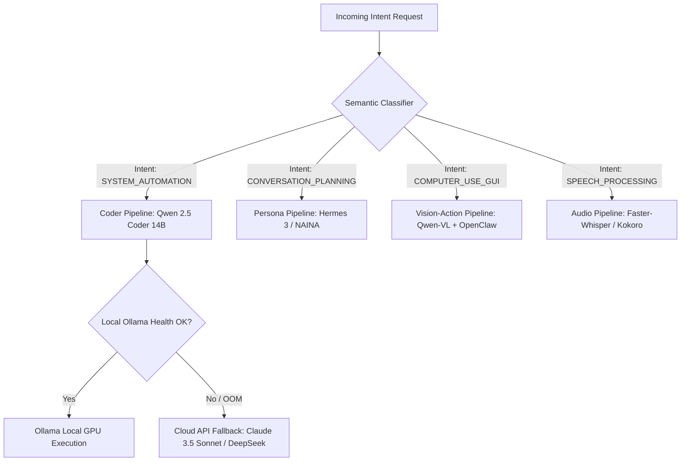
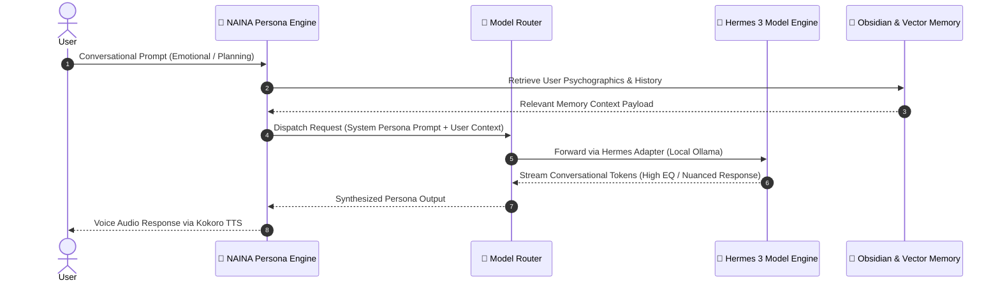

# NAINA OS — AI Integration Framework (AIIF v1.0)
**Volume 3: Model Cascading, External AI Adapters, & Computer Use Subsystem**  
**Document Identifier:** NOS-AIIF-SPEC-2026-V1.0  
**Version:** 1.0.0  
**Status:** Approved Engineering Specification  
**Classification:** Open Source Systems Standard  
**Authors:** Chief Systems Architect & AI Engineering Group  

---

## Document Revision History

| Date | Revision | Author | Description of Changes |
| :--- | :--- | :--- | :--- |
| **2026-07-31** | `v1.0.0` | Chief Systems Architect | Initial Release of Volume 3 — AI Integration Framework (AIIF v1.0) |
| **2026-07-25** | `v0.9.0` | AI Systems Team | OpenClaw & Hermes Adapter Architecture Specification Draft |
| **2026-07-10** | `v0.1.0` | Model Infrastructure Group | Initial Specifications for Ollama, Qwen, Whisper, and Kokoro Runtimes |

---

## Executive Summary & ADR-011

### Architecture Decision Record 011 (ADR-011)
**Title:** External AI Framework Integration via Adapter Interface  
**Status:** Approved  
**Context:** The AI landscape evolves rapidly. Monolithic coupling to specific frameworks (e.g., hardcoding LangChain or AutoGen into the OS kernel) creates technical debt and breaks when newer, faster engines emerge (e.g., OpenClaw, Hermes, DeepSeek).  
**Decision:** NAINA OS shall implement a decoupled **Adapter Interface Pattern** (`IAIAdapter`) for all external models, runtimes, and agent frameworks. The microkernel agent runtime interacts strictly with generic system interfaces. External projects (OpenClaw, Hermes, LangGraph, AutoGen, CrewAI, Open Interpreter) plug into NAINA OS as isolated adapter services without modifying the core kernel.

```
┌─────────────────────────────────────────────────────────────────────────┐
│                     NAINA OS ADAPTER DECOUPLING MESH                    │
├─────────────────────────────────────────────────────────────────────────┤
│ NKRS KERNEL & AGENT RUNTIME                                             │
│       │                                                                 │
│       ▼ (Standardized IAIAdapter & MCP Interfaces)                      │
│ ┌─────────────┬─────────────┬─────────────┬─────────────┬─────────────┐ │
│ │  OpenClaw   │   Hermes    │   Ollama    │  LangGraph  │  Future AI  │ │
│ │  Adapter    │  Adapter    │  Adapter    │   Adapter   │   Adapters  │ │
│ └──────┬──────┴──────┬──────┴──────┬──────┴──────┬──────┴──────┬──────┘ │
│        │             │             │             │             │        │
│        ▼             ▼             ▼             ▼             ▼        │
│  Computer Use   Conversational   Qwen / GGUF   Multi-Agent  DeepSeek /  │
│   Automation    Intelligence    Local Models  Graph State   Llama 3 /   │
│  (Desktop/Web) (Persona Engine)   Inference   Execution    Claude / GPT │
└─────────────────────────────────────────────────────────────────────────┘
```

### Day-One Supported Framework Matrix

| Framework / Engine | Purpose | Architectural Status | Integration Mechanism |
| :--- | :--- | :--- | :--- |
| **OpenClaw** | Vision-based Computer Use & Desktop Control | **Official Adapter (Yes)** | Native Computer Use Adapter (`openclaw-adapter`) |
| **Hermes** | High-EQ Long-Context Conversational Model | **Official Adapter (Yes)** | Persona Intelligence Layer (`hermes-adapter`) |
| **Ollama** | Local GGUF Model Runtime Engine | **Core Infrastructure** | Local Async REST / Socket API |
| **MCP** | Model Context Protocol Tool Ecosystem | **Core Infrastructure** | Native Tool Registration Host |
| **Playwright** | Browser Automation Engine | **Core Infrastructure** | Isolated Headless MCP Service |
| **ADB Bridge** | Android Mobile OS Control Subsystem | **Core Infrastructure** | Native Android Debug Adapter |
| **Faster-Whisper** | Low-Latency Speech Recognition (STT) | **Core Infrastructure** | CTranslate2 Streaming Microservice |
| **Kokoro / Piper** | Local Natural Text-to-Speech (TTS) | **Core Infrastructure** | Audio Stream Buffer Synthesizer |
| **Qwen (2.5 & VL)** | Primary Reasoning & Spatial Vision Model | **Core Infrastructure** | Local Ollama / vLLM Endpoint |
| **Obsidian** | Vault Knowledge Base & Second Brain | **Core Infrastructure** | Real-Time File Sync Daemon |
| **LangGraph / CrewAI** | Graph State Execution & Multi-Agent Teams | **Optional Adapter** | Dynamic Agent Runtime Adapter |

---

## CHAPTER 1: Model Router Architecture

The **Model Router** receives abstract execution intents from the NAINA OS Kernel and dynamically dispatches requests to the optimal AI model backend based on task type, latency targets, and local hardware capacity.



### 1.1 Model Cascade Routing Matrix

| Intent Category | Primary Model | Fallback Model 1 | Fallback Model 2 | Target Latency |
| :--- | :--- | :--- | :--- | :--- |
| **System Code / CLI** | `qwen2.5-coder:14b` | `deepseek-coder:6.7b` | Cloud API (DeepSeek-V3) | `< 400 ms` |
| **Dialogue & Persona** | `hermes-3-llama-3.1:8b` | `qwen2.5:14b-instruct` | Cloud API (Claude 3.5) | `< 300 ms` |
| **Computer Use / Vision** | `qwen2.5-vl:7b` | `openclaw-vision-adapter` | Cloud API (GPT-4o Vision) | `< 600 ms` |
| **Speech Recognition** | `faster-whisper-large-v3` | `whisper-medium.en` | Cloud API (Groq Whisper) | `< 200 ms` |
| **Speech Synthesis** | `kokoro-v1.0-82m` | `piper-lessac-medium` | WebSpeech API | `< 120 ms` |

---

## CHAPTER 2: OpenClaw Integration — Computer Use Engine

### 2.1 Overview & Purpose
**OpenClaw** is integrated into NAINA OS as the primary **Computer Use Engine**. Operating as a specialized sub-agent under **CENANI**, OpenClaw enables autonomous desktop automation, GUI element recognition, screen understanding, and hardware keyboard/mouse control.

### 2.2 System Topology Architecture

```
User Voice Input
   │
   ▼
🌙 NAINA (Companion Engine)
   │
   ▼ (Formulates Task Plan: "Open Chrome and search for Rust documentation")
🧠 AI Router Kernel
   │
   ▼ (Task Execution Contract)
⚡ CENANI (Operations Agent)
   │
   ▼ (Dispatches GUI Automation Goal)
💻 OpenClaw Computer Use Agent
   │
   ├──> Screen Capture Sampler (Qwen-VL Vision Analysis)
   ├──> Spatial Coordinate Locator (Bounding Box Detection)
   ├──> Mouse Controller (Win32 / POSIX Pointer Event)
   └──> Keyboard Controller (Keystroke Injection)
   │
   ▼
Target Host OS (Windows Win32 / Linux Desktop / Browser)
```

### 2.3 Computer Use Engine Modules

1. **Screen Understanding Module**: Captures host screen frames at 15 FPS, applying resolution normalization (`1920x1080`) and spatial grid mapping.
2. **UI Recognition Engine**: Uses Qwen-VL to identify UI elements (buttons, input fields, dropdowns) and output normalized bounding box coordinates `[ymin, xmin, ymax, xmax]`.
3. **Mouse & Keyboard Controllers**:
   - `MouseController`: Smooth bezier curve mouse pointer movement, click, right-click, double-click, and drag-and-drop.
   - `KeyboardController`: UTF-8 keystroke injection, hotkey combinations (`Ctrl+C`, `Alt+Tab`), and text typing buffer.
4. **Safety Confirmation & Sandbox Guardrails**:
   - Destructive screen actions (e.g., clicking "Delete Account", "Format Disk", or "Confirm Payment") trigger the `ask_permission` UI modal before execution.

```python
# OpenClaw Computer Use Adapter Interface (Python)
from pydantic import BaseModel
from typing import List, Tuple, Optional

class ScreenCoordinate(BaseModel):
    x: int
    y: int

class ComputerUseAction(BaseModel):
    action_type: str  # "CLICK" | "MOVE" | "TYPE" | "HOTKEY" | "DRAG"
    target_coordinate: Optional[ScreenCoordinate] = None
    text_payload: Optional[str] = None
    hotkey_combination: Optional[List[str]] = None
    requires_user_approval: bool = False

class OpenClawAdapter:
    async def capture_and_analyze_screen(self) -> List[dict]:
        """Captures active screen frame and returns detected UI bounding boxes via Qwen-VL."""
        # Frame capture & vision model inference
        return [{"element": "Submit Button", "bbox": [540, 1200, 580, 1280]}]

    async def execute_action(self, action: ComputerUseAction) -> bool:
        """Executes hardware mouse/keyboard events after safety clearance."""
        if action.requires_user_approval:
            # Trigger ask_permission middleware
            print(f"Safety Gate: Requesting user clearance for {action.action_type}")
        # Execute mouse click or keyboard injection via Win32 API
        return True
```

---

## CHAPTER 3: Hermes Integration — Conversational Intelligence Layer

### 3.1 Overview & Why Hermes
**Hermes** (Hermes 3 / Nous Research) is adopted as the foundational model engine powering **NAINA's Conversational Intelligence Layer**. While code execution requires strict mathematical precision (Qwen-Coder), natural human companionship requires deep emotional intelligence, nuanced roleplay, adaptive persona switching, and long-context conversation tracking.



### 3.2 Key Features of Hermes Layer
- **Long-Form Dialogue Consistency**: Retains persona alignment across 32k+ token context windows without tone drift.
- **High EQ & Adaptive Empathy**: Generates warm, encouraging, playful, or professional dialogue dynamically matched to user emotional state.
- **System Prompt Integrity**: Adheres strictly to NAINA's core personality directives (*Gentle, Empathetic, Curious, Professional*).

---

## CHAPTER 4: Ollama Local Model Runtime

Ollama serves as NAINA OS's primary local LLM execution daemon, managing quantized GGUF models on consumer GPUs:

```yaml
# Ollama Runtime Engine Configuration (ollama.service.config.yml)
ollama_runtime:
  host: "http://127.0.0.1:11434"
  keep_alive: "15m"
  vram_allocation:
    max_gpu_memory_mb: 8192
    kv_cache_type: "q4_0"
    num_parallel_slots: 4
  loaded_models:
    primary_reasoning: "qwen2.5:14b-instruct-q4_K_M"
    primary_coding: "qwen2.5-coder:14b-instruct-q4_K_M"
    primary_persona: "hermes-3-llama-3.1:8b-q4_K_M"
    primary_vision: "qwen2.5-vl:7b-instruct-q4_K_M"
```

---

## CHAPTER 5: Qwen Model Suite Architecture

The **Qwen 2.5 Model Family** provides NAINA OS with high-tier local reasoning and spatial vision processing:
1. **Qwen 2.5 14B Instruct**: General reasoning, task decomposition, and memory summary generation.
2. **Qwen 2.5 Coder 14B**: Code generation, terminal command parsing, and debugging.
3. **Qwen 2.5-VL 7B**: Spatial image analysis, screen element localization, and video frame understanding.

---

## CHAPTER 6: Faster-Whisper Speech Recognition Runtime

Audio streams captured by the Layer 1 Voice UI are routed to the **Faster-Whisper Microservice**:

```python
# Faster-Whisper Real-Time Audio Transcriber (Python)
from faster_whisper import WhisperModel
import numpy as np

class SpeechToTextEngine:
    def __init__(self, model_size: str = "large-v3", device: str = "cuda"):
        # Load CTranslate2 quantized model
        self.model = WhisperModel(model_size, device=device, compute_type="int8_float16")

    def transcribe_chunk(self, audio_pcm_data: np.ndarray) -> str:
        """Transcribes incoming audio PCM chunks with VAD filtering."""
        segments, _ = self.model.transcribe(audio_pcm_data, beam_size=5, vad_filter=True)
        return " ".join([segment.text for segment in segments]).strip()
```

---

## CHAPTER 7: Kokoro & Piper Text-to-Speech Runtime

Speech synthesis is handled by **Kokoro-82M** (high-fidelity natural voice) with **Piper TTS** as a ultra-fast low-resource fallback:

- **Kokoro-82M**: Delivers natural vocal cadence, emotion, and low latency (`< 120ms` to first chunk).
- **Audio Stream Pipeline**: Synthesizes 24kHz 16-bit PCM audio chunks and streams directly to the host OS sound buffer via PortAudio / WebAudio.

---

## CHAPTER 8: Modular Adapter Pattern for Future AI Models

To ensure NAINA OS remains future-proof against future AI model releases (e.g., DeepSeek-V3, Llama 4, Claude 4, GPT-5, Gemma 3, Phi-4), all model runtimes implement the unified `IAIAdapter` interface:

```typescript
// Shared TypeScript AI Model Adapter Interface
export interface ModelInferenceRequest {
  requestId: string;
  modelIdentifier: string;
  systemPrompt: string;
  userPrompt: string;
  temperature: number;
  maxTokens: number;
  stopSequences?: string[];
}

export interface ModelInferenceResponse {
  requestId: string;
  generatedText: string;
  tokensProcessed: number;
  timeToFirstTokenMs: number;
  totalInferenceTimeMs: number;
}

export interface IAIAdapter {
  adapterName: string;
  isAvailable(): Promise<boolean>;
  generateText(req: ModelInferenceRequest): Promise<ModelInferenceResponse>;
  streamText(req: ModelInferenceRequest, onChunk: (text: string) => void): Promise<void>;
}
```

---

## CHAPTER 9: Fallback & Resilience Strategy

When a model backend experiences latency degradation or VRAM OOM, the Model Router initiates an automated **4-Tier Cascade Fallback**:

```
[Tier 1: Primary Local Model (e.g., Qwen 14B GPU)]
      │
      ├── (Fails / VRAM Full / Timeout > 3s)
      ▼
[Tier 2: Quantized Local Fast Model (e.g., Qwen 7B Q4_K_M)]
      │
      ├── (Fails / Ollama Offline)
      ▼
[Tier 3: Local CPU Backup Engine (llama.cpp CPU fallback)]
      │
      ├── (Fails / Hardware Overload)
      ▼
[Tier 4: Secure Cloud API Gateway (Claude 3.5 / OpenAI / DeepSeek API)]
```

---

## CHAPTER 10: Model Benchmarking & Hardware Allocation

| Model Engine | Target GPU VRAM | RAM Footprint | TTFT Latency | Throughput (tok/s) |
| :--- | :--- | :--- | :--- | :--- |
| **Qwen 2.5 14B Q4_K_M** | `8.2 GB` | `2.1 GB` | `280 ms` | `38 tok/s` |
| **Hermes 3 8B Q4_K_M** | `4.8 GB` | `1.4 GB` | `190 ms` | `54 tok/s` |
| **Qwen 2.5-VL 7B** | `5.1 GB` | `1.8 GB` | `410 ms` | `28 tok/s` |
| **Faster-Whisper Large-v3**| `1.5 GB` | `800 MB` | `140 ms` | N/A (Audio) |
| **Kokoro-82M TTS** | `0.4 GB` | `350 MB` | `95 ms` | N/A (Audio) |

---
*End of NAINA OS AI Integration Framework — Document NOS-AIIF-SPEC-2026-V1.0*
