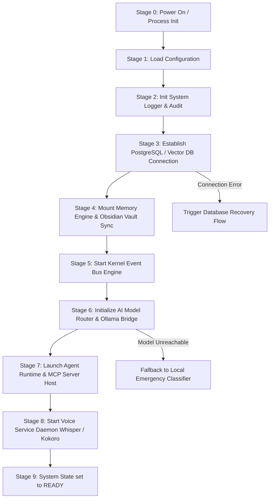
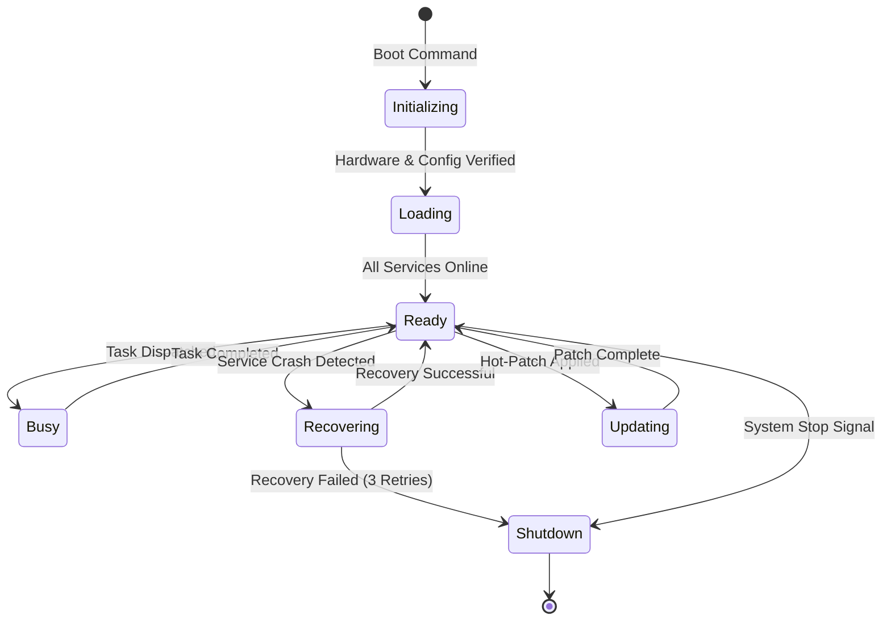
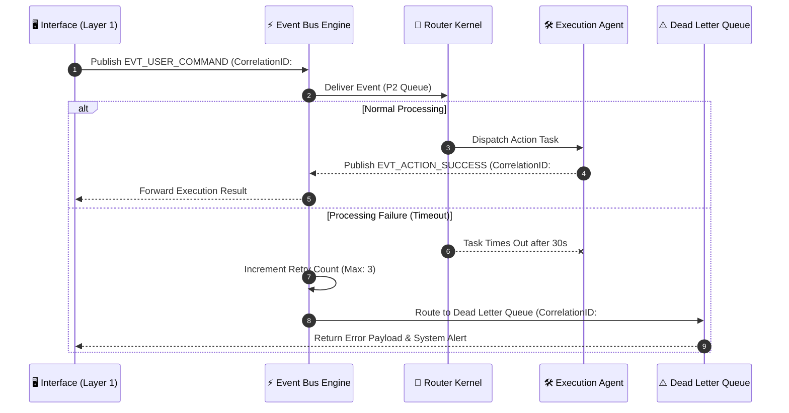
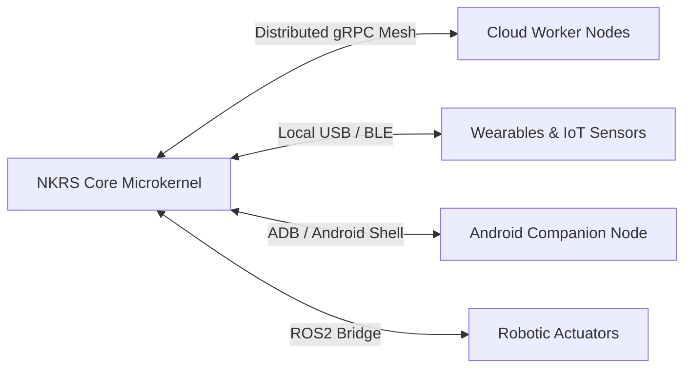

# NAINA OS — Kernel & Runtime Specification (NKRS v1.0)
**Volume 2: Microkernel Architecture, Subsystem Runtime, & Core Services**  
**Document Identifier:** NOS-NKRS-SPEC-2026-V1.0  
**Version:** 1.0.0  
**Status:** Approved Engineering Specification  
**Classification:** Open Source Systems Standard  
**Authors:** Chief Systems Architect & Kernel Engineering Group  

---

## Document Revision History

| Date | Revision | Author | Description of Changes |
| :--- | :--- | :--- | :--- |
| **2026-07-31** | `v1.0.0` | Chief Systems Architect | Initial Release of NAINA OS Kernel & Runtime Specification (Volume 2) |
| **2026-07-20** | `v0.9.5` | Kernel Systems & Subsystem Runtime Group | Internal Technical Review of Event Bus, Scheduler, and ADRs |
| **2026-06-15** | `v0.2.0` | Systems Security Team | Capability Token & Sandbox Isolation Specification Draft |

---

## Executive Summary

### Purpose
The **NAINA OS Kernel & Runtime Specification (NKRS v1.0)** defines the foundational microkernel and subsystem execution engine governing NAINA OS. It serves as the authoritative technical blueprint for process scheduling, IPC messaging, capability-based security, state transition management, crash recovery, and multi-agent execution across desktop, mobile, cloud, and edge hardware nodes.

### System Goals
1. **Deterministic Microkernel Isolation**: Decouple peripheral services (Voice, Vision, MCP Tools, UI) from kernel space so that external agent crashes cannot corrupt system integrity.
2. **Sub-Millisecond IPC Messaging**: Provide an asynchronous, event-driven message bus delivering high-throughput IPC with latency `< 1.2ms`.
3. **Fault-Tolerant Self-Healing**: Guarantee continuous uptime via automated circuit breakers, dead-letter queues (DLQ), and multi-stage process recovery protocols.
4. **Capability-Gated Zero Trust**: Enforce granular process capabilities (`CAP_SYS_ADMIN`, `CAP_FILE_WRITE`, `CAP_NETWORK_RAW`) for every tool and agent invocation.

### Non-Goals
- **Monolithic In-Process Execution**: Direct in-memory pointer sharing between third-party plugins and kernel space is strictly prohibited.
- **Proprietary OS Kernel Replacement**: NKRS operates as a user-space AI Operating System kernel hosted on top of Win32, POSIX (Linux/macOS), or Android kernels.

---

## SECTION 1: Kernel Philosophy & Architecture

### 1.1 Why a Microkernel Architecture?
Traditional AI frameworks bundle agent execution, LLM inference, vector storage, and UI logic into a single monolithic Python process. This results in global interpreter lock (GIL) contention, unhandled exception cascades, and memory bloat.

NAINA OS adopts a **User-Space Microkernel Architecture**. The NKRS Kernel Core maintains absolute minimal responsibility: state management, event routing, process lifecycle monitoring, and security capability verification. All heavy functional modules (Whisper STT, Ollama LLM, Playwright Automation, Docker SDK) run as isolated **User-Space Service Servers**.

```
┌─────────────────────────────────────────────────────────────────────────┐
│                      NAINA OS MICROKERNEL TOPOLOGY                      │
├─────────────────────────────────────────────────────────────────────────┤
│ USER SPACE (Isolated Services)                                          │
│  ┌──────────────┐  ┌──────────────┐  ┌──────────────┐  ┌──────────────┐ │
│  │ Voice Daemon │  │ Ollama Bridge│  │ MCP Tools    │  │ Obsidian Sync│ │
│  └──────┬───────┘  └──────┬───────┘  └──────┬───────┘  └──────┬───────┘ │
│         │                 │                 │                 │         │
│ IPC     ▼                 ▼                 ▼                 ▼         │
│ ═══════════════════════════════════════════════════════════════════════ │
│ KERNEL SPACE (NKRS Microkernel Core)                                    │
│  ┌──────────────┐  ┌──────────────┐  ┌──────────────┐  ┌──────────────┐ │
│  │ Event Bus    │  │ Scheduler    │  │ Permission   │  │ Lifecycle    │ │
│  │ Router       │  │ Engine       │  │ Manager      │  │ Monitor      │ │
│  └──────────────┘  └──────────────┘  └──────────────┘  └──────────────┘ │
└─────────────────────────────────────────────────────────────────────────┘
```

### 1.2 Advantages & Trade-Offs

> [!NOTE]
> **Microkernel Architectural Trade-off Analysis**  
> - **Fault Isolation**: A crash in an MCP tool or Python memory leak affects only that child worker; the NKRS Microkernel remains completely stable.  
> - **Hot-Swappability**: Plugins and LLM routers can be reloaded or upgraded at runtime without restarting the OS shell.  
> - **Trade-off Overhead**: Inter-process communication (IPC) serialization adds `~0.8ms - 1.2ms` per message compared to raw in-process function calls. NKRS mitigates this using shared memory buffers (`shm`) for large media arrays.

---

## SECTION 2: Kernel Responsibilities Matrix

The NKRS Microkernel manages nine core operational primitives:

| Primitive | Responsibility Description | Core Component |
| :--- | :--- | :--- |
| **Startup / Boot** | Sequentially validates hardware, initializes database pools, launches event bus, and loads core personas. | `LifecycleManager` |
| **Shutdown** | Flushes memory buffers to disk, terminates child agent processes cleanly, and releases hardware locks. | `LifecycleManager` |
| **Scheduling** | Prioritizes CPU/GPU task execution across Realtime (Voice), Interactive (UI), and Background (Index) queues. | `TaskScheduler` |
| **Agent Runtime** | Instantiates, monitors, and isolates autonomous agent execution contexts. | `AgentRegistry` |
| **Memory Sync** | Coordinates multi-tiered state updates across pgvector, ChromaDB, and local Obsidian Markdown files. | `MemoryEngine` |
| **Permissions** | Validates capability tokens before granting process access to filesystem, network, or device interfaces. | `PermissionManager` |
| **Logging & Audit** | Writes structured, immutable JSON logs with correlation IDs for post-mortem tracing. | `KernelLogger` |
| **Events Dispatch** | High-speed pub/sub message routing between kernel modules and external microservices. | `EventBusEngine` |
| **Health & Recovery** | Executes automated heartbeat checks, circuit breakers, and process restart policies upon failure. | `HealthMonitor` |

---

## SECTION 3: System Boot Sequence

The NKRS boot sequence follows a strict ten-stage initialization chain. If any stage fails validation, the kernel enters **Recovery Mode** or halts safely.



---

## SECTION 4: Core Kernel Components Specification

NKRS consists of eleven modular, self-contained sub-components:

### 4.1 Configuration Manager (`ConfigManager`)
- **Purpose**: Parses, validates, and hot-reloads global system configurations (`naina_os.config.json` and `.env`).
- **Interfaces**: `getConfig(key: string): Value`, `reloadConfig(): boolean`.
- **Events**: `EVT_CONFIG_UPDATED`.
- **Failure Mode**: Invalid JSON triggers fallback to `naina_os.config.default.json`.

### 4.2 Lifecycle Manager (`LifecycleManager`)
- **Purpose**: Governs system state transitions (Boot, Shutdown, Suspend, Safe Mode).
- **Interfaces**: `boot()`, `shutdown(reason: string)`, `getState(): KernelState`.
- **Events**: `EVT_STATE_CHANGED`, `EVT_SHUTDOWN_INITIATED`.

### 4.3 Dependency Manager (`DependencyManager`)
- **Purpose**: Validates system prerequisites (Python version, CUDA drivers, Ollama daemon, PostgreSQL socket).
- **Failure Mode**: Missing dependencies flag warning in UI or prevent boot if critical.

### 4.4 Agent Registry (`AgentRegistry`)
- **Purpose**: Maintains active manifest of all registered agents (NAINA, CENANI, Desktop Agent, Android Controller).
- **Interfaces**: `registerAgent(manifest: AgentManifest)`, `getAgent(id: string): AgentRef`.
- **Events**: `EVT_AGENT_REGISTERED`, `EVT_AGENT_UNREGISTERED`.

### 4.5 Plugin Registry (`PluginRegistry`)
- **Purpose**: Discovers and loads Model Context Protocol (MCP) tool servers dynamically.
- **Performance Target**: Dynamically bind new MCP tools in `< 50ms`.

### 4.6 Task Scheduler (`TaskScheduler`)
- **Purpose**: Preemptive priority queue scheduler managing async task execution slots.
- **Queues**: `REALTIME` (Voice), `INTERACTIVE` (User UI), `BACKGROUND` (Sync/Embedding).

### 4.7 Permission Manager (`PermissionManager`)
- **Purpose**: Enforces RBAC capability checks and triggers `ask_permission` UI modals for Level 2/3 operations.
- **Interfaces**: `verifyCapability(token: string, cap: SystemCapability): boolean`.

### 4.8 Kernel Logger (`KernelLogger`)
- **Purpose**: Structured JSON streaming logger appending to disk (`kernel.log`) and database audit tables.

### 4.9 Health Monitor (`HealthMonitor`)
- **Purpose**: Periodically pings child processes (every 3000ms).
- **Events**: `EVT_HEARTBEAT_TIMEOUT`, `EVT_HEALTH_WARNING`.

### 4.10 Recovery Manager (`RecoveryManager`)
- **Purpose**: Executes automated self-healing procedures when processes crash or time out.

### 4.11 Event Bus Engine (`EventBusEngine`)
- **Purpose**: Core messaging channel routing events across all OS layers.

---

## SECTION 5: Kernel State Machine

The NKRS microkernel executes a deterministic finite state machine (FSM):



---

## SECTION 6: Event Bus Architecture & Messaging

### 6.1 Priority Queue & Channel Design
Events are grouped into four priority bands:
1. **CRITICAL (P0)**: System shutdown signals, safety interrupts, hardware faults.
2. **REALTIME (P1)**: Voice VAD audio streams, real-time user speech input.
3. **INTERACTIVE (P2)**: GUI clicks, command inputs, active agent status updates.
4. **BACKGROUND (P3)**: Memory embedding generation, Obsidian file sync, log archiving.

### 6.2 Message Tracing & Correlation Sequence



---

## SECTION 7: Preemptive Task Scheduler

The NKRS Scheduler prevents resource starvation using token-bucket rate limiting and async worker pools:

```python
# Task Scheduler Priority Queue Definition (Python AsyncIO)
import asyncio
from enum import IntEnum
from dataclasses import dataclass, field
from typing import Any, Callable, Awaitable

class Priority(IntEnum):
    CRITICAL = 0
    REALTIME = 1
    INTERACTIVE = 2
    BACKGROUND = 3

@dataclass(order=True)
class ScheduledTask:
    priority: Priority
    task_id: str = field(compare=False)
    coro: Callable[[], Awaitable[Any]] = field(compare=False)
    timeout_seconds: float = field(compare=False, default=30.0)

class NKRSScheduler:
    def __init__(self, max_concurrent: int = 16):
        self.queue: asyncio.PriorityQueue[ScheduledTask] = asyncio.PriorityQueue()
        self.max_concurrent = max_concurrent
        self.semaphore = asyncio.Semaphore(max_concurrent)

    async def schedule(self, task: ScheduledTask):
        await self.queue.put(task)

    async def worker_loop(self):
        while True:
            item = await self.queue.get()
            async with self.semaphore:
                try:
                    await asyncio.wait_for(item.coro(), timeout=item.timeout_seconds)
                except asyncio.TimeoutError:
                    print(f"Task {item.task_id} timed out after {item.timeout_seconds}s")
                finally:
                    self.queue.task_done()
```

---

## SECTION 8: Recovery & Self-Healing Subsystem

NKRS implements strict circuit breakers to contain service crashes:

```
┌─────────────────────────────────────────────────────────────────────────┐
│                     RECOVERY & CIRCUIT BREAKER MATRIX                   │
├─────────────────┬──────────────────────┬────────────────────────────────┤
│ Failure Type    │ Detection Mechanism  │ Automated Recovery Protocol    │
├─────────────────┼──────────────────────┼────────────────────────────────┤
│ Agent Crash     │ Heartbeat Timeout    │ Respawn process (Max 3/min).   │
│ Model OOM (GPU) │ VRAM Allocation Error│ Unload model; switch to GGUF Q4│
│ Database Socket │ Connection Dropped   │ Retry pool (exp backoff 1s-10s)│
│ Plugin Freeze   │ Unresponsive IPC     │ Terminate PID & isolate tool.  │
└─────────────────┴──────────────────────┴────────────────────────────────┘
```

---

## SECTION 9: Resource Allocation & Benchmarks

To maintain microkernel performance on consumer hardware (e.g., 16GB RAM, 8-Core CPU, 6GB VRAM):

- **CPU Quota**: Kernel space processes capped at maximum `< 5%` total CPU usage at idle.
- **Memory Footprint**: NKRS Microkernel Core footprint `< 120 MB` resident memory.
- **GPU VRAM Reservation**: 85% allocated for Ollama LLM / Whisper, 15% reserved for host OS display.

---

## SECTION 10: Security Architecture & Capability Tokens

NKRS rejects root process execution. Every process operates under a **Capability Token**:

```typescript
// NKRS Security Capability Token Signature
export interface SecurityCapabilityToken {
  tokenId: string;             // HMAC-SHA256 Signed Token
  issuedToAgent: string;       // e.g., "cenani.desktop_agent"
  capabilities: Array<
    | 'CAP_FILE_READ'
    | 'CAP_FILE_WRITE'
    | 'CAP_EXEC_SHELL'
    | 'CAP_NET_HTTP'
    | 'CAP_DEVICE_ADB'
  >;
  expiresAt: number;           // Unix Timestamp
  isSandboxEnforced: boolean;  // True for third-party MCP tools
}
```

---

## SECTION 11: Configuration Schemas

### 11.1 Kernel Configuration Schema (`kernel.config.json`)

```json
{
  "$schema": "http://json-schema.org/draft-07/schema#",
  "title": "NKRSKernelConfig",
  "type": "object",
  "properties": {
    "kernel": {
      "type": "object",
      "properties": {
        "tick_rate_ms": { "type": "integer", "default": 100 },
        "max_worker_threads": { "type": "integer", "default": 8 },
        "enable_airgap_sandbox": { "type": "boolean", "default": true }
      },
      "required": ["tick_rate_ms", "max_worker_threads"]
    },
    "event_bus": {
      "type": "object",
      "properties": {
        "max_queue_depth": { "type": "integer", "default": 10000 },
        "dlq_retries": { "type": "integer", "default": 3 }
      }
    }
  }
}
```

---

## SECTION 12: API Specifications & Code Contracts

### 12.1 FastAPI REST Endpoint Contract (`/api/v1/kernel/state`)

```python
from fastapi import FastAPI, HTTPException, Security, Depends
from fastapi.security import HTTPBearer, HTTPAuthorizationCredentials
from pydantic import BaseModel

app = FastAPI(title="NAINA OS Kernel API", version="1.0.0")
security_scheme = HTTPBearer()

class KernelStateResponse(BaseModel):
    status: str
    uptime_seconds: float
    active_agents: int
    memory_usage_mb: float

@app.get("/api/v1/kernel/state", response_model=KernelStateResponse)
async def get_kernel_state(auth: HTTPAuthorizationCredentials = Depends(security_scheme)):
    # Verify Capability Token
    if not auth.credentials:
        raise HTTPException(status_code=403, detail="Invalid Capability Token")
    return KernelStateResponse(
        status="READY",
        uptime_seconds=14250.4,
        active_agents=4,
        memory_usage_mb=88.5
    )
```

---

## SECTION 13: Testing & Quality Assurance Matrix

| Test Suite | Focus Area | Command / Framework | Success Criteria |
| :--- | :--- | :--- | :--- |
| **Unit Tests** | Event Bus & Scheduler logic | `pytest tests/unit/` | 100% pass, >90% code coverage |
| **Integration** | Microkernel <-> Ollama / DB IPC | `pytest tests/integration/` | End-to-end event resolution |
| **Stress Tests** | 10,000 events/sec burst load | `locust -f tests/stress.py` | Zero message loss, latency < 5ms |
| **Recovery** | SIGKILL on child agents | `python tests/test_crash_recovery.py` | Auto-respawn within 3000ms |

---

## SECTION 14: Architecture Decision Records (ADRs)

### ADR-001: Selection of FastAPI for Kernel Microservice Core
- **Status**: Approved.
- **Context**: Need high-speed async Python microservice framework with native Pydantic OpenAPI validation.
- **Decision**: Adopt FastAPI over Flask/Django due to `AsyncIO` event loop performance and low overhead.

### ADR-002: Selection of Tauri v2 over Electron for Desktop Shell
- **Status**: Approved.
- **Context**: Electron consumes `>400MB` RAM at idle.
- **Decision**: Adopt Tauri (Rust backend + native OS WebView), reducing idle memory to `<40MB`.

### ADR-003: Selection of PostgreSQL + pgvector for Core Relational & Vector Storage
- **Status**: Approved.
- **Context**: Need unified ACID relational DB and vector embedding search.
- **Decision**: Use `pgvector` HNSW indexing to eliminate running separate relational and vector databases.

### ADR-004: Selection of Obsidian Vault Markdown Files as Primary Memory Mirror
- **Status**: Approved.
- **Context**: Avoid database vendor lock-in for long-term user knowledge.
- **Decision**: Mirror vector memory updates down to local `.md` files in an Obsidian vault structure.

### ADR-005: Event-Driven Bus Decoupling over In-Process Function Invocation
- **Status**: Approved.
- **Context**: Prevent third-party tool crashes from taking down the core OS runtime.
- **Decision**: All functional calls execute asynchronously via typed IPC event topics.

### ADR-006: Adoption of Anthropic Model Context Protocol (MCP) for Tool Integration
- **Status**: Approved.
- **Decision**: Standardize tool integration on MCP to enable seamless compatibility with open-source tools.

### ADR-007: Selection of Faster-Whisper for Local Speech-to-Text
- **Status**: Approved.
- **Decision**: Use `faster-whisper` (CTranslate2 conversion) for 4x speedup over standard OpenAI PyTorch Whisper.

### ADR-008: Selection of Kokoro-82M for High-Quality Text-to-Speech
- **Status**: Approved.
- **Decision**: Deploy Kokoro-82M for local streaming TTS due to high audio naturalness and low VRAM footprint.

### ADR-009: Separation of NAINA (Companion) and CENANI (Systems Operator) Personas
- **Status**: Approved.
- **Decision**: Enforce strict architectural boundary preventing emotional models from directly executing system scripts.

### ADR-010: Implementation of Capability-Based Access Control Tokens
- **Status**: Approved.
- **Decision**: All process actions require signed capability tokens to enforce Zero Trust security.

---

## SECTION 15: Future Vision & Edge Expansion



NKRS is engineered for seamless scaling beyond desktop environments:
1. **Distributed Mesh Kernels**: Link desktop NKRS instances to cloud worker nodes for heavy 70B+ model inference.
2. **ROS2 Robotics Adapter**: Connect CENANI automation contracts directly to Robot Operating System (ROS2) nodes for physical environment interaction.
3. **Wearable Sensor Streaming**: Ingest real-time bio-metric telemetry (heart rate, voice cues) from wearable hardware into NAINA's working memory.

---
*End of NAINA OS Kernel & Runtime Specification — Document NOS-NKRS-SPEC-2026-V1.0*
