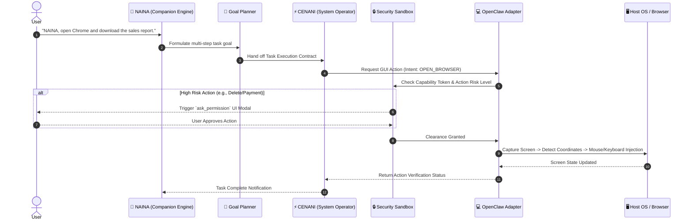

# NAINA OS — AI Integration Framework (Volume 3: AIIF v1.0)
**Document Identifiers:** NOS-AIIF-03.1 / NOS-AIIF-03.2 / NOS-AIIF-03.3  
**Version:** 1.0.0  
**Status:** Approved Engineering Specification  
**Classification:** Open Source Systems Standard  
**Authors:** Chief Systems Architect, AI Runtime Engineers & HCI Group  

---

## Document Revision History

| Date | Revision | Author | Description of Changes |
| :--- | :--- | :--- | :--- |
| **2026-07-31** | `v1.0.0` | Chief Systems Architect | Release of Volume 3 — AI Runtime Abstraction Layer (ARAL), OpenClaw, Hermes & Compatibility Matrix |
| **2026-07-28** | `v0.9.0` | AI Systems Group | Draft of Architectural Rule #2 & System Compatibility Matrix |

---

## ARCHITECTURAL RULE #2: THE ADAPTER RULE

> **"No external technology, model, runtime, or framework shall interface directly with the NAINA OS Kernel. Every integration must pass through a strict, typed Stable Interface Adapter."**

```
┌─────────────────────────────────────────────────────────────────────────┐
│                           THE ADAPTER PATTERN                           │
├─────────────────────────────────────────────────────────────────────────┤
│  CORRECT MANDATED DESIGN:                                               │
│  [NKRS Kernel] ──> [Stable Interface (ARAL)] ──> [Adapter] ──> [External Project] │
├─────────────────────────────────────────────────────────────────────────┤
│  PROHIBITED DIRECT COUPLING:                                            │
│  [NKRS Kernel] ──x [External Project]  (STRICTLY FORBIDDEN)              │
└─────────────────────────────────────────────────────────────────────────┘
```

**Rationale**: External libraries, APIs, and models change APIs unpredictably or become obsolete. By enforcing Architectural Rule #2, replacing Qwen, Ollama, OpenClaw, or Hermes requires updating only its specific adapter module—zero lines of code in the NKRS Kernel are modified.

---

## DOCUMENT 03.1 — AI Runtime Abstraction Layer (ARAL v1.0)

### 1. Purpose & Core Design
The **AI Runtime Abstraction Layer (ARAL)** defines a uniform contract between the NAINA OS Kernel and all underlying LLM engines, Vision models, Embedding generators, and Speech runtimes.

```
                  NKRS Kernel / Model Router
                              │
                              ▼
                AI Runtime Manager (ARAL Core)
                              │
     ┌────────────────────────┼────────────────────────┐
     │                        │                        │
     ▼                        ▼                        ▼
Qwen Adapter            Hermes Adapter           Future Adapter
(Ollama / vLLM)       (Ollama / llama.cpp)     (DeepSeek / Claude)
```

### 2. Standard Capability Interface Specification

```typescript
// ARAL Unified Model Adapter Interface (TypeScript / Python Contract)
export type CapabilityType = 
  | 'CAP_CHAT' 
  | 'CAP_STREAMING' 
  | 'CAP_EMBEDDINGS' 
  | 'CAP_VISION' 
  | 'CAP_FUNCTION_CALLING' 
  | 'CAP_JSON_MODE' 
  | 'CAP_CONTEXT_WINDOW' 
  | 'CAP_TOKEN_COUNTING';

export interface ChatMessage {
  role: 'system' | 'user' | 'assistant' | 'tool';
  content: string;
  images?: string[]; // Base64 or local URI for vision models
}

export interface ARALCompletionRequest {
  requestId: string;
  modelName: string;
  messages: ChatMessage[];
  temperature?: number;
  maxTokens?: number;
  responseFormat?: 'text' | 'json_object';
  tools?: Array<Record<string, unknown>>;
}

export interface IAIRuntimeAdapter {
  readonly adapterName: string;
  readonly supportedCapabilities: Set<CapabilityType>;

  // Core Capabilities
  chat(request: ARALCompletionRequest): Promise<string>;
  chatStream(request: ARALCompletionRequest, onChunk: (token: string) => void): Promise<void>;
  generateEmbeddings(text: string): Promise<number[]>;
  countTokens(text: string): Promise<number>;
  getMaxContextWindow(): number;
}
```

---

## DOCUMENT 03.2 — OpenClaw Computer Use Integration

### 1. Overview & Purpose
**OpenClaw** is integrated into NAINA OS as an optional, high-precision **Computer Use Engine**. Operating strictly under the command of **CENANI**, OpenClaw provides vision-guided desktop and browser automation without bypassing NAINA OS safety guardrails.

### 2. Computer Use Execution Flow



### 3. Safety Confirmations & UI Change Recovery
- **UI Element Shift Handling**: If a targeted button shifts position due to responsive layout change, OpenClaw re-samples the screen frame via Qwen-VL, re-computes spatial bounding boxes `[ymin, xmin, ymax, xmax]`, and retries coordinate placement up to 3 times before raising an exception.
- **Safety Gate**: Any action involving system settings modification, credential entry, or destructive file operations automatically calls the `ask_permission` kernel prompt.

---

## DOCUMENT 03.3 — Conversational Intelligence Layer (Hermes)

### 1. Overview & Architecture
**Hermes** (Nous Research Hermes 3) acts as the specialized **Conversational Backend Engine** powering **NAINA's Personality Layer**. While CENANI relies on mathematical code models, NAINA uses Hermes for long-context roleplay, high-EQ dialogue, and adaptive persona tracking.

```
User Voice Input
   │
   ▼
NAINA Personality Engine (System Persona Prompt & Working Memory)
   │
   ▼
AI Router (Detects CONVERSATIONAL / EMOTIONAL Intent)
   │
   ▼
Hermes Adapter (Ollama / llama.cpp GGUF Engine)
   │
   ▼
Streaming Natural Language Tokens -> Kokoro TTS Synthesizer
```

### 2. Features & Fallback Strategy
- **Long-Form Context Retention**: Manages 32,000+ token context buffers without persona decay or instruction loss.
- **Replacement Strategy**: If Hermes is replaced by a newer conversational model (e.g., Llama 4 Persona or Claude 3.5), only the `HermesAdapter` module is swapped out; the NAINA Personality Engine and NKRS Kernel remain untouched.

---

## SYSTEM COMPATIBILITY MATRIX

Every integrated technology in NAINA OS is documented under this formal specification matrix:

| Integrated Technology | Version Supported | Adapter Status | Required Capabilities | Known Limitations | Replacement Options | Maintenance Owner |
| :--- | :--- | :--- | :--- | :--- | :--- | :--- |
| **Qwen (2.5 & VL)** | `v2.5 (7B/14B)` | **Core Engine** | Reasoning, Code, Vision, JSON | Requires 8GB+ GPU VRAM | DeepSeek-Coder, Llama 3.3 | AI Systems Team |
| **Ollama** | `v0.5.0+` | **Core Runtime** | GGUF Runner, REST API | VRAM allocation locks | vLLM, llama.cpp native | Model Infra Team |
| **OpenClaw** | `v1.2.0` | **Official Adapter** | Screen Capture, Mouse/Keyboard | High screen DPI scaling | Playwright Native, PyAutoGUI| Automation Group |
| **Hermes** | `Hermes 3 (8B/70B)`| **Official Adapter** | High EQ, Persona, 32k Context | Higher latency than 3B models| Qwen-Instruct, Llama 3.1 | HCI Persona Team |
| **Faster-Whisper** | `v1.0.0 (Large-v3)`| **Core Engine** | STT, VAD, CTranslate2 | Requires CUDA / Metal | Whisper.cpp, Groq API | Voice Subsystem Team |
| **Kokoro / Piper** | `Kokoro-82M v1.0` | **Core Engine** | Streaming TTS, 24kHz PCM | Single-threaded synth limit | Piper TTS, ElevenLabs Cloud | Voice Subsystem Team |
| **MCP** | `v1.0 (Anthropic)` | **Core Host** | Tool Discovery, Execution | IPC serialization overhead | Custom gRPC Sockets | Subsystems Group |
| **Playwright** | `v1.40.0+` | **Core Service** | Headless Chrome, DOM Scrape | Heavy RAM footprint (>300MB) | Puppeteer, Selenium | Automation Group |
| **ADB Bridge** | `v34.0.0 (Android)`| **Core Service** | Touch, App Launch, Logcat | USB/Wifi latency (~50ms) | Appium Native Bridge | Mobile Systems Team |
| **Obsidian** | `v1.5.0+` | **Core Service** | Markdown Sync, Frontmatter | Local disk I/O lock contention | Logseq, Plain File Vault | Memory Engine Group |
| **LangGraph** | `v0.2.0+` | **Optional Adapter**| Graph State Execution | High Python abstraction overhead | Native NKRS Scheduler | Agent Framework Group|
| **CrewAI** | `v0.80.0+` | **Optional Adapter**| Team Role Delegation | Rigid agent communication loop| Native CENANI Mesh | Agent Framework Group|
| **AutoGen** | `v0.4.0+` | **Optional Adapter**| Multi-Agent Conversation | High token usage overhead | Native Multi-Agent Router | Agent Framework Group|

---
*End of NAINA OS AI Integration Framework — Documents 03.1, 03.2, 03.3 & System Compatibility Matrix*
