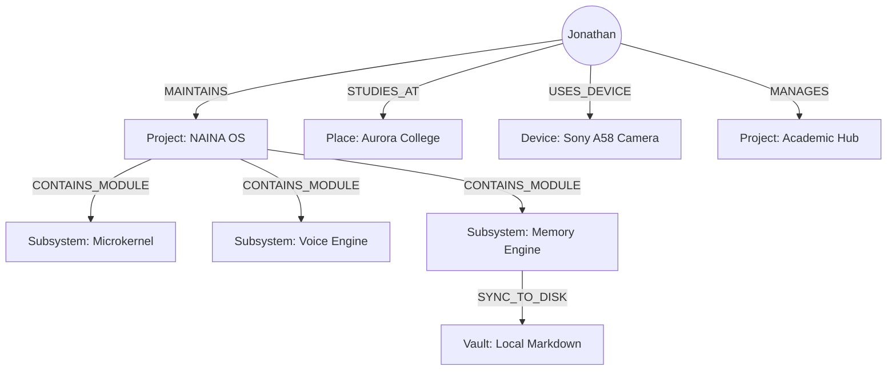
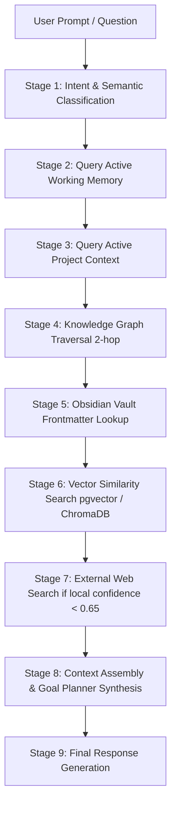

# NAINA OS — Memory & Knowledge Intelligence Engine (MKIE v1.0)
**Volume 4: Multi-Tier Memory Engine, Knowledge Graph, Obsidian Integration & Identity Engine**  
**Document Identifiers:** NOS-MKIE-04.1 through 04.6  
**Version:** 1.0.0  
**Status:** Approved Engineering Specification  
**Classification:** Open Source Systems Standard  
**Authors:** Chief Systems Architect, Memory & Cognitive Intelligence Group  

---

> *"A model answers questions. A memory system builds a mind."*

---

## Document Revision History

| Date | Revision | Author | Description of Changes |
| :--- | :--- | :--- | :--- |
| **2026-07-31** | `v1.0.0` | Chief Systems Architect | Release of Volume 4 — Memory & Knowledge Intelligence Engine (MKIE v1.0) |
| **2026-07-26** | `v0.9.0` | Memory Engineering Team | Specifications for 7 Memory Layers, 16 Entity Knowledge Graph, and Identity Engine |

---

## DOCUMENT 04.1 — Unified Memory Engine (UME)

### 1. Overview & Multi-Domain Memory Concept
The **Unified Memory Engine (UME)** provides a single, cross-modal memory system servicing all user interaction domains: **Voice**, **Chat**, **Vision**, **Desktop**, **Android**, **Browser**, **Research**, **Coding**, and **Photography**.

```
┌─────────────────────────────────────────────────────────────────────────┐
│                    UNIFIED MEMORY ENGINE (UME) LAYERS                   │
├─────────────────────────────────────────────────────────────────────────┤
│ LAYER 1: SENSORY MEMORY (Microphone Audio Buffer, Frame Captures)       │
├─────────────────────────────────────────────────────────────────────────┤
│ LAYER 2: WORKING MEMORY (Active Task State: Docker -> GitHub -> Railway)│
├─────────────────────────────────────────────────────────────────────────┤
│ LAYER 3: SESSION MEMORY (Daily Operations: Coding, Meetings, Study)    │
├─────────────────────────────────────────────────────────────────────────┤
│ LAYER 4: PROJECT MEMORY (Academic Hub, NAINA OS, Photography, YouTube)  │
├─────────────────────────────────────────────────────────────────────────┤
│ LAYER 5: LONG-TERM MEMORY (Goals, Habits, Coding Style, Life History)   │
├─────────────────────────────────────────────────────────────────────────┤
│ LAYER 6: KNOWLEDGE GRAPH (16 Entity Types, Triples & Relations)        │
├─────────────────────────────────────────────────────────────────────────┤
│ LAYER 7: OBSIDIAN VAULT (Intelligent Plaintext Markdown .md Mirror)    │
└─────────────────────────────────────────────────────────────────────────┘
```

### 2. Detailed Memory Layer Specifications

1. **Sensory Memory**:
   - *Lifespan*: 500ms – 10 seconds (In-RAM ring buffer).
   - *Examples*: Raw PCM microphone stream, latest camera frame, clipboard data, active screen viewport bounding box.
2. **Working Memory**:
   - *Lifespan*: Active task duration (Minutes to hours).
   - *Examples*: Active goal pipeline (`Deploy website -> Docker -> GitHub -> Railway -> OBS notification`).
3. **Session Memory**:
   - *Lifespan*: Single calendar day (24 hours).
   - *Examples*: Today's debugging log, morning meeting notes, study session summaries.
4. **Project Memory**:
   - *Lifespan*: Project lifecycle (Weeks to months).
   - *Examples*: Repository specs, design decisions, photography assets, YouTube video transcripts.
5. **Long-Term Memory**:
   - *Lifespan*: Permanent / Continuous retention.
   - *Examples*: User preferences, habits, personal goals, coding style rules, core relationships.
6. **Knowledge Graph**:
   - *Lifespan*: Permanent graph nodes and semantic edges.
7. **Obsidian Vault Mirror**:
   - *Lifespan*: Immutable human-readable `.md` vault files on local disk.

---

## DOCUMENT 04.2 — Knowledge Graph Engine

### 1. Graph Topology vs. Flat Folders
Traditional systems organize files into hierarchical directories. NAINA OS models knowledge as a **Multi-Relational Directed Knowledge Graph**, enabling deep associative reasoning across modalities.



### 2. Schema for 16 Core Entity Types

The NKRS Knowledge Graph schema standardizes sixteen entity types and their allowed relationships:

```typescript
// Knowledge Graph Entity Node Schema (TypeScript Contract)
export type EntityType = 
  | 'Person' | 'Project' | 'Company' | 'Device' 
  | 'File' | 'Note' | 'Task' | 'Goal' 
  | 'Skill' | 'Event' | 'Place' | 'Photo' 
  | 'Website' | 'AI_Model' | 'Agent' | 'Plugin';

export interface GraphNode {
  entityId: string;           // UUIDv4 or URI
  entityType: EntityType;
  displayName: string;
  attributes: Record<string, unknown>;
  confidenceScore: number;    // 0.0 to 1.0
  privacyLevel: 'PUBLIC' | 'PRIVATE' | 'RESTRICTED' | 'ENCRYPTED';
  createdAt: string;          // ISO-8601
  lastAccessedAt: string;
}

export interface GraphEdge {
  edgeId: string;
  sourceEntityId: string;
  targetEntityId: string;
  relationshipType: string;   // e.g., "CREATED_BY", "DEPENDS_ON", "LOCATED_AT"
  weight: number;             // Relationship strength (0.0 to 1.0)
}
```

---

## DOCUMENT 04.3 — Obsidian Intelligence Framework

### 1. Vault Directory Architecture
Every note inside the local Obsidian Vault is an **Intelligent Machine-Readable Object**:

```
NainaSecondBrain/
├── 00 Dashboard/          # System Status & Daily Summary Widgets
├── 01 Daily Notes/        # Daily Session Journals (YYYY-MM-DD.md)
├── 02 Projects/           # Active Project Hubs & Specifications
├── 03 Research/           # Paper Summaries & Web Scrape Clippings
├── 04 People/             # Contacts, Collaborators & Profiles
├── 05 AI/                 # Prompt Libraries, Model Benchmarks & Specs
├── 06 Coding/             # Code Snippets, Architecture Specs & ADRs
├── 07 College/            # Academic Notes, Syllabi & Assignment Logs
├── 08 Photography/        # Camera Gear, EXIF Metadata & Shooting Logs
├── 09 Journal/            # Personal Thoughts & Reflection Entries
├── 10 Meetings/           # Meeting Transcripts & Action Items
├── 11 Tasks/              # Atomic Task Items & Goal Trees
├── 12 Media/              # Images, Diagrams & Voice Clips
├── 13 Archives/           # Inactive Projects & Historical Logs
└── 99 System/             # NAINA OS Metadata, Schemas & Indices
```

### 2. Standard YAML Frontmatter Schema
Every `.md` file generated or managed by NAINA OS incorporates strict metadata frontmatter:

```yaml
---
title: "NAINA OS Kernel Specification"
created: "2026-07-31T21:42:41Z"
updated: "2026-07-31T21:56:44Z"
owner: "Jonathan"
agent: "CENANI"
project: "NAINA OS"
tags: ["engineering", "kernel", "microkernel", "specification"]
entities:
  - "Person:Jonathan"
  - "Project:NAINA OS"
  - "Subsystem:Microkernel"
embeddings:
  model: "text-embedding-3-small"
  dimensions: 1536
  vector_id: "vec_k8912a_kernel"
relationships:
  - relation: "MAINTAINED_BY"
    target: "Person:Jonathan"
  - relation: "PART_OF"
    target: "Project:NAINA OS"
status: "APPROVED"
---
```

---

## DOCUMENT 04.4 — Layered Memory Retrieval Pipeline

Rather than relying solely on naive vector embedding similarity, NAINA OS employs a **9-Stage Layered Retrieval Pipeline**:



---

## DOCUMENT 04.5 — Memory Lifecycle Engine

Every memory object flows through nine lifecycle states:

```
[Created] ──> [Indexed] ──> [Embedded] ──> [Linked] ──> [Updated] 
                                                             │
[Deleted] <── [Recovered] <── [Archived] <───────────────────┘
```

1. **Created**: Captured from voice, chat, vision, or file input.
2. **Indexed**: Parsed for entities, keywords, and metadata.
3. **Embedded**: Converted into dense vector space (1536-dim).
4. **Linked**: Attached to Knowledge Graph nodes and Obsidian frontmatter.
5. **Updated**: Modified as new context or facts emerge.
6. **Archived**: Shifted to cold storage when access frequency drops.
7. **Recovered**: Restored from archives upon relevant query match.
8. **Deleted**: Safely purged upon explicit user privacy request.

---

## DOCUMENT 04.6 — Memory Quality System

To reason accurately about its memories, NAINA OS tracks eight metadata quality dimensions for every memory record:

| Quality Dimension | Type / Range | Purpose & Description |
| :--- | :--- | :--- |
| **Confidence** | `Float (0.0 - 1.0)` | Probability that the memory node is factual and uncorrupted. |
| **Source** | `String Enum` | Origin: `VOICE`, `GUI_AUTOMATION`, `USER_EXPLICIT`, `WEB_SCRAPE`. |
| **Timestamp** | `ISO-8601 UTC` | Exact creation time for temporal ordering. |
| **Importance** | `Integer (1 - 5)` | Priority rating determining retention lifecycle. |
| **Privacy Level** | `String Enum` | Access restriction: `PUBLIC`, `PRIVATE`, `RESTRICTED`, `ENCRYPTED`. |
| **Related Entities** | `Array[EntityURI]` | Direct graph edges linking to associated entities. |
| **Verification Status**| `String Enum` | Validation state: `UNVERIFIED`, `USER_CONFIRMED`, `SYSTEM_TESTED`. |
| **Last Access** | `ISO-8601 UTC` | Recency marker used for memory decay calculations. |

---

## SPECIAL SUBSYSTEM 1: Personal Knowledge Timeline (PKT)

The **Personal Knowledge Timeline (PKT)** provides a unified chronological view of user projects, activities, and achievements.

```
2026
 ├── Jan 15: Started NAINA OS Design Specs
 ├── Mar 10: Added OpenClaw Computer Use Integration
 ├── May 20: Built Multi-Tier Memory Engine (MKIE)
 ├── Jul 31: Released NAINA OS Specification v1.0
 └── Aug 15: Initiated ROS2 Robotics Module Integration
```

### Interactive Drill-Down Capabilities
Clicking any timeline event immediately synthesizes and displays:
- Associated Git commits and code diffs.
- Relevant Obsidian notes and meeting logs.
- Voice chat transcripts and planning contracts.
- High-resolution screenshots, photos, and media captures.

---

## SPECIAL SUBSYSTEM 2: Identity Engine

The **Identity Engine** serves as the master anchoring subsystem for NAINA OS, granting every memory, task, project, and permission a clear owner:

```
┌─────────────────────────────────────────────────────────────────────────┐
│                          IDENTITY ENGINE MATRIX                         │
├──────────────────┬──────────────────────────────────────────────────────┤
│ User Profile     │ Master User Identity (Jonathan), Preferences, Keys   │
├──────────────────┼──────────────────────────────────────────────────────┤
│ Devices          │ Desktop Rig, Laptop, Android Phone, Sony A58 Camera  │
├──────────────────┼──────────────────────────────────────────────────────┤
│ Projects         │ NAINA OS, Academic Hub, Photography, YouTube Channel │
├──────────────────┼──────────────────────────────────────────────────────┤
│ Organizations    │ Aurora College, Open Source AI Collective            │
├──────────────────┼──────────────────────────────────────────────────────┤
│ Collaborators    │ Friends, Co-developers, Research Partners           │
├──────────────────┼──────────────────────────────────────────────────────┤
│ Digital Identities│ GitHub Handle, Google Workspace ID, OBS Socket Tokens│
└──────────────────┴──────────────────────────────────────────────────────┘
```

---
*End of NAINA OS Memory & Knowledge Intelligence Engine — Documents 04.1 through 04.6, PKT & Identity Engine*
