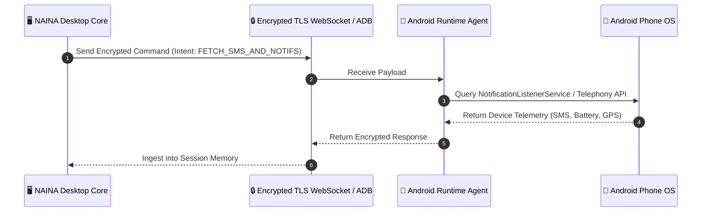
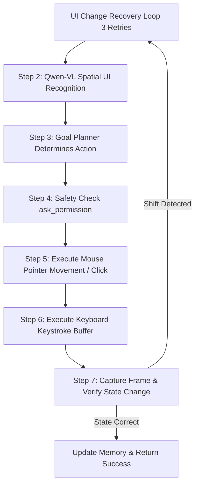

# NAINA OS — Desktop, Mobile & Computer Interaction Framework (DMCIF v1.0)
**Volume 5: Host OS Runtime, Android Companion, Browser Automation, Hardware Drivers & Workspace Awareness**  
**Document Identifiers:** NOS-DMCIF-05.1 through 05.7  
**Version:** 1.0.0  
**Status:** Approved Engineering Specification  
**Classification:** Open Source Systems Standard  
**Authors:** Chief Systems Architect, Device Runtimes & Hardware Abstraction Group  

---

> *"If Memory is the Mind, then Devices are the Body."*

---

## Document Revision History

| Date | Revision | Author | Description of Changes |
| :--- | :--- | :--- | :--- |
| **2026-07-31** | `v1.0.0` | Chief Systems Architect | Release of Volume 5 — Desktop, Mobile & Device Interaction Specification |
| **2026-07-29** | `v0.9.0` | Systems Hardware Group | Specifications for Windows Runtime, Android ADB, OpenClaw Engine & WAE |

---

## FLAGSHIP SUBSYSTEM: Workspace Awareness Engine (WAE)

### 1. Architectural Concept & Purpose
The **Workspace Awareness Engine (WAE)** elevates NAINA OS from a passive command runner into a context-aware operating environment. WAE continuously monitors screen layouts, active window handles, project working directories, process states, and peripheral connections.

```
┌─────────────────────────────────────────────────────────────────────────┐
│                    WORKSPACE AWARENESS ENGINE (WAE)                     │
├─────────────────────────────────────────────────────────────────────────┤
│ MONITOR 1 (Primary Workstation)      │ MONITOR 2 (Monitoring Dashboard) │
│  ┌────────────────────────────────┐  │  ┌────────────────────────────┐  │
│  │ VS Code (NAINA OS Kernel Repo) │  │  │ Docker Desktop Build Logs  │  │
│  └────────────────────────────────┘  │  └────────────────────────────┘  │
│  ┌────────────────────────────────┐  │  ┌────────────────────────────┐  │
│  │ Chrome (GitHub PR Review)      │  │  │ Terminal (Pytest Running)  │  │
│  └────────────────────────────────┘  │  └────────────────────────────┘  │
├──────────────────────────────────────┴──────────────────────────────────┤
│ WAE CONTEXT REASONING ENGINE                                            │
│  • Active Focus: Coding / Systems Engineering                            │
│  • Active Project: NAINA OS Kernel (v1.0 Branch)                        │
│  • Connected Hardware: Sony A58 Camera, Android Phone, USB Audio DAC     │
│  • Proactive Context Alert: "Docker build idle for 20m. Check logs?"    │
└─────────────────────────────────────────────────────────────────────────┘
```

---

## DOCUMENT 05.1 — Windows Runtime Framework

### 1. System Architecture
The **Windows Runtime Framework** interfaces directly with Win32 APIs, PowerShell 7+, Windows Management Instrumentation (WMI), and desktop process handles under **CENANI's** command loop.

```
User Voice Input
   │
   ▼
🌙 NAINA (Companion Engine)
   │
   ▼
🧠 Goal Planner
   │
   ▼
⚡ CENANI (System Operator)
   │
   ▼
💻 Windows Runtime Manager
   ├── Win32 API / Desktop Window Manager (DWM)
   ├── PowerShell 7 / WMI Process Controller
   ├── Explorer File System Operations Daemon
   └── Desktop Vision (Qwen-VL Window Recognition)
```

### 2. Core Windows Subsystems & Capabilities

| Subsystem Component | Direct Capability Description | System Interface |
| :--- | :--- | :--- |
| **Application Manager** | Discovers, launches, monitors, and terminates Win32/UWP processes. | `Process.GetProcesses()`, Win32 API |
| **Window Manager** | Enumerates HWND handles, sets focus, resizes, and captures z-index states.| `EnumWindows()`, `SetForegroundWindow()`|
| **File System Daemon** | Read, Write, Move, Compress (ZIP/7z), Encrypt (AES-256), Hash, Version. | Native Win32 File IO, `vssadmin` |
| **Registry & Services** | Inspects/modifies registry keys and controls Windows Background Services. | `RegOpenKeyEx()`, `sc.exe` |
| **Terminal & Shell** | Executes sandboxed PowerShell, CMD, and WSL2 Linux commands. | `powershell.exe -NoProfile -Command` |
| **Performance Monitor**| Real-time CPU, GPU (NVIDIA NVML), RAM, SSD, and VRAM telemetry. | WMI / NVML C++ DLL Bindings |
| **Application Plugins**| OBS Studio (WebSockets), VS Code, Docker Desktop, Spotify, Discord. | Application Plugin Manifest API |

### 3. Desktop Vision Engine
Instead of requiring exact executable names (e.g., `"Launch chrome.exe"`), Desktop Vision accepts spatial visual intents such as *"Switch to the browser window currently showing GitHub PR #42"*. It samples active HWND viewports, passes screenshots through Qwen-VL, and identifies target windows by visual content rather than process titles alone.

---

## DOCUMENT 05.2 — Android Companion Framework (NAINA Mobile)

### 1. System Architecture & Secure Channel
NAINA OS pairs seamlessly with Android mobile devices via ADB (Android Debug Bridge) or an encrypted local WebSocket bridge:



### 2. Mobile Capabilities Matrix
- **Communication**: Read/Send SMS, manage Phone Calls, WhatsApp notification parsing (subject to OS permissions).
- **Sensors & Hardware**: GPS Location queries, Battery charge telemetry, Camera frame capture, Mic audio streaming.
- **Connectivity**: Wi-Fi status, Hotspot control, Bluetooth peripheral pairing, File transfer sync.

---

## DOCUMENT 05.3 — Browser Intelligence Framework

The **Browser Intelligence Framework** manages web interaction across Chrome, Firefox, Edge, Brave, and Arc:

```
User Prompt: "Research vector database indexing benchmarks and summarize in Obsidian."
   │
   ▼
🧠 AI Router & Goal Planner
   │
   ▼
🌐 Browser Agent Subsystem
   │
   ▼
💻 OpenClaw Computer Use Engine
   │
   ▼
🎭 Playwright Headless Automation (Chrome / Firefox / Edge Drivers)
   ├── Tab Management & Multi-Profile Support
   ├── Cookie & Auth Session Persistence
   └── DOM Scraper & Markdown Text Extractor
```

---

## DOCUMENT 05.4 — Application Runtime Framework

Instead of building hardcoded, isolated agent scripts for every application, NAINA OS implements the **Application Plugin Architecture**:

```json
{
  "application_name": "OBS Studio",
  "plugin_version": "1.0.0",
  "executable_match": "obs64.exe",
  "required_capabilities": ["CAP_NET_HTTP", "CAP_MEDIA_STREAM"],
  "supported_commands": [
    { "command_id": "obs_start_streaming", "mcp_tool": "obs_ws_start_stream" },
    { "command_id": "obs_switch_scene", "mcp_tool": "obs_ws_set_scene" }
  ]
}
```

---

## DOCUMENT 05.5 — Hardware Runtime & Device Drivers

The **Hardware Runtime** provides unified abstraction across physical computing peripherals:

- **Input Devices**: Raw USB/Bluetooth Keyboard, Mouse pointer events, Touch digitizer.
- **Media Inputs**: USB Webcams, Capture Cards, Microphone array beamforming.
- **Compute & Storage**: CPU core frequency tuning, NVIDIA GPU CUDA streams, NVMe SSD SMART health.
- **Peripherals**: Bluetooth audio DAC, USB printers, Multi-monitor Display Data Channel (DDC/CI).

---

## DOCUMENT 05.6 — Computer Use Engine Execution Loop

The **Computer Use Engine** executes an autonomous vision-guided loop powered by OpenClaw:



---

## DOCUMENT 05.7 — Multi-Device Synchronization

NAINA OS maintains a single unified identity across all hardware platforms:

```
                 NAINA Identity & Memory Engine
                              │
     ┌────────────────────────┼────────────────────────┐
     │                        │                        │
     ▼                        ▼                        ▼
Desktop Workstation      Android Mobile Phone       Tablet / Smart Glasses
(Win32 / POSIX Core)     (ADB / Mobile App)        (Lightweight Client)
```

- **One Identity**: Single capability-gated security token across all devices.
- **One Memory**: Real-time vector and Obsidian vault synchronization across nodes.
- **One AI Engine**: Transparent model cascading distributing inference between local GPU rigs and mobile client nodes.

---
*End of NAINA OS Desktop, Mobile & Computer Interaction Framework — Volume 5 (Documents 05.1 - 05.7 & WAE)*
