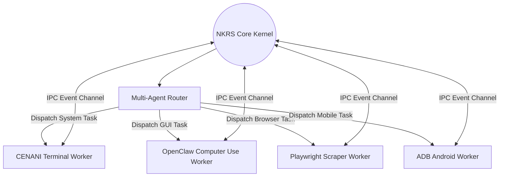

# NAINA OS — Voice OS, Multimodal Perception & Security Specification (v1.0)
**Volume 6: Real-Time Audio Pipeline, Spatial Vision, Zero-Trust Sandbox & Plugin SDK**  
**Document Identifiers:** NOS-VOSP-06.1 through 06.6  
**Version:** 1.0.0  
**Status:** Approved Engineering Specification  
**Classification:** Open Source Systems Standard  
**Authors:** Chief Systems Architect, Audio Pipeline Leads, Security Group & SDK Engineers  

---

> *"Natural conversation is the ultimate operating system interface."*

---

## Document Revision History

| Date | Revision | Author | Description of Changes |
| :--- | :--- | :--- | :--- |
| **2026-07-31** | `v1.0.0` | Chief Systems Architect | Release of Volume 6 — Voice OS, Multimodal Perception, Zero-Trust Security & MCP SDK |
| **2026-07-30** | `v0.9.0` | Audio & Security Teams | Deep-dive specs for Silero VAD, Kokoro streaming TTS, Capability Tokens & Docker Sandboxing |

---

## DOCUMENT 06.1 — Voice Operating System & Real-Time Audio Pipeline

### 1. Audio Pipeline Architecture
The **Voice Operating System (VOSP)** provides a continuous, sub-700ms voice-to-voice interaction loop:

```
[Analog Microphone Stream]
          │
          ▼ (16kHz 16-bit PCM Audio Chunks)
[Silero VAD C++ Engine] ──(Speech Detected?)──> [Faster-Whisper STT Transcriber]
                                                         │
                                                         ▼ (Transcribed Text Tokens)
                                                [AI Router & Persona Engine]
                                                         │
                                                         ▼ (Response Tokens)
[Audio Speaker Output] <──(PCM Stream Buffer)── [Kokoro-82M TTS Synthesizer]
```

### 2. Audio Pipeline Performance SLA Targets

| Stage | Target Latency | Max Threshold | Implementation Technology |
| :--- | :--- | :--- | :--- |
| **Voice Activity Detection (VAD)**| `< 25 ms` | `50 ms` | Silero VAD C++ ONNX Runtime Binding |
| **Speech-to-Text Transcribe (STT)**| `< 180 ms` | `300 ms` | Faster-Whisper (Large-v3 CTranslate2 FP16) |
| **Persona Token Streaming** | `< 250 ms` | `450 ms` | Hermes 3 / Qwen 2.5 local Ollama stream |
| **Text-to-Speech Chunk Synth** | `< 95 ms` | `150 ms` | Kokoro-82M ONNX 24kHz PCM Generator |
| **End-to-End Latency Target** | `< 550 ms` | `950 ms` | Parallelized Async Buffer Pipelines |

---

## DOCUMENT 06.2 — Spatial Vision & Screen Perception Engine

### 1. Spatial Processing Loop
The **Spatial Vision Engine** processes static images, camera feeds, and desktop screenshots via Qwen-VL:

```
Screen Viewport Capture (1920x1080)
   │
   ▼
Image Downsampling & Resolution Normalization
   │
   ▼
Qwen-VL Vision Language Model Processing
   │
   ▼
Spatial Bounding Box Output: [ymin, xmin, ymax, xmax] + Element Class
   │
   ▼
Target Spatial Action (Mouse Click / OpenClaw Guidance)
```

---

## DOCUMENT 06.3 — Multi-Agent Mesh & Concurrency Controller

NAINA OS orchestrates sub-agents in an isolated concurrent execution mesh:



---

## DOCUMENT 06.4 — Security, Capability Tokens & Zero-Trust Sandbox

### 1. Capability-Based Access Control (CBAC)
Every sub-agent and MCP tool execution requires an explicitly signed **HMAC-SHA256 Capability Token**:

```python
# Security Capability Token Verification Engine (Python)
import hmac
import hashlib
import time
from typing import List, Dict

class CapabilitySecurityManager:
    def __init__(self, secret_key: bytes):
        self.secret_key = secret_key

    def generate_token(self, agent_id: str, capabilities: List[str], ttl_seconds: int = 3600) -> str:
        expires_at = int(time.time()) + ttl_seconds
        payload = f"{agent_id}:{','.join(sorted(capabilities))}:{expires_at}"
        signature = hmac.new(self.secret_key, payload.encode('utf-8'), hashlib.sha256).hexdigest()
        return f"{payload}:{signature}"

    def verify_capability(self, token: str, required_cap: str) -> bool:
        try:
            parts = token.split(":")
            if len(parts) != 4:
                return False
            agent_id, caps_str, expires_at_str, signature = parts
            
            # Check expiration
            if int(time.time()) > int(expires_at_str):
                return False
                
            # Verify signature
            payload = f"{agent_id}:{caps_str}:{expires_at_str}"
            expected_sig = hmac.new(self.secret_key, payload.encode('utf-8'), hashlib.sha256).hexdigest()
            if not hmac.compare_digest(signature, expected_sig):
                return False
                
            # Verify required capability
            assigned_caps = caps_str.split(",")
            return required_cap in assigned_caps
        except Exception:
            return False
```

### 2. Air-Gap Docker Sandboxing
Untrusted third-party plugins run inside ephemeral, network-restricted Docker containers:
- Read-only root filesystem (`--read-only`).
- CPU quota cap (`--cpus="1.0"`) and Memory cap (`--memory="512m"`).
- Dropped Linux capabilities (`--cap-drop=ALL`).

---

## DOCUMENT 06.5 — Developer Plugin & MCP Extension SDK

Developers can create custom NAINA OS tools using the Anthropic Model Context Protocol (MCP):

```typescript
// Example Custom MCP Tool Plugin Server (TypeScript SDK)
import { MCPServer, MCPToolDefinition } from '@naina-os/mcp-core';

const server = new MCPServer({
  name: 'custom-weather-plugin',
  version: '1.0.0'
});

const weatherTool: MCPToolDefinition = {
  name: 'get_weather_forecast',
  description: 'Retrieves current weather forecast for a given city.',
  parameters: {
    type: 'object',
    properties: {
      city: { type: 'string', description: 'Target city name' }
    },
    required: ['city']
  },
  execute: async (args) => {
    // API Call logic
    return { temperature_c: 24, condition: 'Sunny' };
  }
};

server.registerTool(weatherTool);
server.listen();
```

---

## DOCUMENT 06.6 — Enterprise DevOps & Edge Hardware Deployment

### 1. System Requirements & Hardware Allocation

| Tier | Min CPU | Min RAM | GPU Requirement | Target Use Case |
| :--- | :--- | :--- | :--- | :--- |
| **Minimum Edge** | 4-Core x86 / ARM | 8 GB | CPU-Only (llama.cpp Q4) | Voice Assistant & Obsidian Sync |
| **Recommended PC** | 8-Core CPU | 16 GB | NVIDIA RTX 3060 (12GB) / Apple M1 | Full Local Specs (Qwen 14B + Kokoro) |
| **Enterprise Rig** | 16-Core CPU | 64 GB | NVIDIA RTX 4090 (24GB) / Apple M3 Max | Multi-Agent Cluster + Qwen 72B |

---

## MASTER DOCUMENTATION SUITE COMPLETION MATRIX

```
┌─────────────────────────────────────────────────────────────────────────┐
│              NAINA OS COMPLETE ENGINEERING SPECIFICATION SERIES         │
├──────────┬─────────────────────────────────────────────┬────────────────┤
│ Volume   │ Technical Title                             │ Specification  │
├──────────┼─────────────────────────────────────────────┼────────────────┤
│ Volume 1 │ Architecture Blueprint & System Design      │ APPROVED (v1.0)│
│ Volume 2 │ Microkernel & Runtime (NKRS v1.0)           │ APPROVED (v1.0)│
│ Volume 3 │ AI Integration & ARAL Framework (AIIF v1.0)│ APPROVED (v1.0)│
│ Volume 4 │ Memory & Knowledge Intelligence (MKIE v1.0) │ APPROVED (v1.0)│
│ Volume 5 │ Interaction & Workspace Awareness (DMCIF)   │ APPROVED (v1.0)│
│ Volume 6 │ Voice OS, Security Sandbox & MCP SDK (VOSP) │ APPROVED (v1.0)│
└──────────┴─────────────────────────────────────────────┴────────────────┘
```

---
*End of NAINA OS Voice OS, Multimodal Perception & Security Specification — Volume 6 (Documents 06.1 - 06.6)*
