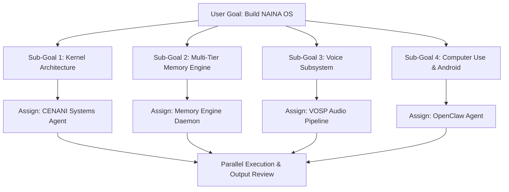
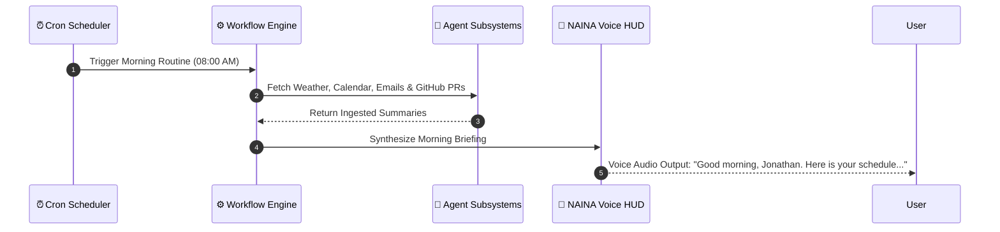

# NAINA OS — Cognitive Architecture & Reasoning Framework (CARF v1.0)
**Volume 7: Reasoning Engines, Planning, Self-Evaluation & Executive Function**  
**Document Identifiers:** NOS-CARF-07.1 through 07.10  
**Version:** 1.0.0  
**Status:** Approved Engineering Specification  
**Classification:** Open Source Systems Standard  
**Authors:** Chief Systems Architect, Cognitive AI Engineers & Behavioral Systems Group  

---

> *"Models generate text. Minds generate decisions."*

---

## Document Revision History

| Date | Revision | Author | Description of Changes |
| :--- | :--- | :--- | :--- |
| **2026-07-31** | `v1.0.0` | Chief Systems Architect | Release of Volume 7 — Cognitive Architecture & Reasoning Framework (CARF v1.0) |
| **2026-07-30** | `v0.9.0` | Cognitive Systems Team | Specifications for 5 Thinking Layers, Executive Function Engine & Reflection Loops |

---

## FLAGSHIP SUBSYSTEM: Executive Function Engine (EFE)

### 1. Concept & Cognitive Control Purpose
The **Executive Function Engine (EFE)** models human-level cognitive control within NAINA OS. Beyond basic memory retrieval, EFE manages **Goal Prioritization**, **Task Switching**, **Interruption Handling**, **Resource Allocation**, and **Focus Recovery**.

```
┌─────────────────────────────────────────────────────────────────────────┐
│                     EXECUTIVE FUNCTION ENGINE (EFE)                     │
├─────────────────────────────────────────────────────────────────────────┤
│ ACTIVE STATE BEFORE INTERRUPTION:                                       │
│  • Task: Debugging Authentication Middleware (`auth.py:L142`)           │
│  • Working State: Pytest Log Captured, Terminal Buffer Saved            │
├─────────────────────────────────────────────────────────────────────────┤
│ INTERRUPTION EVENT: Incoming Phone Call / Emergency Priority Task       │
│  • Action: Pause Execution, Snapshot Focus State to Ephemeral Memory    │
├─────────────────────────────────────────────────────────────────────────┤
│ FOCUS RECOVERY PROMPT ON TASK RESUMPTION:                               │
│  "Before the call, you were debugging the authentication middleware.    │
│   I saved your terminal output and bookmarked auth.py. Ready to resume?"│
└─────────────────────────────────────────────────────────────────────────┘
```

---

## DOCUMENT 07.1 — Cognitive Architecture & Thinking Layers

### 1. Cognitive Pipeline Flow
Input flows through nine discrete cognitive transformations:

```
[Input Sensory Data]
        │
        ▼
[1. Understanding Engine] ──> [2. Context Assembly] ──> [3. Memory Query]
                                                               │
                                                               ▼
[6. Execution Subsystem] <── [5. Decision Engine] <── [4. Planning & Reasoning]
        │
        ▼
[7. Post-Task Reflection] ──> [8. Continuous Learning Update]
```

### 2. The Five Thinking Layers

```
┌─────────────────────────────────────────────────────────────────────────┐
│                      THE FIVE THINKING LAYERS                           │
├───────────────────┬─────────────────────────────────────────────────────┤
│ 1. Reactive       │ Sub-100ms immediate execution (e.g., "Open VS Code")│
├───────────────────┼─────────────────────────────────────────────────────┤
│ 2. Analytical     │ Diagnostic problem-solving (e.g., "Why Docker fails")│
├───────────────────┼─────────────────────────────────────────────────────┤
│ 3. Planning       │ Multi-tier goal decomposition (e.g., "Build App")   │
├───────────────────┼─────────────────────────────────────────────────────┤
│ 4. Reflective     │ Self-review & verification ("Is my answer complete?")│
├───────────────────┼─────────────────────────────────────────────────────┤
│ 5. Creative       │ Design, writing, photography, art & brainstorming   │
└───────────────────┴─────────────────────────────────────────────────────┘
```

---

## DOCUMENT 07.2 — Planning Engine

The **Planning Engine** breaks down high-level user goals into structured sub-goal DAGs (Directed Acyclic Graphs):



---

## DOCUMENT 07.3 — Decision Engine & Risk Matrix

Every system decision is evaluated against seven quantitative metrics before execution:

```python
# Decision Engine Evaluation Contract (Python)
from pydantic import BaseModel
from typing import List, Optional

class SystemDecision(BaseModel):
    action_name: str                  # e.g., "delete_database_table"
    confidence_score: float           # 0.0 to 1.0 (e.g., 0.99)
    risk_level: str                   # "LOW" | "MEDIUM" | "HIGH" | "CRITICAL"
    estimated_cost_usd: float         # Cloud API or Compute Cost
    latency_ms: float                 # Estimated execution time
    required_capability: str          # e.g., "CAP_FILE_WRITE"
    safer_alternative: Optional[str]   # e.g., "move_to_trash_bin"

class DecisionEngine:
    def evaluate(self, decision: SystemDecision) -> bool:
        if decision.risk_level in ["HIGH", "CRITICAL"]:
            print(f"Risk Warning: Action '{decision.action_name}' requires explicit approval.")
            if decision.safer_alternative:
                print(f"Suggestion: Recommend alternative '{decision.safer_alternative}'.")
            return False  # Route to ask_permission UI modal
        return True
```

---

## DOCUMENT 07.4 — Reflection Engine

The **Reflection Engine** executes post-task evaluation loops to drive continuous self-improvement:

```
[Task Completion] ──> [Review Log & Output] ──> [Detect Mistakes / Inefficiencies]
                                                         │
                                                         ▼
[Record Preference Update in Obsidian Vault] <── [Formulate Improvement Strategy]
```

---

## DOCUMENT 07.5 — Learning Engine

The **Learning Engine** updates user preferences, habits, coding style rules, and workflow shortcuts without modifying core system logic or retraining underlying LLM parameters. Updates are stored in local Obsidian Markdown files (`/NainaMemory/04 People/Jonathan.md`).

---

## DOCUMENT 07.6 — Goal Engine & Long-Term Tracking

Long-term life and project goals are tracked continuously across timelines:

```
[Master Goal: Build Enterprise AI Platform]
       │
       ├──> Milestone 1: Finish Architecture Specs (v1.0) [COMPLETED]
       ├──> Milestone 2: Microkernel & Event Bus Prototype [ACTIVE]
       ├──> Milestone 3: OpenClaw Computer Use Integration [PLANNED]
       └──> Milestone 4: Hardware Edge Deployment [PLANNED]
```

---

## DOCUMENT 07.7 — Autonomous Workflow Engine

Orchestrates routine multi-agent workflows (e.g., **Morning Routine Skill**):



---

## DOCUMENT 07.8 — Skill Engine Architecture

Skills group multi-agent tool capabilities into reusable operational primitives:

```json
{
  "skill_name": "MorningRoutineSkill",
  "version": "1.0.0",
  "required_agents": ["browser_agent", "obsidian_agent", "voice_agent"],
  "execution_sequence": [
    { "step": 1, "mcp_tool": "weather_get_current" },
    { "step": 2, "mcp_tool": "google_calendar_list_events" },
    { "step": 3, "mcp_tool": "github_list_prs" },
    { "step": 4, "mcp_tool": "obsidian_append_daily_note" }
  ]
}
```

---

## DOCUMENT 07.9 — Multi-Step Reasoning Protocol

Complex queries execute an expanded multi-step reasoning protocol:

```
Understand Prompt ──> Research Memory ──> Synthesize Options ──> Verify Safety ──> Reflect ──> Output
```

---

## DOCUMENT 07.10 — Self-Evaluation Framework

Every generated response is scored against seven quality dimensions:
1. **Correctness**: Factually accurate against vector/knowledge graph context.
2. **Completeness**: Covers all aspects of user request without truncation.
3. **Safety**: Zero capability violations or data leakages.
4. **Confidence**: Confidence score `> 0.85`. (If `< 0.65`, triggers web research or asks user for clarification).
5. **Latency**: Within SLA targets.
6. **Memory Used**: Relevant Obsidian nodes linked.
7. **Sources**: Verifiable attribution.

---
*End of NAINA OS Cognitive Architecture & Reasoning Framework — Volume 7 (Documents 07.1 - 07.10 & EFE)*
