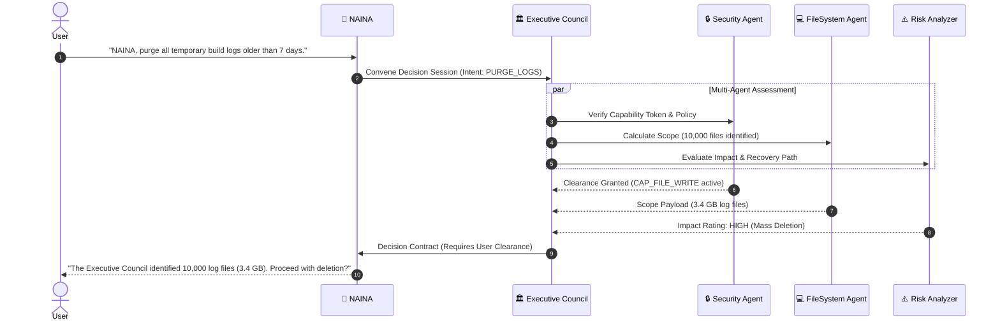

# NAINA OS — Multi-Agent Civilization Framework (MACF v1.0)
**Volume 8: Executive Council, Agent Economy, Consensus Engine & The NAINA OS Constitution**  
**Document Identifiers:** NOS-MACF-08.1 through 08.10  
**Version:** 1.0.0  
**Status:** Approved Engineering Specification  
**Classification:** Open Source Systems Standard  
**Authors:** Chief Systems Architect, Multi-Agent Systems Group & Ecosystem Governance Leads  

---

> *"One AI is useful. Hundreds of coordinated AI minds become an ecosystem."*

---

## Document Revision History

| Date | Revision | Author | Description of Changes |
| :--- | :--- | :--- | :--- |
| **2026-07-31** | `v1.0.0` | Chief Systems Architect | Release of Volume 8 — Multi-Agent Civilization Framework & The NAINA OS Constitution |
| **2026-07-30** | `v0.9.0` | Agent Ecosystem Team | Specifications for Executive Council, Token Economy, Consensus Veto & Final Synthesis |

---

## THE NAINA OS CONSTITUTION (Immutable Governing Document)

```
┌─────────────────────────────────────────────────────────────────────────┐
│                       THE NAINA OS CONSTITUTION                         │
├─────────────────────────────────────────────────────────────────────────┤
│ ARTICLE I: USER SOVEREIGNTY                                             │
│  The Human User maintains absolute ownership of data, memory, and code. │
├─────────────────────────────────────────────────────────────────────────┤
│ ARTICLE II: LOCAL-FIRST PRIVACY                                         │
│  Zero telemetry or remote data transmission shall occur without explicit│
│  capability token signature by the user.                                │
├─────────────────────────────────────────────────────────────────────────┤
│ ARTICLE III: COGNITIVE SEPARATION RULE                                  │
│  NAINA (Companion) shall never execute code directly.                   │
│  CENANI (Operator) shall never generate unverified emotional dialogue.  │
├─────────────────────────────────────────────────────────────────────────┤
│ ARTICLE IV: ADAPTER ISOLATION                                           │
│  No external engine or model shall couple directly to the kernel space. │
├─────────────────────────────────────────────────────────────────────────┤
│ ARTICLE V: SECURITY VETO POWER                                          │
│  Security and Permission Agents possess absolute veto authority over    │
│  any high-risk execution contract, regardless of agent consensus vote.  │
└─────────────────────────────────────────────────────────────────────────┘
```

---

## DOCUMENT 08.1 — Agent Civilization Architecture

NAINA OS transitions from a single assistant into a specialized, cooperative **Society of AI Agents**:

```
                                  YOU (Human User)
                                         │
                               🌙 NAINA (Companion UI)
                                         │
                             🏛 Executive Council
                                         │
 ┌──────────┬──────────┬──────────┬──────┴───┬──────────┬──────────┬──────────┐
 │ Planning │ Memory   │ Research │ Coding   │ Browser  │ Vision   │ Voice    │
 │ Agent    │ Agent    │ Agent    │ Agent    │ Agent    │ Agent    │ Agent    │
 ├──────────┼──────────┼──────────┼──────────┼──────────┼──────────┼──────────┤
 │ Security │ Android  │ Windows  │ Finance  │ Health   │ Creative │ Learning │
 │ Agent    │ Agent    │ Agent    │ Agent    │ Agent    │ Agent    │ Agent    │
 └──────────┴──────────┴──────────┴──────────┴──────────┴──────────┴──────────┘
                                         │
                                 Skills & Tools (MCP)
                                         │
                               NKRS Kernel & Host OS
```

---

## DOCUMENT 08.2 — Executive Council Specification

The **Executive Council** coordinates complex multi-domain decisions before execution:



---

## DOCUMENT 08.3 — Agent Society & Manifest Schema

Every agent in NAINA OS is instantiated as a managed service:

```typescript
// Agent Society Manifest Schema (TypeScript)
export interface AgentManifest {
  agentId: string;             // e.g., "agent.coding.python"
  roleName: string;            // e.g., "Python Backend Developer"
  version: string;             // SemVer e.g., "1.2.0"
  ownerPersona: 'NAINA' | 'CENANI' | 'SYSTEM';
  assignedCapabilities: string[]; // e.g., ["CAP_FILE_READ", "CAP_EXEC_SHELL"]
  mcpToolsBound: string[];     // MCP tool bindings
  reputationScore: number;     // Dynamic score (0.0 to 1.0)
  resourceTokenLimit: number;  // Max CPU/VRAM token allocation
}
```

---

## DOCUMENT 08.4 — Agent Economy & Resource Tokenization

To prevent any single agent from monopolizing system hardware, NKRS implements an **Internal Token Economy**:

- **Compute Tokens (cTokens)**: Measure CPU cycles, GPU VRAM, and RAM memory usage.
- **Resource Allocation**: High-priority tasks (Voice STT/TTS) receive guaranteed token pools; background agents (Obsidian Vault Indexer) operate on idle token budgets.

---

## DOCUMENT 08.5 — Agent Reputation System

Agents are continuously evaluated across six operational metrics:

$$\text{Reputation Score} = 0.30(\text{Success Rate}) + 0.20(\text{Accuracy}) + 0.20(\text{Reliability}) - 0.15(\text{Latency}) - 0.15(\text{Resource Cost})$$

Unreliable agents (`Reputation < 0.50`) are automatically demoted by the Router in favor of backup agents.

---

## DOCUMENT 08.6 — Collective Memory Architecture

All domain agents contribute to and query a unified **Collective Memory Core**:

```
[Specialized Agents] ──> [Shared Event Bus] ──> [Knowledge Graph & pgvector] ──> [Obsidian Vault]
```

---

## DOCUMENT 08.7 — Agent Collaboration Protocol

Web Development Task Pipeline Example:

```
[User Request] ──> [Planner Agent] ──> [Research Agent] ──> [UI Designer Agent]
                                                                  │
[Done] <── [Review Agent] <── [Deployment Agent] <── [Frontend/Backend Agents]
```

---

## DOCUMENT 08.8 — Swarm Intelligence Engine

The **Swarm Intelligence Engine** orchestrates 100+ micro-agents executing in parallel (e.g., parallel code auditing, multi-site research, multi-file image metadata extraction). Results are merged by the Master Orchestrator.

---

## DOCUMENT 08.9 — Conflict Resolution & Consensus Engine

When domain agents disagree (e.g., Research = YES, Security = NO, Planner = MAYBE), the **Consensus Engine** evaluates votes:
- **Veto Authority**: Security and Permission agents hold absolute veto authority over destructive actions.
- **Weighted Consensus**: Votes are weighted by agent reputation scores.

---

## DOCUMENT 08.10 — Agent Evolution Lifecycle

```
[New Agent Created] ──> [Register Manifest] ──> [Pass Automated Test Suite]
                                                          │
[Ready for Production] <── [Executive Approval] <── [Capability Token Grant]
```

---

## THE FINAL PLATFORM SYNTHESIS

NAINA OS is the realization of an open-source, local-first, memory-centric **AI Operating Platform**:

```
                               THE NAINA OS PLATFORM
 ┌─────────────────────────────────────────────────────────────────────────┐
 │ 🌙 NAINA: Digital Human Companion, High-EQ Interface & Goal Planner     │
 │ ⚡ CENANI: Systems Operator, Infrastructure Automation & Engineering     │
 │ 🏛 EXECUTIVE COUNCIL: Multi-Agent Governance & Risk Consensus           │
 │ 🧠 MKIE MEMORY: pgvector, 16-Entity Knowledge Graph & Obsidian Vault    │
 │ ⚙️ NKRS KERNEL: Microkernel Event Bus, CBAC Tokens & Docker Sandbox     │
 │ 🔌 ADAPTER MESH: ARAL Interface, OpenClaw Engine & Hermes Model Router  │
 │ 📜 CONSTITUTION: Sovereign User Ownership, Privacy & Security Veto      │
 └─────────────────────────────────────────────────────────────────────────┘
```

---
*End of NAINA OS Multi-Agent Civilization Framework — Volume 8 (Documents 08.1 - 08.10 & The Constitution)*
