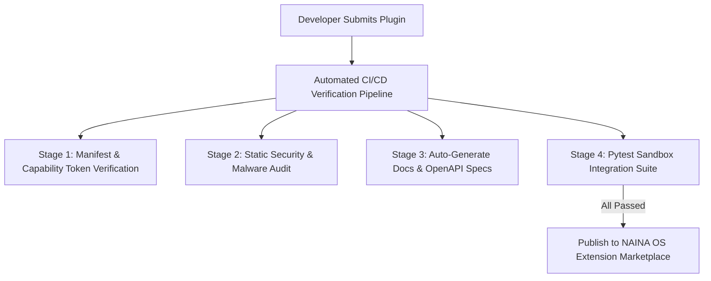

# NAINA OS — Developer Platform & NAINA SDK (DPN SDK v1.0)
**Volume 9: Developer Platform, Subsystem SDKs, AI Plugin Generator & 15-Volume Roadmap**  
**Document Identifiers:** NOS-DPN-09.1 through 09.10  
**Version:** 1.0.0  
**Status:** Approved Engineering Specification  
**Classification:** Open Source Systems Standard  
**Authors:** Chief Systems Architect, Developer Relations & SDK Engineering Group  

---

> *"An operating system becomes successful when other people can build on it."*

---

## Document Revision History

| Date | Revision | Author | Description of Changes |
| :--- | :--- | :--- | :--- |
| **2026-07-31** | `v1.0.0` | Chief Systems Architect | Release of Volume 9 — Developer Platform, SDK Suite, AI Plugin Generator & 15-Volume Roadmap |
| **2026-07-30** | `v0.9.0` | Developer SDK Team | Technical specifications for Agent, Skill, Plugin, Memory, Voice, Vision & Model SDKs |

---

## FLAGSHIP SUBSYSTEM: AI Plugin Generator Engine (APGE)

### 1. Conversational Plugin Generation Architecture
The **AI Plugin Generator Engine (APGE)** enables developers or end-users to generate complete, production-ready NAINA OS plugins using natural language:

```
User Prompt: "Naina, create a plugin that connects to my DJI drone."
   │
   ▼
🌙 NAINA Companion Engine
   │
   ▼
🧠 APGE Goal Planner & Code Synthesis Engine
   │
   ├── Generates plugin/manifest.yaml (Capability & Tool Claims)
   ├── Generates plugin/plugin.py (Python SDK Async Implementation)
   ├── Generates plugin/tests/test_drone.py (Pytest Unit Tests)
   ├── Generates plugin/docs/README.md & Architecture Diagram
   └── Applies Security Capability Token Checks
   │
   ▼
Developer Interactive Code Review & Approval Gate
   │
   ▼
Plugin Installed to NAINA OS Local Extension Sandbox
```

---

## DOCUMENT 09.1 — NAINA SDK Suite Overview

The **NAINA OS SDK (DPN SDK)** is the official developer abstraction layer extending system functionality:

```
Developer / Contributor
           │
           ▼
    NAINA DPN SDK
  ┌─────────────────────────────────────────────────────────────────┐
  │ Agent SDK   │ Plugin SDK  │ Skill SDK   │ Memory SDK            │
  ├─────────────┼─────────────┼─────────────┼───────────────────────┤
  │ Voice SDK   │ Vision SDK  │ Desktop SDK │ Android SDK           │
  ├─────────────┴─────────────┴─────────────┴───────────────────────┤
  │ Model SDK (ARAL Interface) │ UI / Avatar Component SDK          │
  └─────────────────────────────────────────────────────────────────┘
           │
           ▼
NKRS Microkernel Core & System Security Sandbox
```

---

## DOCUMENT 09.2 — Agent SDK Specification

All domain agents implement the universal `BaseAgent` abstract class:

```python
# NAINA OS Base Agent Abstract Specification (Python SDK)
from abc import ABC, abstractmethod
from typing import Dict, Any

class BaseAgent(ABC):
    def __init__(self, agent_id: str, capability_token: str):
        self.agent_id = agent_id
        self.capability_token = capability_token
        self.is_running = False

    @abstractmethod
    async def initialize(self) -> bool:
        """Loads configuration and establishes IPC event subscriptions."""
        pass

    @abstractmethod
    async def execute(self, payload: Dict[str, Any]) -> Dict[str, Any]:
        """Executes the assigned domain task contract."""
        pass

    @abstractmethod
    async def pause((self) -> bool:
        """Temporarily yields resource tokens and pauses queue processing."""
        pass

    @abstractmethod
    async def resume(self) -> bool:
        """Resumes active queue processing."""
        pass

    @abstractmethod
    async def shutdown(self) -> bool:
        """Flushes buffers and releases system locks."""
        pass

    @abstractmethod
    async def health(self) -> Dict[str, Any]:
        """Returns heartbeat telemetry and error counters."""
        pass
```

---

## DOCUMENT 09.3 — Skill SDK Specification

Skills package multi-agent workflows into reusable operational blueprints:

```yaml
# Standard Skill Manifest Schema (skill.manifest.yaml)
id: "skill.morning_routine"
name: "Morning Briefing Routine"
version: "1.0.0"
description: "Ingests weather, calendar, GitHub PRs, and synthesizes a morning voice briefing."
author: "Jonathan <jonathan@nainaos.org>"
permissions:
  - "CAP_NET_HTTP"
  - "CAP_OBSIDIAN_READ"
  - "CAP_VOICE_TTS"
required_agents:
  - "agent.browser"
  - "agent.obsidian"
  - "agent.voice"
required_tools:
  - "weather_get_current"
  - "google_calendar_list_events"
  - "github_list_prs"
timeout_seconds: 60
```

---

## DOCUMENT 09.4 — Plugin SDK Architecture

Every NAINA OS plugin follows a standardized directory structure:

```
my-dji-drone-plugin/
├── manifest.yaml          # Plugin metadata & required capability tokens
├── plugin.py              # Primary Python plugin implementation
├── README.md              # Auto-generated documentation & usage guide
├── assets/                # Icon badges, diagrams & visual assets
├── tests/                 # Unit & integration test suites
└── docs/                  # API reference specs
```

---

## DOCUMENT 09.5 — Memory SDK Specification

Third-party plugins access memory strictly through permission-controlled proxy APIs:

```typescript
// Permission-Gated Memory SDK (TypeScript Contract)
export class MemorySDK {
  constructor(private capabilityToken: string) {}

  async search(query: string, limit: number = 5): Promise<Array<Record<string, unknown>>> {
    // Verifies CAP_OBSIDIAN_READ capability before querying pgvector
    return [];
  }

  async store(content: string, metadata: Record<string, unknown>): Promise<string> {
    // Verifies CAP_OBSIDIAN_WRITE capability
    return "memory_id_1092a";
  }

  async addRelationship(sourceEntity: string, targetEntity: string, relation: string): Promise<boolean> {
    // Inserts triple edge into Knowledge Graph
    return true;
  }
}
```

---

## DOCUMENT 09.6 through 09.8 — Voice, Vision & Model SDKs

- **Voice SDK**: Exposes `voice.say()`, `voice.listen()`, `voice.stream()`, `voice.interrupt()` without exposing raw microphone devices.
- **Vision SDK**: Unified interface across OpenClaw and Qwen-VL: `vision.capture()`, `vision.locate_ui()`, `vision.ocr()`.
- **Model SDK (ARAL)**: Unified abstraction across all LLMs: `model.chat()`, `model.embed()`, `model.vision()`, `model.stream()`, `model.tokens()`.

---

## DOCUMENT 09.9 & 09.10 — Extension Marketplace & Auto-Documentation



---

## NAINA DEVELOPER PORTAL (`docs.nainaos.org`)

The **NAINA Developer Portal** serves as the central hub for the developer ecosystem:
- **API References**: Auto-generated interactive OpenAPI / TypeDoc documentation.
- **SDK Guides**: Tutorials for Python, TypeScript, and Rust agent development.
- **Marketplace Directory**: Discover, audit, and install verified community plugins.

---

## MASTER ARCHITECTURAL ROADMAP (15-VOLUME SERIES)

```
┌─────────────────────────────────────────────────────────────────────────┐
│              NAINA OS COMPLETE 15-VOLUME MASTER ROADMAP                 │
├───────────┬─────────────────────────────────────────────┬───────────────┤
│ Volume    │ Architectural Domain                        │ Status        │
├───────────┼─────────────────────────────────────────────┼───────────────┤
│ Volume 1  │ Foundation & Architecture Blueprint         │ APPROVED      │
│ Volume 2  │ Microkernel & Runtime (NKRS v1.0)           │ APPROVED      │
│ Volume 3  │ AI Integration & ARAL Framework (AIIF v1.0)│ APPROVED      │
│ Volume 4  │ Memory & Knowledge Engine (MKIE v1.0)       │ APPROVED      │
│ Volume 5  │ Desktop & Device Interaction (DMCIF v1.0)   │ APPROVED      │
│ Volume 6  │ Voice OS & Zero-Trust Security (VOSP v1.0)  │ APPROVED      │
│ Volume 7  │ Cognitive Architecture & Reasoning (CARF)   │ APPROVED      │
│ Volume 8  │ Multi-Agent Civilization (MACF v1.0)        │ APPROVED      │
│ Volume 9  │ Developer Platform & SDK (DPN SDK v1.0)    │ APPROVED      │
│ Volume 10 │ Vision, Spatial Computing & Computer Use    │ PLANNED (v1.1)│
│ Volume 11 │ Security, Governance & Audit Standard       │ PLANNED (v1.1)│
│ Volume 12 │ Enterprise DevOps, Infrastructure & Cloud   │ PLANNED (v1.2)│
│ Volume 13 │ UI/UX Design System & Avatar Engine         │ PLANNED (v1.2)│
│ Volume 14 │ Robotics, ROS2 & Edge Physical Computing    │ PLANNED (v2.0)│
│ Volume 15 │ Future Quantum & Post-LLM Research          │ PLANNED (v2.0)│
└───────────┴─────────────────────────────────────────────┴───────────────┘
```

---
*End of NAINA OS Developer Platform & NAINA SDK — Volume 9 (Documents 09.1 - 09.10, APGE & 15-Volume Roadmap)*
