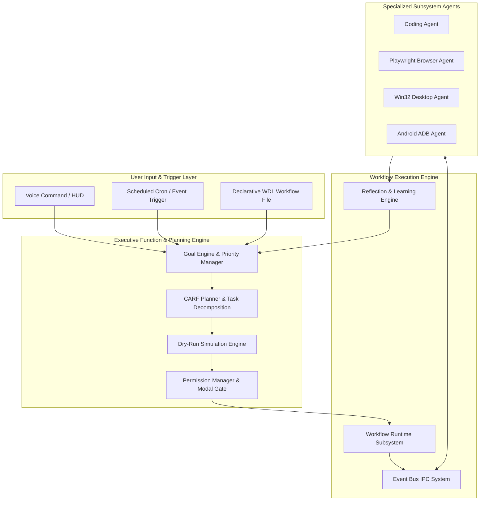
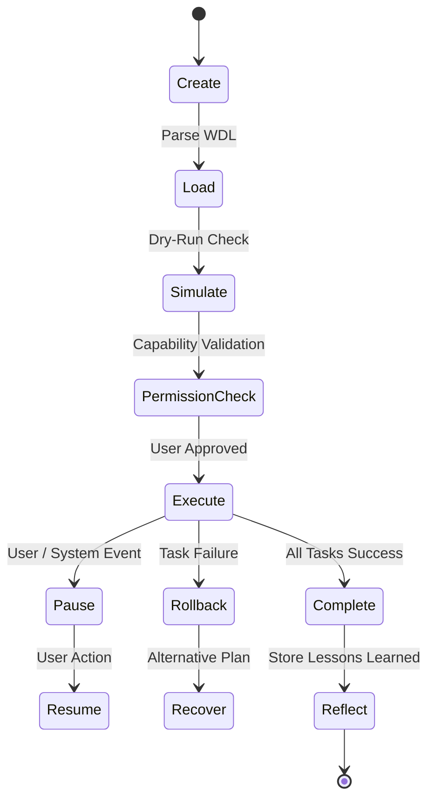

# NAINA OS — Workflow Automation, Planning & Autonomous Execution Framework
**Document Identifier:** NOS-AUTOMATION-001  
**Title:** Workflow Automation, Planning & Autonomous Execution Framework Specification  
**Version:** 1.0  
**Status:** Approved Engineering Specification  
**Classification:** Open Source Systems Standard  
**Authors:** Chief Systems Architect, Executive Function Group & Autonomous Agents Team  

---

## Document Revision History

| Date | Revision | Author | Description of Changes |
| :--- | :--- | :--- | :--- |
| **2026-08-07** | `1.0` | Chief Systems Architect | Initial Engineering Release of NOS-AUTOMATION-001 Specification |
| **2026-08-05** | `0.9` | Autonomous Agents Team | Complete draft of WDL Schema, Goal Engine, and Reflection Loop |

---

## SECTION 1: Automation Philosophy & Core Mandates

### 1.1 Intelligent Automation vs. Static Scripting
The **Workflow Automation, Planning & Autonomous Execution Framework** defines how NAINA OS plans, simulates, executes, supervises, recovers, and learns from complex multi-step workflows.

Under strict NAINA OS architectural guidelines:
- **Automation is NOT Simple Scripting**: It is goal-driven cognitive planning where the system reasons before taking action.
- **8-Stage Execution Cycle**:
  `Planning -> Simulation -> Permission Gate -> Execution -> Monitoring -> Recovery -> Reflection -> Learning`.
- **Human Approval Gate**: Critical system operations (file deletions, financial transactions, credential access) require explicit user approval.

```
[Goal Request] ──> [Goal Engine] ──> [CARF Planner] ──> [Dry-Run Simulation]
                                                              │
[Obsidian Memory] <── [Reflection Engine] <── [Runtime Exec] <── [User Approval]
```

---

## SECTION 2: System Automation Architecture Topology



---

## SECTION 3 & 4: Goal Engine & CARF Planner Engine

- **Goal Decomposition**: Breaks high-level user requests (e.g., *"Build an Android companion app and publish to testing"*) into a Directed Acyclic Graph (DAG) of atomic subtasks.
- **Risk Analysis & Alternatives**: Evaluates resource requirements, potential failure points, and fallback execution branches prior to invocation.

---

## SECTION 5: Workflow Runtime Subsystem & Lifecycle



---

## SECTION 8: NAINA Workflow Definition Language (WDL) Specification

NAINA OS introduces **WDL (Workflow Definition Language)** — a declarative YAML/JSON format allowing users and agents to express complex automation workflows:

```yaml
# NAINA OS Workflow Definition Language (WDL) v1.0 Specification
wdl_version: "1.0"
workflow_id: wdl_build_and_deploy_app
name: Automated Build, Test & Notification Workflow
description: Compiles codebase, runs unit tests, updates Obsidian logs, and sends a mobile notification.

triggers:
  - type: schedule
    cron: "0 22 * * 1-5" # Mon-Fri at 10 PM
  - type: event
    topic: "github.pr.merged"

context:
  project_dir: "C:\\naina-os\\src\\core"
  target_device: "android_companion"

steps:
  - id: step_lint_and_test
    name: Execute Automated Test Suite
    agent: agent.coder
    capability_required: CAP_EXECUTE_CMD
    command: "pytest tests/ --cov=src"
    timeout_seconds: 120
    retry_policy:
      max_retries: 2
      backoff_seconds: 5

  - id: step_update_obsidian_log
    name: Append Test Results to Daily Note
    agent: agent.memory
    capability_required: CAP_FILE_WRITE
    action: obsidian_append
    target_folder: "01 Daily Notes"
    template: "| {{timestamp}} | {{step_lint_and_test.status}} | {{step_lint_and_test.coverage}} |"
    depends_on:
      - step_lint_and_test

  - id: step_notify_mobile
    name: Send Summary to Android Companion
    agent: agent.android
    capability_required: CAP_ANDROID_NOTIFY
    action: send_notification
    title: "CI/CD Build Completed"
    body: "Build status: {{step_lint_and_test.status}}"
    depends_on:
      - step_update_obsidian_log

on_failure:
  action: rollback_and_alert
  target: "voice.alert"
  message: "Workflow wdl_build_and_deploy_app failed at step {{failed_step_id}}"
```

---

## SECTION 9 & 10: Reflection Engine & Self-Learning Engine

- **Reflection Loop**: Following workflow completion, the Reflection Engine evaluates step execution metrics, records failures, and writes lessons learned directly into the Obsidian Vault (`99 System/lessons_learned.md`).
- **Optimization**: Adaptively tunes subtask retry policies, resource limits, and agent assignments based on historical execution success rates.

---

## SECTION 11 & 12: Scheduling, Safety & Emergency Stop

- **Event Scheduling Engine**: Supports cron timers, calendar triggers, system event hooks, and conditional evaluation (`when GPU VRAM < 2GB`).
- **Emergency Stop Interrupt Key**: Pressing `Ctrl+Shift+Escape` immediately halts all active subagents, revokes transient capability tokens, and places the Microkernel into safe mode.

---

## ARCHITECTURE DECISION RECORDS (ADRs)

### ADR-051: NAINA Workflow Definition Language (WDL) Declarative Schema
- **Status**: Approved.
- **Decision**: Standardize on a declarative WDL YAML schema for expressing multi-agent workflows with explicit dependency graphs, retry policies, and rollback handlers.

### ADR-052: Reflective Feedback Loop with Obsidian Memory Store
- **Status**: Approved.
- **Decision**: Persist workflow execution metrics and reflection lessons directly into the Obsidian Vault to enable continuous agent learning over time.

### ADR-053: Air-Gapped Simulation & Permission Gate for Autonomous Actions
- **Status**: Approved.
- **Decision**: Mandate dry-run simulation and explicit permission gates before executing high-risk system actions.

---
*End of NOS-AUTOMATION-001 — Workflow Automation, Planning & Autonomous Execution Framework Specification (v1.0)*
