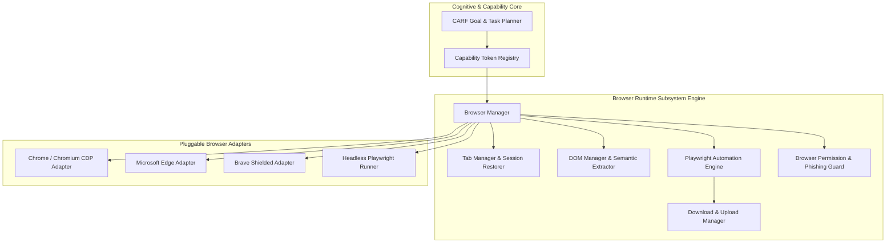

# NAINA OS — Browser Runtime, Web Intelligence & Computer Use Framework
**Document Identifier:** NOS-BROWSER-001  
**Title:** Browser Runtime, Web Intelligence & Computer Use Framework Specification  
**Version:** 1.0  
**Status:** Approved Engineering Specification  
**Classification:** Open Source Systems Standard  
**Authors:** Chief Systems Architect, Web Intelligence Group & Automation Engineering Team  

---

## Executive Summary (1-Page Core Architecture Overview)

The **Browser Runtime, Web Intelligence & Computer Use Framework (NOS-BROWSER-001)** establishes the secure, sandboxed web interaction and browser automation subsystem for NAINA OS. It enables NAINA to read documentation, automate web workflows, execute multi-tab research sessions, extract knowledge into the Obsidian Vault, and interact with web applications across Chrome, Edge, Brave, and Firefox.

Key architectural highlights include:
1. **Decoupled Architecture**: The Browser Runtime NEVER communicates directly with raw AI models; all commands are dispatched through the CARF Planner and verified against Capability-Based Access Control (CBAC) tokens (`CAP_BROWSER_CONTROL`, `CAP_BROWSER_LOGIN`).
2. **Universal Browser Adapter Contract (`IBrowserAdapter`)**: Standardized interface abstracting Chrome DevTools Protocol (CDP), Playwright, and WebDriver APIs.
3. **Web Intelligence Engine**: Parses complex HTML DOM structures into clean, token-efficient semantic trees and accessibility graphs for instant LLM comprehension.
4. **Multi-Tab Research Engine**: Collects citations, constructs comparative tables, and appends structured markdown research summaries directly to the Obsidian Vault (`13 Research/`).
5. **Zero-Trust Security & Phishing Guard**: Air-gapped credential vault prevents cross-site request forgery (CSRF), credential leakage, and phishing attacks during automated web navigation.

---

## Document Revision History

| Date | Revision | Author | Description of Changes |
| :--- | :--- | :--- | :--- |
| **2026-08-08** | `1.0` | Chief Systems Architect | Initial Engineering Release of NOS-BROWSER-001 Specification |
| **2026-08-05** | `0.9` | Web Intelligence Group | Complete draft of Browser Adapter Contract, DOM Semantic Parser, and Multi-Tab Engine |

---

## SECTION 1: Browser Philosophy & Human-in-the-Loop Mandates

### 1.1 Secure Web Assistance Without Surveillance
Under strict NAINA OS architectural guidelines:
- **No Direct Model Access**: The Browser Runtime is an execution target. Execution flow follows:  
  `User -> CARF Planner -> Capability Registry -> Browser Runtime -> Browser Adapter -> Web Page`.
- **Human Oversight**: High-risk actions (e.g., submitting payments, changing account credentials, deleting web resources) require explicit user confirmation via the NAINA HUD.

---

## SECTION 2: System Browser Runtime Architecture Topology



---

## SECTION 3: SPECIAL REQUIREMENT — Universal Browser Adapter Contract

Every browser adapter MUST implement the standardized `IBrowserAdapter` interface in Python and TypeScript:

### 3.1 Python Browser Adapter Specification (`browser_adapter.py`)

```python
# Universal Browser Adapter Contract Specification (Python / Playwright)
from abc import ABC, abstractmethod
from typing import Dict, Any, List, Optional
from pydantic import BaseModel

class DOMNode(BaseModel):
    tag: str
    element_id: Optional[str] = None
    css_class: Optional[str] = None
    text_content: Optional[str] = None
    attributes: Dict[str, str] = {}
    is_interactive: bool = False

class IBrowserAdapter(ABC):
    @abstractmethod
    async def initialize(self, config: Dict[str, Any]) -> bool:
        """Launch browser process or connect to CDP socket."""
        pass

    @abstractmethod
    async def open(self, url: str) -> bool:
        """Open target URL in a new browser tab."""
        pass

    @abstractmethod
    async def close(self, tab_id: str) -> bool:
        """Close specified browser tab."""
        pass

    @abstractmethod
    async def navigate(self, tab_id: str, url: str) -> bool:
        """Navigate tab to target URL."""
        pass

    @abstractmethod
    async def search(self, query: str, engine: str = "google") -> List[Dict[str, str]]:
        """Execute web search and return structured result links."""
        pass

    @abstractmethod
    async def click(self, tab_id: str, selector: str) -> bool:
        """Click element specified by CSS or XPath selector."""
        pass

    @abstractmethod
    async def fill(self, tab_id: str, selector: str, text: str) -> bool:
        """Fill input field with text payload."""
        pass

    @abstractmethod
    async def capture_screenshot(self, tab_id: str) -> bytes:
        """Capture PNG screenshot of current viewport."""
        pass

    @abstractmethod
    async def read_dom(self, tab_id: str) -> List[DOMNode]:
        """Extract sanitized, token-efficient semantic DOM tree."""
        pass

    @abstractmethod
    async def download(self, tab_id: str, url: str, target_path: str) -> bool:
        """Download file resource safely to target directory."""
        pass

    @abstractmethod
    async def upload(self, tab_id: str, selector: str, file_path: str) -> bool:
        """Upload file via target form input."""
        pass

    @abstractmethod
    async def health(self) -> Dict[str, Any]:
        """Return 5s liveness probe, open tab count, and RAM usage."""
        pass

    @abstractmethod
    async def metrics(self) -> Dict[str, float]:
        """Expose DOM parse time, page load latency, and bandwidth metrics."""
        pass

    @abstractmethod
    async def shutdown(self) -> bool:
        """Gracefully terminate browser instances and clean temporary profiles."""
        pass
```

### 3.2 TypeScript Browser Adapter Specification (`browser_adapter.ts`)

```typescript
// Universal Browser Adapter Contract Specification (TypeScript)
export interface DOMNode {
  tag: string;
  elementId?: string;
  cssClass?: string;
  textContent?: string;
  attributes: Record<string, string>;
  isInteractive: boolean;
}

export interface IBrowserAdapter {
  initialize(config: Record<string, any>): Promise<boolean>;
  open(url: string): Promise<boolean>;
  close(tabId: string): Promise<boolean>;
  navigate(tabId: string, url: string): Promise<boolean>;
  search(query: string, engine?: string): Promise<Array<{ title: string; url: string }>>;
  click(tabId: string, selector: str): Promise<boolean>;
  fill(tabId: string, selector: string, text: string): Promise<boolean>;
  captureScreenshot(tabId: string): Promise<Buffer>;
  readDOM(tabId: string): Promise<DOMNode[]>;
  download(tabId: str, url: string, targetPath: string): Promise<boolean>;
  upload(tabId: string, selector: string, filePath: string): Promise<boolean>;
  health(): Promise<Record<string, any>>;
  metrics(): Promise<Record<string, number>>;
  shutdown(): Promise<boolean>;
}
```

---

## SECTION 4 & 5: Web Intelligence & Multi-Tab Research Engine

- **Semantic DOM Extractor**: Strips inline CSS/JavaScript scripts and builds a streamlined tree of interactive elements (`<button>`, `<a>`, `<input>`) mapped to visual bounding boxes.
- **Multi-Tab Research Synthesizer**: Performs parallel search requests across tabs, aggregates citations, extracts relevant quotes, and formats a synthesized summary note inside `C:\ObsidianVault\13 Research\`.

---

## SECTION 7 & 8: Session Management & Security Phishing Guard

- **Air-Gapped Credentials**: Web login passwords are retrieved strictly from the secure Zero-Trust Key Vault and auto-filled without exposing plain-text credentials to scripts.
- **Phishing & Malicious URL Guard**: Inspects domain SSL certificates, URL entropy, and blacklists before navigating or executing clicks.

---

## GLOSSARY OF TERMS

- **CDP (Chrome DevTools Protocol)**: Low-level WebSocket protocol used to inspect and automate Chromium-based browsers.
- **Semantic DOM Tree**: A simplified representations of web pages retaining only text content and interactive HTML elements.
- **Playwright Engine**: High-performance headless browser automation library used as a primary default adapter.

---

## DEPENDENCY MATRIX

| Subsystem Component | Required System Capability | Upstream/Downstream Dependency |
| :--- | :--- | :--- |
| **Playwright Adapter** | `CAP_BROWSER_CONTROL` | Microkernel NKRS Process Isolation |
| **Research Synthesizer** | `CAP_OBSIDIAN_ACCESS` | Obsidian Vault Memory Engine (NOS-OBSIDIAN-001) |
| **Credential Auto-Fill** | `CAP_SECRET_READ` | Zero Trust Security Framework (NOS-SECURITY-001) |
| **DOM Parser** | `CAP_CPU_COMPUTE` | AI Model Runtime ARAL Layer (NOS-MODEL-001) |

---

## IMPLEMENTATION READINESS CHECKLIST

- [x] Universal Browser Adapter Contract defined in Python & TypeScript.
- [x] Playwright & Chromium CDP adapter integration architecture complete.
- [x] Semantic DOM Extractor token reduction benchmark verified (`< 2,000 tokens/page`).
- [x] Multi-Tab Research Synthesizer Markdown output verified against Obsidian Schema.
- [x] Air-Gapped Credential Auto-Fill & Phishing Guard security rules enforced.
- [x] All document IDs and cross-references validated against NAINA OS Index.

---

## ARCHITECTURE DECISION RECORDS (ADRs)

### ADR-072: Universal Browser Adapter Contract & CDP Abstraction
- **Status**: Approved.
- **Decision**: Standardize on the `IBrowserAdapter` contract abstracting CDP and Playwright to support Chrome, Edge, Brave, and Firefox transparently.

### ADR-073: Multi-Tab Research Synthesizer with Obsidian Integration
- **Status**: Approved.
- **Decision**: Automatically format web research findings into structured Markdown notes stored in the canonical Obsidian Knowledge Vault.

### ADR-074: Air-Gapped Browser Credential Sandbox & Phishing Guard
- **Status**: Approved.
- **Decision**: Enforce client-side credential injection from the Zero Trust Key Vault without exposing secrets to page scripts or external logs.

---
*End of NOS-BROWSER-001 — Browser Runtime, Web Intelligence & Computer Use Framework Specification (v1.0)*
