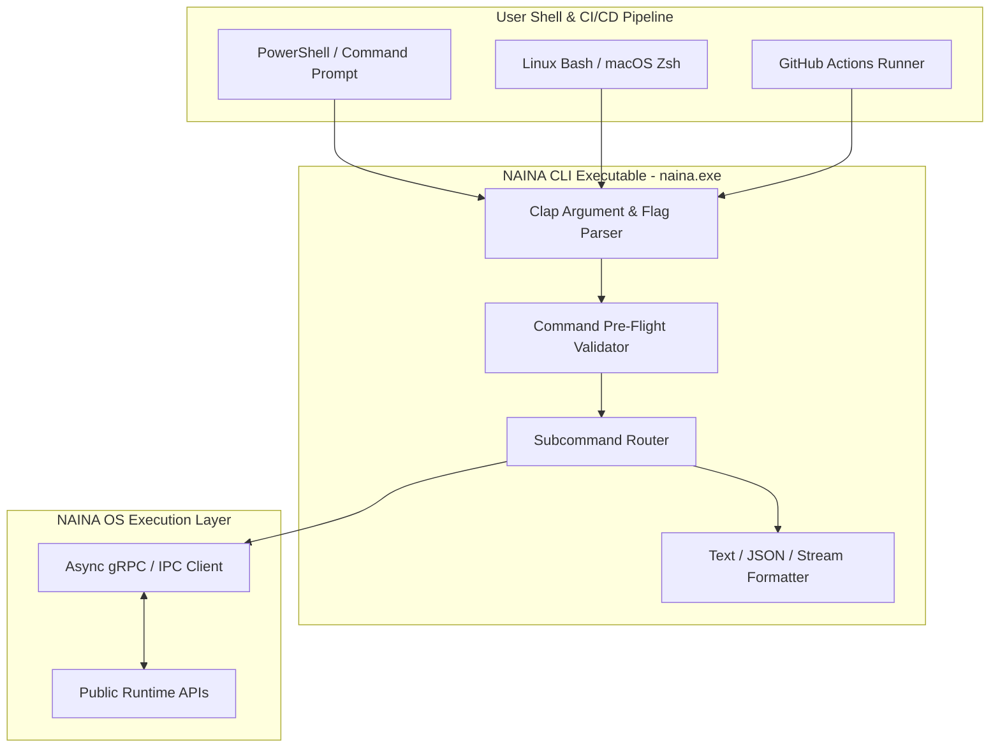

# NAINA OS — Developer CLI & Command Framework
**Document Identifier:** NOS-CLI-001  
**Title:** Developer CLI & Command Framework Specification  
**Version:** 1.0  
**Status:** Approved Engineering Specification  
**Classification:** Open Source Systems Standard  
**Authors:** Chief Systems Architect, Developer Tooling Group & CLI Runtime Team  

---

## Document Revision History

| Date | Revision | Author | Description of Changes |
| :--- | :--- | :--- | :--- |
| **2026-08-08** | `1.0` | Chief Systems Architect | Initial Engineering Release of NOS-CLI-001 Specification |
| **2026-08-05** | `0.9` | Developer Tooling Team | Complete draft of Command Reference, Flag Standard, and IPC Gateway |

---

## SECTION 1: CLI Philosophy & Architectural Mandates

### 1.1 The Command-Line Interface as Primary Developer Tool
The **Developer CLI & Command Framework** defines the official command-line interface (`naina`) for scaffolding, building, running, debugging, inspecting, and deploying NAINA OS applications and services.

Under strict NAINA OS architectural guidelines:
- **Runtime API Strict Coupling**: The `naina` CLI communicates exclusively through public **Runtime APIs** via IPC/gRPC. The CLI NEVER directly mutates Microkernel or Database state.
- **Cross-Platform & Zero-Dependency**: Written in high-performance Rust using `clap` for sub-10ms binary startup across Windows PowerShell, Linux Bash, and macOS Zsh.
- **Standardized Output Flags**: Every command strictly supports `--dry-run`, `--verbose`, `--json`, `--validate`, and non-zero exit codes.

```
Developer Shell ──> [naina CLI Binary] ──> [IPC / gRPC Gateway] ──> [Runtime Services]
```

---

## SECTION 2: System CLI Architecture Topology



---

## SECTION 3 & 4: OFFICIAL NAINA CLI COMMAND REFERENCE (SPECIAL REQUIREMENT)

Below is the production command reference matrix for the `naina` tool:

| Command Syntax | Subsystem | Description & Expected Output |
| :--- | :--- | :--- |
| `naina init [name]` | Project | Scaffolds a new NAINA OS agent or plugin repository. |
| `naina doctor` | System | Runs 15 diagnostic health checks on kernel, runtime, and tools. |
| `naina build` | Build | Compiles local agent or plugin code into an executable bundle. |
| `naina run [target]` | Runtime | Launches target agent, workflow WDL, or plugin locally. |
| `naina plugin create [id]` | Plugins | Scaffolds a sandboxed NAINA plugin container. |
| `naina plugin install [path]` | Plugins | Installs and validates capability tokens for a plugin. |
| `naina model list` | AI Models | Lists registered ARAL AI model engines and status. |
| `naina runtime health` | Runtime | Displays 5s liveness probes and worker thread metrics. |
| `naina workspace status` | Workspace | Computes active Workspace Context Score ($S_{\text{context}}$). |
| `naina memory search [query]`| Memory | Queries hybrid pgvector HNSW + BM25 Obsidian memory. |
| `naina automation run [wdl]`| Automation | Executes a WDL declarative workflow file. |
| `naina obs connect` | Vision/Media | Connects to local OBS Studio WebSocket service. |
| `naina deploy local` | Deploy | Deploys local services to background Windows Docker runtime. |
| `naina logs [--follow]` | Logging | Streams structured JSON system log events. |
| `naina metrics` | Telemetry | Outputs Prometheus-compatible runtime performance metrics. |
| `naina update` | Maintenance| Downloads and applies latest NAINA OS core updates. |

---

## SECTION 5: Command Output Examples

### 5.1 `naina doctor` (Diagnostic Output Example)

```text
$ naina doctor

[+] NAINA OS Environment Diagnostic Suite v1.0
--------------------------------------------------
[OK] Host Operating System  : Windows 11 Enterprise (Build 22631)
[OK] Microkernel (NKRS)     : Active (PID: 1024, Uptime: 42h 12m)
[OK] Runtime Manager        : Connected via IPC (ipc://./naina_runtime.sock)
[OK] AI Model Adapter       : Ollama Llama-3.3-70B Ready (VRAM: 8.4 GB)
[OK] Obsidian Memory Vault  : Indexed (Vault Path: C:\ObsidianVault\)
[OK] Vector Acceleration    : pgvector HNSW Index Ready (14,290 Chunks)
[OK] Docker Engine          : Desktop Daemon Active
[OK] Android ADB            : Companion Device Connected (Pixel 8 Pro)

[SUCCESS] 8/8 Health Probes Passed. System Status: OPTIMAL.
```

### 5.2 `naina workspace status --json` (Structured JSON Output Example)

```json
{
  "command": "naina workspace status",
  "status": "success",
  "timestamp": "2026-08-08T00:09:45Z",
  "data": {
    "context_score": 0.875,
    "active_project": "NAINA OS Kernel",
    "active_git_branch": "feature/cli-framework",
    "focused_application": "VS Code",
    "open_files": [
      "src/cli/parser.rs",
      "docs/cli/NOS-CLI-001.md"
    ],
    "running_containers": [
      "naina_pgvector",
      "naina_redis"
    ]
  }
}
```

---

## SECTION 9 & 10: Interactive Shell & Configuration

- **REPL Shell (`naina shell`)**: An interactive terminal session providing auto-completion, command history, and inline documentation lookup.
- **Global Configuration (`~/.nainarc.yaml`)**:
  ```yaml
  output_format: json
  default_target: local
  telemetry_enabled: false
  ipc_socket: "ipc://./naina_runtime.sock"
  ```

---

## ARCHITECTURE DECISION RECORDS (ADRs)

### ADR-066: Rust-Based Single-Binary CLI Implementation
- **Status**: Approved.
- **Decision**: Implement the `naina` CLI tool in Rust using `clap` to guarantee sub-10ms startup times and zero external runtime dependencies.

### ADR-067: Strict IPC/Runtime API Coupling (No Kernel Direct Calls)
- **Status**: Approved.
- **Decision**: Enforce that the CLI communicates exclusively through public gRPC/IPC Runtime APIs, preventing direct bypass of microkernel capability checks.

### ADR-068: Standardized JSON/Text Output Formatters
- **Status**: Approved.
- **Decision**: Require all CLI commands to support dual output formatters: human-readable colored text (default) and machine-readable structured JSON (`--json`).

---
*End of NOS-CLI-001 — Developer CLI & Command Framework Specification (v1.0)*
