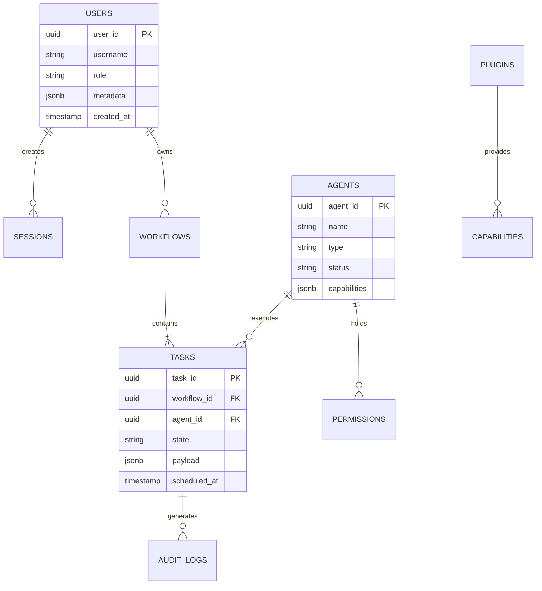

# NAINA OS — Database, Storage & Persistence Architecture
**Document Identifier:** NOS-DATABASE-001  
**Title:** Database, Storage & Persistence Architecture Specification  
**Version:** 1.0  
**Status:** Approved Engineering Specification  
**Classification:** Open Source Systems Standard  
**Authors:** Chief Systems Architect, Data Engineering Group & Persistence Runtime Team  

---

## Document Revision History

| Date | Revision | Author | Description of Changes |
| :--- | :--- | :--- | :--- |
| **2026-08-08** | `1.0` | Chief Systems Architect | Initial Engineering Release of NOS-DATABASE-001 Specification |
| **2026-08-05** | `0.9` | Persistence Engineering Team | Complete draft of Universal Storage Adapter Contract, Relational DDL Schemas, and CRDT Sync |

---

## SECTION 1: Storage Philosophy & Architecture Mandates

### 1.1 Storage Agnosticism & Adapter Architecture
The **Database, Storage & Persistence Architecture** defines how NAINA OS stores, indexes, retrieves, caches, encrypts, and synchronizes system data across all environments.

Under strict NAINA OS architectural guidelines:
- **Storage Agnosticism**: The Microkernel (`NKRS`) and higher-level runtimes NEVER directly reference a specific database driver (e.g., `psycopg2` or `sqlite3`). All persistence operations pass through a **Universal Storage Adapter Interface (`IStorageAdapter`)**.
- **Obsidian Vault as SSOT**: Plaintext Markdown inside the Obsidian Vault is the immutable Single Source of Truth (SSOT) for human knowledge. Vector databases (`pgvector` / ChromaDB) are accelerated read caches that can be destroyed and rebuilt at any time.
- **Local-First & Offline-First**: Primary operations execute against local storage engines (PostgreSQL / SQLite) with seamless background cloud sync when online.

```
Kernel / Services ──> Storage Runtime Manager ──> [Universal Storage Adapter Interface]
                                                         │
  ┌──────────────────┬──────────────────┬────────────────┴──────────────────┐
  ▼                  ▼                  ▼                                   ▼
[PostgreSQL / pgvector] [SQLite Embedded] [Redis L1/L2 Cache]     [Obsidian Markdown SSOT]
```

---

## SECTION 2: System Storage Architecture Topology



---

## SECTION 3: Relational Database Design & SQL DDL Schemas

Below is the production SQL DDL schema for the operational state store:

```sql
-- NAINA OS Operational State Store Schema (PostgreSQL Standard)

CREATE EXTENSION IF NOT EXISTS "uuid-ossp";
CREATE EXTENSION IF NOT EXISTS "pgvector";

-- 1. Users & Accounts Table
CREATE TABLE nos_users (
    user_id UUID PRIMARY KEY DEFAULT uuid_generate_v4(),
    username VARCHAR(64) UNIQUE NOT NULL,
    role VARCHAR(32) NOT NULL DEFAULT 'owner',
    capabilities JSONB NOT NULL DEFAULT '[]'::jsonb,
    created_at TIMESTAMP WITH TIME ZONE DEFAULT CURRENT_TIMESTAMP,
    updated_at TIMESTAMP WITH TIME ZONE DEFAULT CURRENT_TIMESTAMP
);

-- 2. Agents & Subsystem Registry
CREATE TABLE nos_agents (
    agent_id UUID PRIMARY KEY DEFAULT uuid_generate_v4(),
    name VARCHAR(64) NOT NULL,
    agent_type VARCHAR(32) NOT NULL,
    status VARCHAR(16) NOT NULL DEFAULT 'ready',
    capabilities JSONB NOT NULL DEFAULT '[]'::jsonb,
    configuration JSONB NOT NULL DEFAULT '{}'::jsonb,
    last_heartbeat TIMESTAMP WITH TIME ZONE DEFAULT CURRENT_TIMESTAMP
);

-- 3. Workflow Execution Table
CREATE TABLE nos_workflows (
    workflow_id UUID PRIMARY KEY DEFAULT uuid_generate_v4(),
    name VARCHAR(128) NOT NULL,
    state VARCHAR(24) NOT NULL DEFAULT 'created',
    wdl_definition JSONB NOT NULL,
    created_at TIMESTAMP WITH TIME ZONE DEFAULT CURRENT_TIMESTAMP,
    completed_at TIMESTAMP WITH TIME ZONE
);

-- 4. Vector Embedding Cache Table (pgvector HNSW)
CREATE TABLE nos_vector_embeddings (
    embedding_id UUID PRIMARY KEY DEFAULT uuid_generate_v4(),
    document_path VARCHAR(512) NOT NULL,
    chunk_index INT NOT NULL,
    chunk_content TEXT NOT NULL,
    embedding vector(1536) NOT NULL,
    metadata JSONB NOT NULL,
    updated_at TIMESTAMP WITH TIME ZONE DEFAULT CURRENT_TIMESTAMP
);

CREATE INDEX idx_vector_hnsw ON nos_vector_embeddings 
USING hnsw (embedding vector_cosine_ops) WITH (m = 16, ef_construction = 64);
```

---

## SECTION 6 & 7: Vector Database & Redis Caching

- **Vector Search Engine**: `pgvector` HNSW cosine similarity search combined with BM25 lexical keyword matching using Reciprocal Rank Fusion (RRF).
- **Caching Layer**: Redis L1/L2 query cache for active sessions, user capability tokens, and recent memory retrieval vectors.

---

## SECTION 8 & 9: SPECIAL REQUIREMENT — Universal Storage Adapter Interface

Every storage provider MUST implement the standardized `IStorageAdapter` contract:

```python
# Universal Storage Adapter Interface Specification (Python)
from abc import ABC, abstractmethod
from typing import Dict, Any, List, Optional

class IStorageAdapter(ABC):
    @abstractmethod
    async def initialize(self, config: Dict[str, Any]) -> bool:
        """Initialize connection pool and configure database settings."""
        pass

    @abstractmethod
    async def connect(self) -> bool:
        """Establish active database socket or file lock connection."""
        pass

    @abstractmethod
    async def health(self) -> Dict[str, Any]:
        """Return 5s liveness probe, latency ms, and active connection count."""
        pass

    @abstractmethod
    async def read(self, collection: str, record_id: str) -> Optional[Dict[str, Any]]:
        """Retrieve record by unique key or primary identifier."""
        pass

    @abstractmethod
    async def write(self, collection: str, record_id: str, data: Dict[str, Any]) -> bool:
        """Insert new record into target storage collection."""
        pass

    @abstractmethod
    async def update(self, collection: str, record_id: str, data: Dict[str, Any]) -> bool:
        """Update existing record attributes."""
        pass

    @abstractmethod
    async def delete(self, collection: str, record_id: str) -> bool:
        """Purge record from target collection."""
        pass

    @abstractmethod
    async def search(self, collection: str, query: Dict[str, Any], limit: int = 10) -> List[Dict[str, Any]]:
        """Execute filtered query or vector similarity search."""
        pass

    @abstractmethod
    async def backup(self, destination_path: str) -> bool:
        """Generate encrypted database snapshot backup."""
        pass

    @abstractmethod
    async def restore(self, source_path: str) -> bool:
        """Restore database state from snapshot archive."""
        pass

    @abstractmethod
    async def metrics(self) -> Dict[str, float]:
        """Expose IOPS, query latency, and database size metrics."""
        pass

    @abstractmethod
    async def shutdown(self) -> bool:
        """Flush active write-ahead logs and safely close connection pool."""
        pass
```

---

## SECTION 10 & 11: Backup Strategy & Multi-Device CRDT Synchronization

- **Disaster Recovery Strategy**: Daily automated AES-256 encrypted WAL backups to `C:\naina-os\backups\`.
- **Multi-Device Synchronization**: Offline-first Conflict-free Replicated Data Types (CRDT) to synchronize desktop and Android companion vaults without edit collisions.

---

## ARCHITECTURE DECISION RECORDS (ADRs)

### ADR-060: Storage Adapter Pattern for Complete Storage Agnosticism
- **Status**: Approved.
- **Decision**: Mandate the `IStorageAdapter` interface across all storage layers to decouple the kernel from database engine drivers.

### ADR-061: Obsidian Markdown Vault as Immutable Single Source of Truth
- **Status**: Approved.
- **Decision**: Restrict canonical human knowledge to plaintext Markdown files within the Obsidian Vault. Vector databases are designated purely as disposable acceleration layers.

### ADR-062: Dual-Store Hybrid Vector Search Engine via pgvector HNSW
- **Status**: Approved.
- **Decision**: Standardize on `pgvector` HNSW indexes combined with BM25 lexical search using Reciprocal Rank Fusion (RRF) for hybrid retrieval.

---
*End of NOS-DATABASE-001 — Database, Storage & Persistence Architecture Specification (v1.0)*
