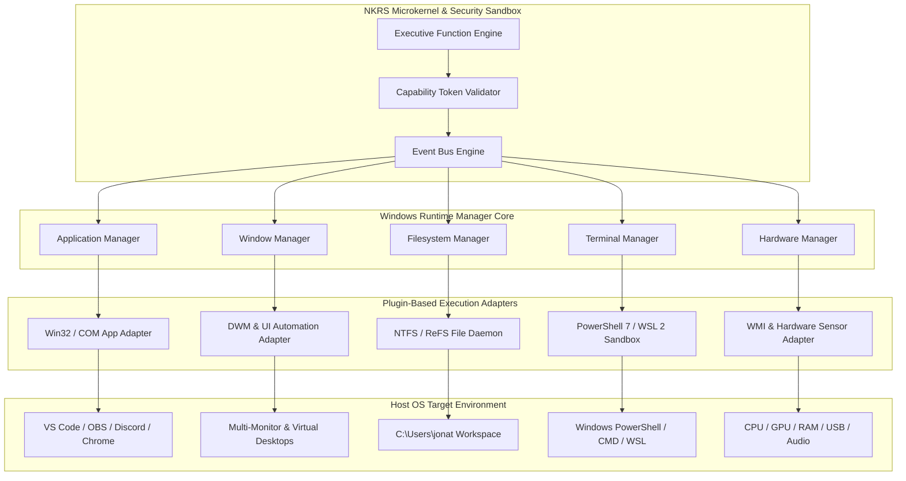

# NAINA OS — Windows Runtime & Desktop Control Framework
**Document Identifier:** NOS-DESKTOP-001  
**Title:** Windows Runtime & Desktop Control Framework Specification  
**Version:** 1.0  
**Status:** Approved Engineering Specification  
**Classification:** Open Source Systems Standard  
**Authors:** Chief Systems Architect, Windows Platform Leads & Systems Engineering Group  

---

## Document Revision History

| Date | Revision | Author | Description of Changes |
| :--- | :--- | :--- | :--- |
| **2026-07-31** | `1.0` | Chief Systems Architect | Initial Engineering Release of NOS-DESKTOP-001 Specification |
| **2026-07-29** | `0.9` | Windows Platform Group | Complete draft of Application Manager, Filesystem Runtime, and WAE Integration |

---

## SECTION 1: Windows Runtime Philosophy & Control Paradigm

### 1.1 Non-Direct AI Execution Mandate
The **Windows Runtime Framework** is the foundational subsystem executing all local OS interactions. Under NAINA OS architectural guidelines, **the Windows Runtime is strictly forbidden from directly communicating with AI models**.

All system instructions must flow strictly through the decoupled execution topology:

```
User Request (Voice / UI) 
   │
   ▼
🌙 NAINA Companion / Goal Planner
   │
   ▼
⚡ Executive Function Engine (EFE)
   │
   ▼
NKRS Event Bus Engine (EventBusEngine)
   │
   ▼
Windows Runtime Manager (Capability Token Check: CAP_EXECUTION)
   │
   ▼
Native Windows Win32 APIs / PowerShell 7 Sandbox / CUE
   │
   ▼
Host Desktop / Applications / Filesystem
```

---

## SECTION 2: System Architecture & Subsystem Topology

### 2.1 Subsystem Architecture Diagram



---

## SECTION 3: Application Runtime Subsystem

### 3.1 Software Discovery & Lifecycle Management
The **Application Manager** maintains real-time awareness of installed software:
- **Registry & AppX Scanning**: Scans `HKLM\SOFTWARE\Microsoft\Windows\CurrentVersion\Uninstall` and Windows AppX packages to construct the local App Directory.
- **Process Lifecycle Operations**:
  - `launch(app_id, flags)`: Spawns application process in isolated security context.
  - `close(app_id, graceful=True)`: Sends `WM_CLOSE` signal before terminating PID.
  - `suspend(app_id)` / `resume(app_id)`: Adjusts process thread priority and working set.
- **Foreground & Background Tracking**: Monitors active window focus and background service health.

---

## SECTION 4: Window Management Subsystem

The **Window Manager** interfaces with Win32 Desktop Window Manager (DWM) and Windows UI Automation:

```python
# Window Manager Interface (Python Specification)
from pydantic import BaseModel
from typing import List, Tuple, Optional

class WindowBounds(BaseModel):
    x: int
    y: int
    width: int
    height: int

class WindowInfo(BaseModel):
    hwnd: int
    pid: int
    title: str
    process_name: str
    bounds: WindowBounds
    is_active: bool
    is_minimized: bool

class IWindowManager:
    async def get_active_window(self) -> WindowInfo: ...
    async def list_windows(self) -> List[WindowInfo]: ...
    async def focus_window(self, hwnd: int) -> bool: ...
    async def snap_window(self, hwnd: int, quadrant: str) -> bool: ... # "left", "right", "top", "bottom"
    async def move_to_monitor(self, hwnd: int, monitor_index: int) -> bool: ...
```

---

## SECTION 5: Filesystem Runtime Subsystem

The **Filesystem Manager** provides safe, transactional local file operations:
- **Core Operations**: Read, Write, Copy, Move, Rename, Delete (Move to Recycle Bin), Restore.
- **Security & Compression**: AES-256 local file encryption, ZIP/7z compression, file versioning.
- **Duplicate Detection & Indexing**: Calculates SHA-256 hashes and updates vector database index.
- **File Watching Daemon**: Listens to Win32 `ReadDirectoryChangesW` events for real-time workspace updates.

---

## SECTION 6: Desktop Automation Engine

Integrates **OpenClaw Adapter**, **Playwright**, and Win32 UI Automation:
- **Accessibility APIs**: Ingests UI Automation element trees for fast button/field identification.
- **Mouse & Keyboard Planning**: Generates smooth Bezier curve mouse movements and natural keystroke timing.
- **Action Verification**: Confirms UI state changes using Qwen-VL screenshot comparison.

---

## SECTION 7: Terminal Runtime Engine

The **Terminal Manager** provides sandboxed command-line execution:

```
Command Input ──> Capability Check (CAP_EXECUTION) ──> Shell Router
                                                           ├──> PowerShell 7 (Default)
                                                           ├──> WSL 2 (Ubuntu Linux)
                                                           └──> CMD / Git Bash
                                                           │
Log Stream <── Air-Gapped Security Sandbox <───────────────┘
```

---

## SECTION 8 & 9: Developer & Creative Tool Integrations

- **Developer Toolstack**: Deep integrations for VS Code (extension status, active workspace), Visual Studio, Docker Desktop (container management), Git/GitHub Desktop, Node.js, Python, and Rust build pipelines.
- **Creative Software**: Plugin control adapters for OBS Studio (scene switching, recording state), Adobe CC, DaVinci Resolve, Blender, Unity, and Unreal Engine.

---

## SECTION 10: Hardware Runtime Subsystem

Monitors and controls workstation hardware via WMI and DirectX:
- **Telemetry Sensors**: CPU usage %, GPU VRAM consumption, RAM load, NVMe temperature.
- **Peripheral Management**: USB device insertion events, Bluetooth pairing, Wi-Fi connections, capture card streams, audio mic levels, and camera feeds.

---

## SECTION 11: Workspace Awareness Engine (WAE)

The **Workspace Awareness Engine (WAE)** synthesizes total desktop situational state:

```json
{
  "timestamp": "2026-07-31T22:21:00Z",
  "active_project": "NAINA_OS_Core",
  "vs_code": {
    "workspace": "C:\\naina-os",
    "active_file": "docs\\desktop\\NOS-DESKTOP-001-Windows-Runtime-and-Desktop-Control-Framework.md",
    "git_branch": "main"
  },
  "docker": {
    "active_containers": ["pgvector-db", "chromadb-vector"]
  },
  "browser": {
    "active_tab": "NAINA OS Specification Repo",
    "url": "https://github.com/nainaos/naina-os"
  },
  "obs": {
    "is_recording": false,
    "active_scene": "Developer Desktop"
  }
}
```

---

## SECTION 12: Event Model & Event Catalog

The Windows Runtime emits typed events to the **NKRS Event Bus**:

| Event Type | Payload | Trigger Condition |
| :--- | :--- | :--- |
| `ApplicationOpened` | `{ pid: 4102, app_name: "Code.exe" }` | Win32 process spawn detected |
| `ApplicationClosed` | `{ pid: 4102, exit_code: 0 }` | Process termination detected |
| `WindowFocused` | `{ hwnd: 0x001A04, title: "VS Code" }` | Active window focus shift |
| `FileCreated` | `{ path: "C:\\naina-os\\docs\\test.md" }` | `ReadDirectoryChangesW` notify |
| `FileDeleted` | `{ path: "C:\\naina-os\\temp.log" }` | File removed or moved to trash |
| `ClipboardChanged` | `{ format: "text", length: 142 }` | Clipboard content updated |
| `USBConnected` | `{ device_name: "Logitech WebCam" }` | WMI PnP device insertion |
| `DockerContainerStarted`| `{ container_id: "a10f9" }` | Docker daemon event stream |

---

## SECTION 13: Permissions & Security

- **Capability Security**: Requires `CAP_EXECUTION` for command execution and `CAP_FILE_DELETE` for deletion.
- **Air-Gapped Process Isolation**: Runs untrusted scripts inside ephemeral Docker containers or restricted Windows app sandboxes.

---

## SECTION 14 & 15: Performance Benchmarks & Testing Matrix

- **Performance SLA**:
  - Window Focus Switching: `< 35 ms`
  - File Watching Event Broadcast: `< 15 ms`
  - PowerShell Sandbox Command Dispatch: `< 50 ms`
  - Hardware Telemetry Sample Rate: `1 Hz`
- **Testing Suite**: Includes 100+ Pytest unit tests, DWM window automation tests, and stress testing under high CPU/memory load.

---

## SECTION 16: Future Roadmap

- **Windows AI APIs Integration**: Direct binding to Windows Copilot Runtime and DirectML NPU acceleration.
- **ROS2 Robotics Bridge**: Connecting Windows Runtime desktop commands to physical ROS2 robotic platforms.

---

## ARCHITECTURE DECISION RECORDS (ADRs)

### ADR-015: Desktop Duplication API (DXGI) for High-FPS Frame Capture
- **Status**: Approved.
- **Decision**: Standardize on DirectX DXGI Desktop Duplication API to achieve 15–30 FPS viewport frame capture with minimum CPU overhead.

### ADR-016: Asynchronous Event Bus Topology for Windows Events
- **Status**: Approved.
- **Decision**: All Win32 API callbacks publish asynchronously to the NKRS Event Bus to prevent main loop blocking.

### ADR-017: Air-Gapped PowerShell Execution Sandbox
- **Status**: Approved.
- **Decision**: All PowerShell script executions initiated by CENANI run within constrained language mode or isolated sandboxes with explicit capability verification.

---
*End of NOS-DESKTOP-001 — Windows Runtime & Desktop Control Framework Specification (v1.0)*
