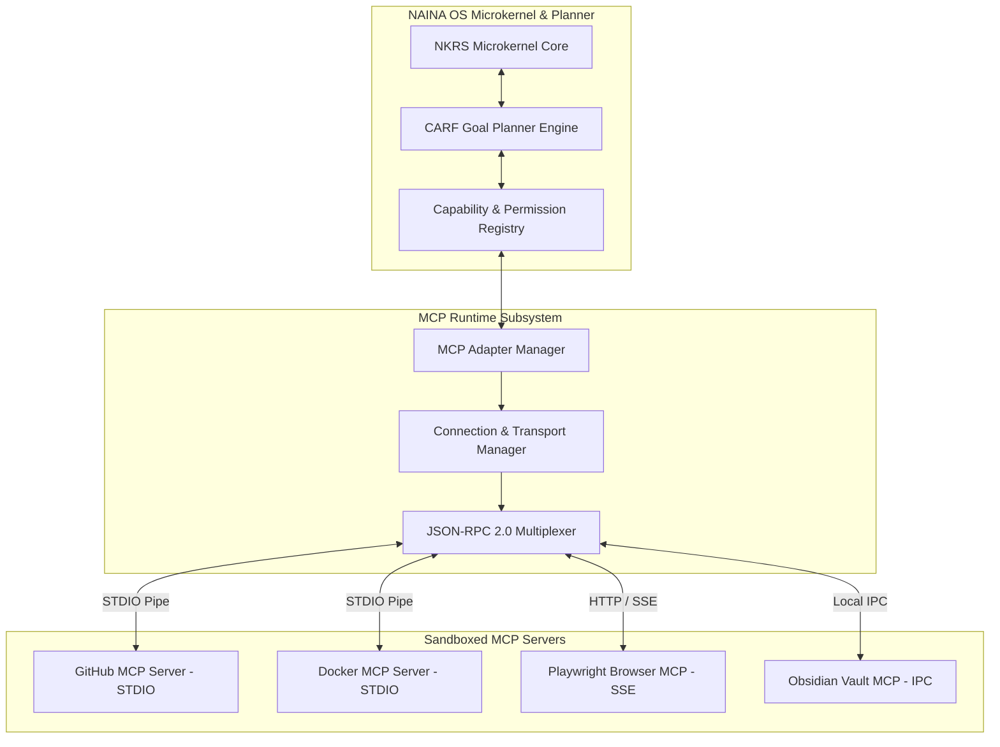

# NAINA OS — Model Context Protocol (MCP) Integration Framework
**Document Identifier:** NOS-MCP-001  
**Title:** Model Context Protocol (MCP) Integration Framework Specification  
**Version:** 1.0  
**Status:** Approved Engineering Specification  
**Classification:** Open Source Systems Standard  
**Authors:** Chief Systems Architect, MCP Integration Group & External Protocols Team  

---

## Document Revision History

| Date | Revision | Author | Description of Changes |
| :--- | :--- | :--- | :--- |
| **2026-08-07** | `1.0` | Chief Systems Architect | Initial Engineering Release of NOS-MCP-001 Specification |
| **2026-08-05** | `0.9` | MCP Integration Group | Complete draft of STDIO/SSE Transports, Capability Registry, and Developer SDK |

---

## SECTION 1: Introduction & Architecture Principles

### 1.1 Decoupled Tool Integration Mandate
The **Model Context Protocol (MCP) Integration Framework** defines how NAINA OS discovers, authenticates, communicates with, manages, and monitors external tool services via the standardized **Model Context Protocol (MCP)**.

Under strict NAINA OS architectural guidelines:
- **The Microkernel NEVER Communicates Directly with MCP Servers**: All MCP requests flow through:
  `User -> CARF Planner -> Capability Registry -> MCP Runtime -> MCP Adapter -> MCP Server -> External Service`.
- **Adapter Rule Enforcement**: Every MCP integration must plug into a typed `IMcpAdapter`. No direct vendor coupling is permitted within the core kernel.
- **Strict Capability Scoping**: Every MCP tool call requires cryptographically signed **Capability Tokens (CBAC)**.

```
User Action ──> Goal Planner ──> Capability Registry ──> MCP Runtime
                                                            │
[External Service] <── [MCP Server] <── [MCP Adapter] <─────┘
```

---

## SECTION 2: MCP Runtime Topology & Architecture



---

## SECTION 3 & 4: Discovery & Connection Management

### 3.1 Dynamic Server Discovery
The MCP Runtime scans `C:\naina-os\config\mcp_config.json` for server definitions and executes capability negotiation (`tools/list`, `resources/list`, `prompts/list`):

```json
{
  "mcpServers": {
    "github": {
      "command": "npx",
      "args": ["-y", "@modelcontextprotocol/server-github"],
      "env": {
        "GITHUB_PERSONAL_ACCESS_TOKEN": "secret:github_pat"
      },
      "capabilities": ["github_repo_read", "github_issue_create", "github_pr_review"]
    },
    "playwright": {
      "command": "python",
      "args": ["-m", "mcp_server_playwright"],
      "transport": "stdio",
      "capabilities": ["browser_navigate", "browser_screenshot", "browser_click"]
    }
  }
}
```

### 4.2 Transport Layer Specification
1. **STDIO Transport**: Child process standard input/output streams for local command-line MCP servers.
2. **HTTP + Server-Sent Events (SSE)**: Asynchronous HTTP transport for remote or containerized web MCP services.
3. **Heartbeat & Resiliency**: 5-second ping/pong heartbeats with exponential reconnect backoff up to 30s max.

---

## SECTION 5: Capability Registry & JSON-RPC 2.0 Payload

Standardized JSON-RPC 2.0 tool invocation payload format:

```json
{
  "jsonrpc": "2.0",
  "id": "req_88192a",
  "method": "tools/call",
  "params": {
    "name": "create_issue",
    "arguments": {
      "owner": "naina-os",
      "repo": "naina-kernel",
      "title": "Bug: Memory LEAK in event queue",
      "body": "Detailed diagnostic stack trace..."
    }
  }
}
```

---

## SECTION 6 & 7: Authentication & Security Sandboxing

- **Secrets Storage**: Sensitive API keys and OAuth tokens are stored in hardware-backed storage (**Windows Credential Manager** / **Android Keystore**) and injected at runtime.
- **Container Isolation**: Third-party MCP servers execute inside ephemeral Docker containers with `--read-only` root filesystems and eBPF socket restriction.

---

## SECTION 8 & 9: Built-in & Supported MCP Server Catalog

| MCP Category | Built-in Server | Capabilities Provided | Transport |
| :--- | :--- | :--- | :--- |
| **Developer Tools** | `server-github` | Repository management, PR review, Issue tracking | STDIO |
| **Containers** | `server-docker` | Container start/stop, volume inspect, log tailing | STDIO |
| **Knowledge Base** | `server-obsidian` | Obsidian note CRUD, Knowledge Graph search | Local IPC |
| **Browser Automation**| `server-playwright`| Web scraping, DOM interaction, vision snapshots | SSE |
| **Database** | `server-postgres` | SQL query execution, schema inspection, pgvector | STDIO |
| **Filesystem** | `server-filesystem`| Sandboxed file read/write, directory listing | STDIO |

---

## SECTION 10: Future MCP Expansion Roadmap
Upcoming MCP integrations: **Slack**, **Discord**, **Notion**, **Google Workspace**, **Microsoft 365**, **Jira**, **Linear**, **Figma**, **Home Assistant**, and **Robotics (ROS 2)**.

---

## SECTION 11 & 12: Developer SDK (`IMcpAdapter`)

```python
# NAINA OS MCP Adapter Specification (Python)
from abc import ABC, abstractmethod
from typing import Dict, Any, List

class IMcpAdapter(ABC):
    @abstractmethod
    async def initialize(self, config: Dict[str, Any]) -> bool:
        """Initialize connection transport to MCP server."""
        pass

    @abstractmethod
    async def list_tools(self) -> List[Dict[str, Any]]:
        """Advertise available tools to the CARF Capability Registry."""
        pass

    @abstractmethod
    async def invoke_tool(self, tool_name: str, arguments: Dict[str, Any]) -> Dict[str, Any]:
        """Execute a tool request with Capability Token validation."""
        pass
```

---

## ARCHITECTURE DECISION RECORDS (ADRs)

### ADR-045: Decoupled MCP Adapter Pattern for External Tool Integration
- **Status**: Approved.
- **Decision**: Mandate that all MCP integrations pass through typed `IMcpAdapter` implementations to keep the NKRS Microkernel 100% vendor-agnostic.

### ADR-046: Dual Transport Support (STDIO + SSE/WebSocket)
- **Status**: Approved.
- **Decision**: Support both STDIO child process streams and HTTP+SSE transports to enable seamless local and remote MCP server communication.

### ADR-047: Capability Token Scoping for MCP Invocation Gateways
- **Status**: Approved.
- **Decision**: Require cryptographically signed Capability Tokens (CBAC) before passing JSON-RPC tool calls to external MCP servers.

---
*End of NOS-MCP-001 — Model Context Protocol (MCP) Integration Framework Specification (v1.0)*
