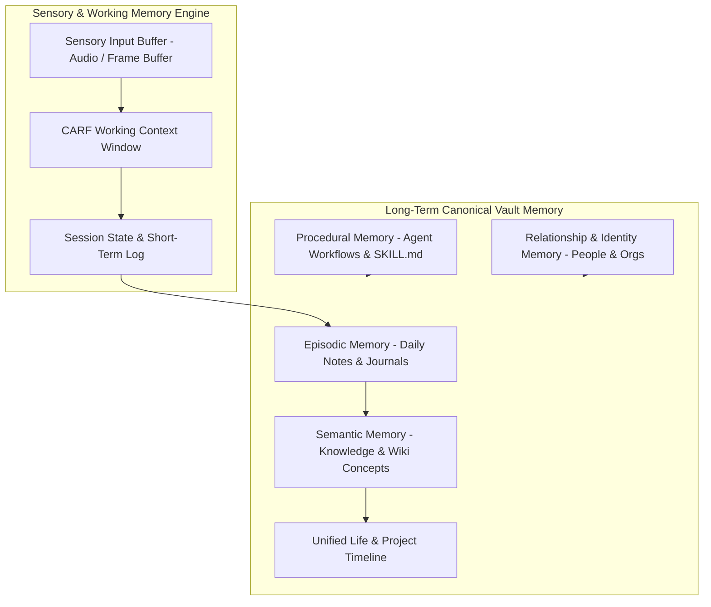

# NAINA OS — Obsidian Knowledge, Memory & Digital Brain Framework
**Document Identifier:** NOS-OBSIDIAN-001  
**Title:** Obsidian Knowledge, Memory & Digital Brain Framework Specification  
**Version:** 1.0  
**Status:** Approved Engineering Specification  
**Classification:** Open Source Systems Standard  
**Authors:** Chief Systems Architect, Memory Engine Team & Knowledge Graph Group  

---

## Document Revision History

| Date | Revision | Author | Description of Changes |
| :--- | :--- | :--- | :--- |
| **2026-08-07** | `1.0` | Chief Systems Architect | Initial Engineering Release of NOS-OBSIDIAN-001 Specification |
| **2026-08-05** | `0.9` | Memory Architecture Group | Complete draft of Obsidian Vault Structure, Hybrid Vector Search, and Identity Engine |

---

## SECTION 1: Knowledge Philosophy & Canonical Mandate

### 1.1 The Obsidian Canonical Storage Mandate
The **Obsidian Knowledge, Memory & Digital Brain Framework** establishes the core memory architecture of NAINA OS.

Under strict NAINA OS architectural guidelines:
- **Obsidian Markdown is the CANONICAL HUMAN KNOWLEDGE STORE**: Plaintext Markdown files inside the Obsidian Vault serve as the immutable single source of truth (SSOT).
- **Vector Database is ONLY an Acceleration Layer**: Databases such as `pgvector` or ChromaDB store cached embeddings to speed up semantic search. The vector index can be destroyed and rebuilt at any time directly from the Markdown vault.
- **100-Year Longevity & Portability**: Knowledge is stored in open, human-readable, vendor-agnostic Markdown with standard YAML frontmatter.

```
[Markdown Vault (SSOT)] ──> [Async Embedding Indexer] ──> [Vector DB Cache (pgvector)]
         ▲                                                            │
         └─────────────────── [Rebuild Embeddings Engine] <───────────┘
```

---

## SECTION 2: Memory Architecture & 12 Memory Domains



---

## SECTION 3: Obsidian Vault Architecture (00–99 Structure)

NAINA OS organizes knowledge using a standardized 20-folder Obsidian Vault structure:

```
C:\naina-os\vault\
├── 00 Dashboard/       # Master overview, system status, active goals
├── 01 Daily Notes/     # Automated daily logs (YYYY-MM-DD.md)
├── 02 Projects/        # Active software, business, & research projects
├── 03 People/          # Identity notes, contacts, relationships
├── 04 Knowledge/       # Evergreen zettelkasten & conceptual notes
├── 05 AI/              # System prompts, model configs, ARAL logs
├── 06 Development/     # Codebases, architecture specs, git notes
├── 07 College/         # Academic courses, research papers, notes
├── 08 Photography/     # EXIF catalogs, camera presets, shooting logs
├── 09 Business/        # Finance, marketing, sales, invoices
├── 10 Journal/         # Voice journals, personal reflections
├── 11 Meetings/        # Automated meeting transcriptions & action items
├── 12 Tasks/          # Global task backlog & Kanban state
├── 13 Research/       # Deep research papers, arXiv digests
├── 14 Media/          # Books, articles, videos, podcasts
├── 15 Automation/     # n8n workflows, automation scripts
├── 16 Robotics/       # ROS 2 nodes, hardware specs
├── 17 Archive/        # Completed projects & historical records
├── 98 Templates/      # Standardized note creation templates
└── 99 System/         # NAINA OS internal indexes & state JSONs
```

---

## SECTION 4 & 5: Knowledge Graph & Metadata Schema

### 5.1 Standardized YAML Frontmatter Specification

Every note managed by NAINA OS MUST comply with the standard frontmatter format:

```yaml
---
id: note_20260807_9918a
title: "Zero Trust Capability Architecture"
type: "concept"
created: 2026-08-07T23:54:00+05:30
updated: 2026-08-07T23:54:00+05:30
author: "NAINA System Agent"
tags:
  - "#security/zerotrust"
  - "#architecture/kernel"
aliases:
  - "CBAC Architecture"
  - "Capability Tokens"
related_projects:
  - "[[02 Projects/NAINA OS Core|NAINA OS Core]]"
related_people:
  - "[[03 People/Chief Systems Architect|Chief Systems Architect]]"
confidence_score: 0.98
source: "NOS-SECURITY-001 Specification"
---
```

---

## SECTION 6 & 7: Memory Retrieval Pipeline & Embeddings

```mermaid
graph TD
    UserQuery[User Voice Query: "How does security work?"] --> IntentParser[CARF Intent Parser]
    IntentParser --> HybridSearch[Hybrid Search Controller]
    
    subgraph HybridEngine [Hybrid Search Acceleration]
        HybridSearch --> VectorSearch[Vector Search (pgvector / Cosine Sim)]
        HybridSearch --> LexicalSearch[Lexical Search (BM25 Note Headers)]
        HybridSearch --> GraphTraversal[Knowledge Graph Traversal (Links)]
    end
    
    VectorSearch --> Ranker[Reciprocal Rank Fusion (RRF)]
    LexicalSearch --> Ranker
    GraphTraversal --> Ranker
    
    Ranker --> VaultFetcher[Fetch Markdown Source Notes]
    VaultFetcher --> ContextBuilder[Inject into ARAL Model Prompt]
```

### 7.1 Text Chunking & Embedding Standards
- **Embedding Model**: `nomic-embed-text-v1.5` (768 dimensions).
- **Chunking Strategy**: 512 tokens with 64-token sliding overlap.
- **Re-indexing Engine**: Background file watcher (`chokidar`) detects vault edits and updates `pgvector` cache asynchronously.

---

## SECTION 8 & 9: Vector Database & Timeline Subsystem

- **Vector Cache Role**: `pgvector` acts strictly as an accelerated read index. If the database crashes, a simple command (`naina memory rebuild`) rescans the Markdown vault and restores the vector cache.
- **Unified Timeline**: Connects daily notes, git commits, voice journals, and project milestones into a continuous temporal index.

---

## SECTION 10 & 11: Identity Engine & Automated Note Extraction

- **Identity Engine**: Tracks entities (people, organizations, devices) with dynamic relationship graphs and conversation history.
- **Automated Logging**: Silero VAD + Whisper TTS automatically transcribes audio conversations and creates structured markdown meeting summaries inside `11 Meetings/`.

---

## SECTION 12 & 13: Multi-Agent Shared Memory & Vault Security

- **Shared Multi-Agent Access**: Both 🌙 **NAINA** (Read/Write) and ⚡ **CENANI** (Read/Write) operate on the shared Markdown vault using file locks.
- **Encryption & Security**: Sensitive folders (`09 Business/`, `10 Journal/`) are encrypted at rest using AES-256-GCM.

---

## ARCHITECTURE DECISION RECORDS (ADRs)

### ADR-048: Obsidian Markdown Vault as Canonical Single Source of Truth
- **Status**: Approved.
- **Decision**: Plaintext Markdown files in the Obsidian Vault are the primary, immutable knowledge storage. Vector databases are strictly secondary read caches.

### ADR-049: Hybrid Search (pgvector HNSW + BM25 Lexical)
- **Status**: Approved.
- **Decision**: Combine vector similarity search with BM25 keyword matching and graph traversal via Reciprocal Rank Fusion (RRF) for optimal context retrieval.

### ADR-050: Automated Asynchronous Embedding Indexer Daemon
- **Status**: Approved.
- **Decision**: Run a lightweight background watcher service updating vector embeddings upon Markdown file mutation without blocking user interactions.

---
*End of NOS-OBSIDIAN-001 — Obsidian Knowledge, Memory & Digital Brain Framework Specification (v1.0)*
