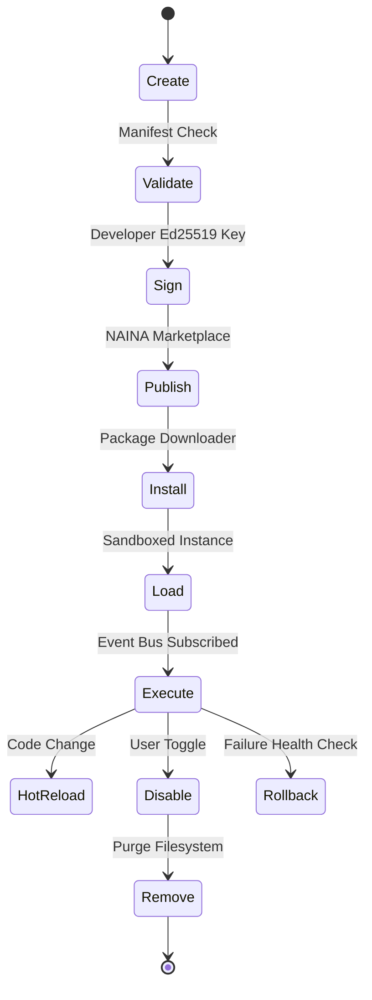

# NAINA OS — Plugin Runtime, Extension System & Marketplace Specification
**Document Identifier:** NOS-PLUGIN-001  
**Title:** Plugin Runtime, Extension System & Marketplace Specification  
**Version:** 1.0  
**Status:** Approved Engineering Specification  
**Classification:** Open Source Systems Standard  
**Authors:** Chief Systems Architect, Plugin Ecosystem Team & Marketplace Group  

---

## Document Revision History

| Date | Revision | Author | Description of Changes |
| :--- | :--- | :--- | :--- |
| **2026-08-07** | `1.0` | Chief Systems Architect | Initial Engineering Release of NOS-PLUGIN-001 Specification |
| **2026-08-05** | `0.9` | Marketplace Engineering | Complete draft of Plugin Manifest, Sandboxing, and Developer CLI Toolchain |

---

## SECTION 1: Plugin Philosophy & Design Principles

### 1.1 Plugin Ecosystem Mandate
The **Plugin Runtime, Extension System & Marketplace Specification** defines how third-party developers extend NAINA OS with new capabilities, integrations, and specialized UI modules.

Under strict NAINA OS architectural guidelines:
- **Plugins NEVER Communicate Directly with the Microkernel**: All plugin operations pass through the Plugin Runtime -> Event Bus -> SDK -> Capability Validation -> Microkernel.
- **Sandboxed by Default**: Every plugin runs inside a secure, resource-constrained isolation container with explicit capability grants.
- **Cryptographically Signed Archives**: Every plugin distributed via the NAINA Marketplace is signed using developer Ed25519 keys and verified against the Marketplace Certificate Authority (CA).

```
Kernel Core ──> Event Bus ──> Plugin Runtime ──> Plugin SDK ──> Sandboxed Plugin
```

---

## SECTION 2: Plugin Architecture Topology

```mermaid
graph TD
    subgraph CoreOS [Microkernel Core & Event Bus]
        Kernel[NKRS Microkernel Core]
        EventBus[Event Bus IPC System]
        CapEngine[Capability Token Engine (CBAC)]
    end

    subgraph RuntimeLayer [Plugin Runtime Subsystem]
        PluginLoader[Plugin Loader & Dependency Manager]
        PluginIPC[Plugin IPC Router & Gateway]
        HotReload[Hot-Reload & State Manager]
    end

    subgraph IsolationBox [Isolated Plugin Sandbox Containers]
        DockerSandbox[Docker Container / Win32 Job Object]
        PluginInstance[Third-Party Plugin (.naina-plugin)]
        SDKShim[NAINA Plugin SDK Adapter]
    end

    Kernel <--> EventBus
    EventBus <--> CapEngine
    CapEngine <--> PluginLoader
    PluginLoader --> PluginIPC
    PluginIPC <--> DockerSandbox
    DockerSandbox --> SDKShim
    SDKShim --> PluginInstance
```

---

## SECTION 3: Plugin Manifest Specification (`naina-plugin.yaml`)

Every plugin package MUST include a valid `naina-plugin.yaml` manifest:

```yaml
# NAINA OS Plugin Manifest Specification
id: org.nainaos.plugin.obs-studio
name: OBS Studio Automation Plugin
version: 1.2.0
author: NAINA Ecosystem Team
description: Automates OBS Studio scene switching, streaming controls, and source management.

naina_os_version: "^1.0.0"
runtime: python:3.11

dependencies:
  - id: org.nainaos.plugin.websocket-core
    version: ">=1.0.0"

permissions:
  - CAP_NETWORK_OUTBOUND: "ws://localhost:4455"
  - CAP_OBS_CONTROL: "scene_switch, start_stream"

events_subscribed:
  - "voice.command.obs"
  - "desktop.window.focused"

events_published:
  - "plugin.obs.scene_changed"

entry_point: src/plugin.py
digital_signature: "3045022100e481...b9020f"
```

---

## SECTION 4 & 5: Plugin Lifecycle & Runtime Engine

### 4.1 12-Stage Plugin Lifecycle



### 5.2 Hot-Reloading & Dynamic Injection
Plugins support live hot-reloading without restarting the host NAINA OS desktop application. The Plugin Runtime captures transient state, swaps binary modules, and re-subscribes to Event Bus topics in `< 150 ms`.

---

## SECTION 6 & 7: Permission System & Sandbox Framework

- **Capability-Based Access Control (CBAC)**: Plugins declare required capability tokens (`CAP_FILESYSTEM_READ`, `CAP_NETWORK_OUTBOUND`, `CAP_VOICE_LISTEN`). Missing tokens trigger an interactive permission prompt.
- **Resource Constraints (cgroups)**:
  - **Maximum Memory Limit**: `128 MB RAM` per plugin instance.
  - **CPU Allocation**: Capped at `15%` single-core execution time.
  - **Filesystem Isolation**: Ephemeral Docker `--read-only` root with isolated scratch directory (`/app/scratch/`).

---

## SECTION 8: NAINA Marketplace & Distribution

```
Developer Build ──> Static Code Audit ──> Crypto Signing ──> Marketplace Index
                                                                    │
Local Installation <── Automated Verification <── Client Download <─┘
```

1. **Automated Static Security Audit**: Scans code for hidden sockets, unverified file I/O, and obfuscated payloads using `semgrep` rulesets.
2. **Cryptographic Signature Verification**: Validates developer public keys against the trusted NAINA Root Certificate Authority.

---

## SECTION 9 & 10: Plugin SDK Integration & Developer Toolchain

### 9.1 Python Plugin Code Example

```python
# NAINA OS Plugin Implementation Example (Python)
from naina_sdk import BasePlugin, CapabilityToken, EventPayload

class OBSPlugin(BasePlugin):
    async def initialize(self) -> bool:
        self.register_handler("voice.command.obs", self.handle_voice_command)
        return True

    async def handle_voice_command(self, event: EventPayload) -> None:
        if "switch to scene" in event.data.get("transcript", ""):
            scene_name = event.data.get("scene_name", "Main")
            await self.call_obs_websocket("SetCurrentProgramScene", {"sceneName": scene_name})
```

### 10.2 Developer CLI Toolchain (`naina-cli`)
- `naina-cli plugin init my-plugin --template python`
- `naina-cli plugin pack ./my-plugin --key ./developer.key`
- `naina-cli plugin test ./my-plugin --offline`

---

## SECTION 11 & 12: Plugin Categories & Package Layout

- **14 Plugin Categories**: Voice, Vision, Automation, Desktop, Android, Browser, Memory, Research, Coding, Photography, Streaming (OBS), Robotics, IoT, Healthcare.
- **`.naina-plugin` Package Format**: Standardized ZIP archive containing `naina-plugin.yaml`, compiled bytecode, asset icons, and developer signatures.

---

## SECTION 13 & 14: Performance & Security Audits

- **Cold Load Performance SLA**: Plugins load into memory in `< 300 ms`.
- **Supply Chain Security**: Dependency lockfiles verified against vulnerability databases before installation.

---

## ARCHITECTURE DECISION RECORDS (ADRs)

### ADR-039: Cryptographically Signed `.naina-plugin` Archive Standard
- **Status**: Approved.
- **Decision**: Standardize on signed `.naina-plugin` archives containing manifest, bytecode, and SHA-256 signatures to prevent supply chain tampering.

### ADR-040: Air-Gapped Docker Sandboxing with eBPF Socket Filtering for Plugins
- **Status**: Approved.
- **Decision**: Enforce Docker `--read-only` root filesystems and eBPF socket filtering for all third-party plugins to block unauthorized network calls.

### ADR-041: Dynamic Hot-Swappable Plugin Runtime
- **Status**: Approved.
- **Decision**: Implement a hot-swappable module system allowing real-time plugin updates without host NAINA OS process restarts.

---
*End of NOS-PLUGIN-001 — Plugin Runtime, Extension System & Marketplace Specification (v1.0)*
