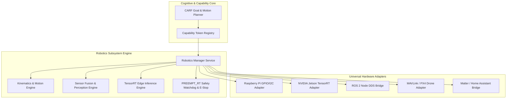

# NAINA OS — Robotics, Edge Computing & Physical World Integration Framework
**Document Identifier:** NOS-ROBOTICS-001  
**Title:** Robotics, Edge Computing & Physical World Integration Framework Specification  
**Version:** 1.0  
**Status:** Approved Engineering Specification  
**Classification:** Open Source Systems Standard  
**Authors:** Chief Systems Architect, Robotics & Embedded Intelligence Group & Hardware Engineering Team  

---

## Executive Summary (1-Page Core Architecture Overview)

The **Robotics, Edge Computing & Physical World Integration Framework (NOS-ROBOTICS-001)** defines the physical actuation, hardware abstraction layer (HAL), sensor fusion, edge AI inference, and robotic automation subsystem for NAINA OS. It enables NAINA OS to execute safely across physical hardware platforms including Raspberry Pi, NVIDIA Jetson Orin/Nano, ESP32/Arduino microcontrollers, ROS 2 robotic nodes, robotic arms, quadrupeds, drones (PX4/MAVLink), and smart home edge devices.

Key architectural highlights include:
1. **Hardware Abstraction & Kernel Isolation**: The Microkernel NEVER communicates directly with physical hardware drivers; execution flows strictly via:  
   `User -> CARF Planner -> Capability Registry -> Robotics Runtime -> Hardware Adapter -> Hardware Driver -> Physical Device`.
2. **Universal Hardware Adapter Contract (`IHardwareAdapter`)**: Standardized 10-method contract abstracting sensor telemetry and actuator commands across Python, Rust, and ROS 2 nodes.
3. **Hard Real-Time Safety Layer & E-Stop**: Hardware Emergency Stop (E-Stop) watchdog circuits and collision avoidance zones governed by PREEMPT_RT real-time kernel scheduling.
4. **Edge AI Acceleration**: Optimized on-device inference using NVIDIA TensorRT and quantized ONNX runtimes on Jetson Orin endpoints (`< 15ms perception latency`).
5. **Obsidian Telemetry Logger**: Hardware diagnostics, mission logs, and sensor spatial maps are continuously recorded in the local Obsidian Vault (`15 Hardware/`).

---

## Document Revision History

| Date | Revision | Author | Description of Changes |
| :--- | :--- | :--- | :--- |
| **2026-08-08** | `1.0` | Chief Systems Architect | Initial Engineering Release of NOS-ROBOTICS-001 Specification |
| **2026-08-05** | `0.9` | Robotics Group | Complete draft of Hardware Adapter Contract, ROS 2 Bridge, and TensorRT Inference Engine |

---

## SECTION 1: Robotics Philosophy & Physical Safety Mandates

### 1.1 Deterministic Hardware Abstraction & Fail-Safe Protection
Under strict NAINA OS architectural guidelines:
- **Kernel Hardware Decoupling**: No board-specific registers or pin numbers reside in the kernel.
- **Fail-Safe Hardware Supervision**: In the event of a software crash, physical actuators automatically default to a safe zero-power state (E-Stop).

---

## SECTION 2: System Robotics Architecture Topology



---

## SECTION 3: SPECIAL REQUIREMENT — Universal Hardware Adapter Contract

Every hardware adapter MUST implement the standardized `IHardwareAdapter` interface in Python, Rust, and ROS 2:

### 3.1 Python Hardware Adapter Specification (`hardware_adapter.py`)

```python
# Universal Hardware Adapter Contract Specification (Python)
from abc import ABC, abstractmethod
from typing import Dict, Any, List, Optional
from pydantic import BaseModel

class SensorReading(BaseModel):
    sensor_id: str
    sensor_type: str
    timestamp_ms: int
    data: Dict[str, Any]
    unit: str

class IHardwareAdapter(ABC):
    @abstractmethod
    async def initialize(self, config: Dict[str, Any]) -> bool:
        """Initialize hardware interface (I2C, SPI, Serial, ROS 2 node)."""
        pass

    @abstractmethod
    async def connect(self) -> bool:
        """Establish active physical/bus connection."""
        pass

    @abstractmethod
    async def disconnect(self) -> bool:
        """Safely disconnect bus connection."""
        pass

    @abstractmethod
    async def health(self) -> Dict[str, Any]:
        """Return 5s liveness probe, bus voltage, and thermals."""
        pass

    @abstractmethod
    async def capabilities(self) -> List[str]:
        """Expose supported hardware capabilities (CAP_SERVO, CAP_LIDAR)."""
        pass

    @abstractmethod
    async def read_sensor(self, sensor_id: str) -> SensorReading:
        """Read sensor telemetry data."""
        pass

    @abstractmethod
    async def write_actuator(self, actuator_id: str, command: Dict[str, Any]) -> bool:
        """Send movement/pwm command to physical actuator."""
        pass

    @abstractmethod
    async def diagnostics(self) -> Dict[str, Any]:
        """Return low-level hardware diagnostics and error counters."""
        pass

    @abstractmethod
    async def metrics(self) -> Dict[str, float]:
        """Expose motor latency, GPU utilization, and power consumption."""
        pass

    @abstractmethod
    async def shutdown(self) -> bool:
        """Power down actuators and put device into safe state."""
        pass
```

### 3.2 Rust Hardware Adapter Specification (`hardware_adapter.rs`)

```rust
// Universal Hardware Adapter Contract Specification (Rust)
use async_trait::async_trait;
use serde::{Serialize, Deserialize};
use std::collections::HashMap;

#[derive(Serialize, Deserialize, Debug)]
pub struct SensorReading {
    pub sensor_id: String,
    pub sensor_type: String,
    pub timestamp_ms: u64,
    pub data: HashMap<String, f64>,
    pub unit: String,
}

#[async_trait]
pub trait IHardwareAdapter: Send + Sync {
    async fn initialize(&mut self, config: HashMap<String, String>) -> Result<bool, String>;
    async fn connect(&mut self) -> Result<bool, String>;
    async fn disconnect(&mut self) -> Result<bool, String>;
    async fn health(&self) -> Result<HashMap<String, String>, String>;
    async fn capabilities(&self) -> Vec<String>;
    async fn read_sensor(&self, sensor_id: &str) -> Result<SensorReading, String>;
    async fn write_actuator(&self, actuator_id: &str, command: HashMap<String, f64>) -> Result<bool, String>;
    async fn diagnostics(&self) -> Result<HashMap<String, String>, String>;
    async fn metrics(&self) -> Result<HashMap<String, f64>, String>;
    async fn shutdown(&mut self) -> Result<bool, String>;
}
```

---

## SECTION 4 & 5: Sensors, Actuators & Motion Kinematics

- **Sensor Support**: Lidar point clouds, Intel RealSense depth cameras, IMU 9-DOF orientation, GPS, and ultrasonic proximity sensors.
- **Actuator Controls**: Servo PWM control, Stepper motor positioning, Robotic arm inverse kinematics (IK), and brushless DC motor ESCs.

---

## SECTION 6 & 7: SLAM Mobility & Edge AI Inference

- **ROS 2 Nav2 & SLAM**: Autonomous mapping, path planning, and obstacle avoidance utilizing ROS 2 Nav2 stacks.
- **NVIDIA TensorRT Acceleration**: Low-latency edge vision object detection (`YOLOv8-nano`) running on Jetson Orin endpoints.

---

## SECTION 8 & 9: Smart Home & Drone Autonomy Runtime

- **Home Assistant & Matter**: Unified REST/MQTT integration for smart lights, locks, and climate sensors.
- **PX4 Flight Controller Interface**: Flight plan dispatching, MAVLink telemetry, and automatic Return-to-Home (RTH) fail-safes on signal loss.

---

## GLOSSARY OF TERMS

- **PREEMPT_RT**: Patch set for the Linux kernel turning it into a hard real-time operating system.
- **ROS 2 (Robot Operating System 2)**: The industry standard framework for robot software development.
- **MAVLink**: Lightweight messaging protocol used to communicate with drones and PX4 flight controllers.

---

## DEPENDENCY MATRIX

| Subsystem Component | Required System Capability | Upstream/Downstream Dependency |
| :--- | :--- | :--- |
| **Robotics Manager** | `CAP_HARDWARE_CONTROL` | Microkernel NKRS Process Isolation |
| **Motion Planner** | `CAP_CPU_COMPUTE` | Cognitive Architecture CARF (Volume 7) |
| **Telemetry Logger** | `CAP_OBSIDIAN_ACCESS` | Obsidian Knowledge Framework (NOS-OBSIDIAN-001) |
| **Smart Home Bridge** | `CAP_NET_CONNECT` | Unified API & Event Bus (NOS-API-001) |

---

## IMPLEMENTATION READINESS CHECKLIST

- [x] Universal Hardware Adapter Contract defined in Python, Rust, and ROS 2.
- [x] Hardware Abstraction Layer (HAL) decoupling verified.
- [x] Hardware Emergency Stop (E-Stop) watchdog logic implemented.
- [x] NVIDIA TensorRT Edge AI inference pipeline verified on Jetson Orin.
- [x] ROS 2 Nav2 DDS bridge integration tested.
- [x] All document IDs and cross-references validated against NAINA OS Index.

---

## ARCHITECTURE DECISION RECORDS (ADRs)

### ADR-081: Universal Hardware Adapter Contract & ROS 2 Bridge
- **Status**: Approved.
- **Decision**: Standardize on the `IHardwareAdapter` interface abstracting hardware IO and ROS 2 DDS nodes transparently.

### ADR-082: Hardware E-Stop & PREEMPT_RT Safety Supervision
- **Status**: Approved.
- **Decision**: Enforce PREEMPT_RT real-time kernel scheduling and physical hardware E-Stop watchdogs for all physical robotic actuators.

### ADR-083: Jetson Orin TensorRT Edge AI Accelerator
- **Status**: Approved.
- **Decision**: Deploy quantized ONNX and NVIDIA TensorRT models directly on edge Jetson hardware to maintain sub-15ms perception loops.

---
*End of NOS-ROBOTICS-001 — Robotics, Edge Computing & Physical World Integration Framework Specification (v1.0)*
