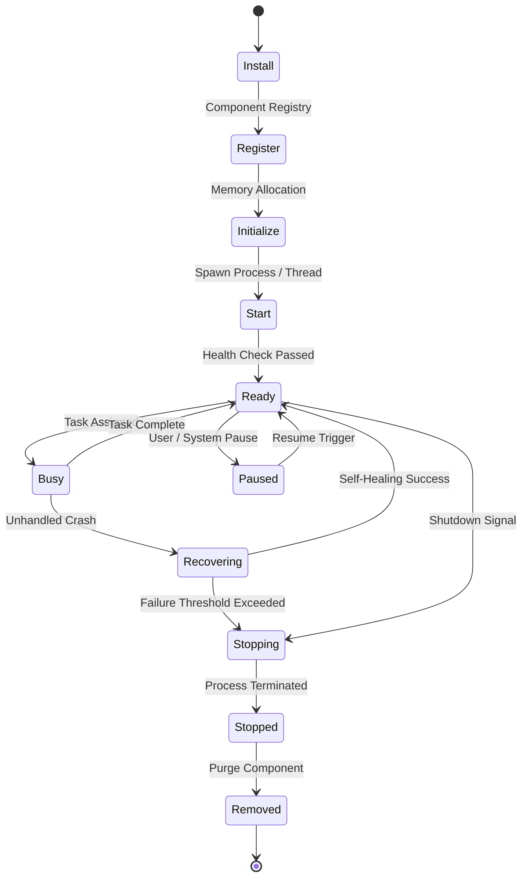

# NAINA OS — Unified Runtime Services & Execution Framework
**Document Identifier:** NOS-RUNTIME-001  
**Title:** Unified Runtime Services & Execution Framework Specification  
**Version:** 1.0  
**Status:** Approved Engineering Specification  
**Classification:** Open Source Systems Standard  
**Authors:** Chief Systems Architect, Runtime Engineering Group & Subsystem Operations Team  

---

## Document Revision History

| Date | Revision | Author | Description of Changes |
| :--- | :--- | :--- | :--- |
| **2026-08-08** | `1.0` | Chief Systems Architect | Initial Engineering Release of NOS-RUNTIME-001 Specification |
| **2026-08-05** | `0.9` | Runtime Operations Group | Complete draft of Universal Component Contract, Task Scheduler, and Self-Healing Engine |

---

## SECTION 1: Runtime Philosophy & Architecture Principles

### 1.1 Kernel vs. Runtime Separation of Concerns
The **Unified Runtime Services & Execution Framework** defines the unified execution engine managing all active workloads across NAINA OS.

Under strict NAINA OS architectural guidelines:
- **The Runtime is NOT the Microkernel**: The Microkernel (`NKRS`) owns system state, hardware access, and security capabilities. The **Runtime Subsystem** manages and executes all active workloads.
- **Universal Component Lifecycle**: Every executable entity (Agents, Plugins, Models, Workflows, Background Services) implements a standardized **Universal Runtime Contract**.
- **Work-Stealing Async Task Scheduler**: Tasks are scheduled across high-performance worker pools with strict SLA latency guarantees.

```
Kernel Core (NKRS) ──> Runtime Manager ──> Core Services (Log/Metrics/Health/Security)
                                                    │
[Isolated Tools] <── [Plugin Runtime] <── [Agent Runtime] <── [Workflow Runtime]
```

---

## SECTION 2: System Runtime Architecture Topology

```mermaid
graph TD
    subgraph NKRSKernel [Microkernel Core & Security Base]
        Microkernel[NKRS Microkernel Core]
        CapEngine[Capability Token Engine (CBAC)]
    end

    subgraph RuntimeManager [Unified Runtime Subsystem Manager]
        RTManager[Runtime Manager Engine]
        ServiceMgr[Service Manager & Registry]
        Scheduler[Work-Stealing Task Scheduler]
    end

    subgraph SubsystemRuntimes [Specialized Workload Runtimes]
        AgentRT[Agent Runtime - Python / Rust]
        PluginRT[Plugin Runtime - Docker Sandbox]
        WorkflowRT[Workflow Runtime - WDL Engine]
        ModelRT[Model Runtime - ARAL Adapter Pool]
    end

    Microkernel <--> CapEngine
    CapEngine <--> RTManager
    RTManager --> ServiceMgr
    ServiceMgr --> Scheduler
    Scheduler --> AgentRT
    Scheduler --> PluginRT
    Scheduler --> WorkflowRT
    Scheduler --> ModelRT
```

---

## SECTION 3: Complete 11-State Runtime Component Lifecycle



---

## SECTION 4: 11 Core Unified Runtime Services

1. **Configuration Service**: Merges runtime config hierarchy (`naina.config.yaml`).
2. **Logging Service**: High-throughput structured JSON log stream with log rotation.
3. **Metrics Service**: Prometheus-compatible metric exporter (`/metrics`).
4. **Health Service**: Periodic 5s liveness and readiness probes.
5. **Monitoring Service**: Process PID and thread telemetry tracker.
6. **Permission Service**: Capability token validation gateway.
7. **Notification Service**: Centralized user toast and mobile push notification router.
8. **Identity Service**: Cryptographic identity verification.
9. **Recovery Service**: Automated crash detection and state restorer.
10. **Scheduler Engine**: Work-stealing async priority task queue.
11. **Dependency Manager**: Directed Acyclic Graph (DAG) dependency resolver.

---

## SECTION 5 & 6: Execution Engine & Resource Quotas

- **Task Dispatch SLA**: Task queuing and worker thread dispatch latency `< 1.2 ms`.
- **Resource Constraints (cgroups & Job Objects)**:
  - **Single Component RAM Cap**: Maximum `256 MB RAM` (Default for Plugins/Agents).
  - **VRAM Allocation Quotas**: PagedAttention memory scheduler managed via ARAL.
  - **Battery & Power Awareness**: Automatically throttles background worker pools to 25% CPU when on mobile battery power.

---

## SECTION 7: SPECIAL REQUIREMENT — Universal Runtime Contract

Every executable component running under NAINA OS MUST implement the standardized **Universal Runtime Contract**:

```python
# Universal Component Runtime Contract Specification (Python)
from abc import ABC, abstractmethod
from typing import Dict, Any, List
from enum import Enum

class ComponentStatus(Enum):
    UNINITIALIZED = "uninitialized"
    READY = "ready"
    BUSY = "busy"
    PAUSED = "paused"
    RECOVERING = "recovering"
    FAILED = "failed"

class IRuntimeComponent(ABC):
    @abstractmethod
    async def initialize(self, config: Dict[str, Any]) -> bool:
        """Allocate resources and initialize component context."""
        pass

    @abstractmethod
    async def health(self) -> Dict[str, Any]:
        """Return 5s liveness check, status, and memory metrics."""
        pass

    @abstractmethod
    async def metrics(self) -> Dict[str, float]:
        """Expose Prometheus-formatted execution metrics."""
        pass

    @abstractmethod
    async def execute(self, payload: Dict[str, Any]) -> Dict[str, Any]:
        """Primary workload execution entrypoint."""
        pass

    @abstractmethod
    async def pause(self) -> bool:
        """Temporarily suspend component processing."""
        pass

    @abstractmethod
    async def resume(self) -> bool:
        """Resume component from paused state."""
        pass

    @abstractmethod
    async def recover(self, error: Exception) -> bool:
        """Trigger component self-healing procedure."""
        pass

    @abstractmethod
    async def shutdown(self) -> bool:
        """Gracefully release resources and stop process."""
        pass

    @abstractmethod
    def status(self) -> ComponentStatus:
        """Return current status enum."""
        pass

    @abstractmethod
    def capabilities(self) -> List[str]:
        """Return list of provided system capabilities."""
        pass

    @abstractmethod
    def permissions(self) -> List[str]:
        """Return list of required CBAC capability tokens."""
        pass

    @abstractmethod
    def dependencies(self) -> List[str]:
        """Return required component dependency identifiers."""
        pass
```

---

## SECTION 8 & 9: Telemetry & Crash Recovery Procedures

- **Crash Detection & Self-Healing**:
  - **Level 1 (Transient Failure)**: Automatic step retry with backoff.
  - **Level 2 (Process Crash)**: Automatic worker process restart and state restoration.
  - **Level 3 (Unrecoverable Error)**: Isolate component, log diagnostic crash dump, notify user.

```
Subsystem Process Crash ──> Detect Health Timeout ──> Restart Process Container
                                                            │
User Alert & Safe Mode <── Log Diagnostic Dump <──── State Restored
```

---

## ARCHITECTURE DECISION RECORDS (ADRs)

### ADR-057: Universal Executable Component Runtime Contract
- **Status**: Approved.
- **Decision**: Enforce the 12-method `IRuntimeComponent` contract across all Agents, Plugins, Models, Services, and Workflows to guarantee unified lifecycle management.

### ADR-058: Async Priority Task Dispatcher with Work-Stealing Pool
- **Status**: Approved.
- **Decision**: Implement a high-concurrency Rust-backed work-stealing task dispatcher delivering task queuing latency `< 1.2 ms`.

### ADR-059: Automated Self-Healing Subsystem Recovery Engine
- **Status**: Approved.
- **Decision**: Implement a 3-tier automated recovery engine capable of restarting crashed worker processes and restoring execution state without restarting the host OS.

---
*End of NOS-RUNTIME-001 — Unified Runtime Services & Execution Framework Specification (v1.0)*
