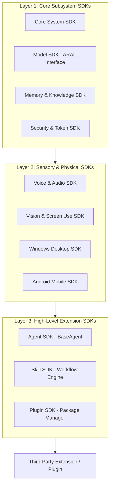
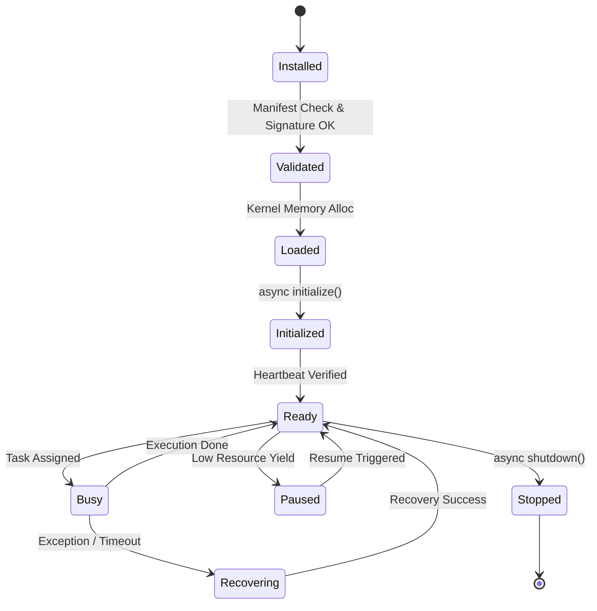

# NAINA OS — Agent SDK & Developer Platform Specification
**Document Identifier:** NOS-SDK-001  
**Title:** Agent SDK & Developer Platform Architecture Specification  
**Version:** 1.0  
**Status:** Approved Engineering Specification  
**Classification:** Open Source Systems Standard  
**Authors:** Chief Systems Architect, Developer Relations & SDK Engineering Group  

---

## Document Revision History

| Date | Revision | Author | Description of Changes |
| :--- | :--- | :--- | :--- |
| **2026-07-31** | `1.0` | Chief Systems Architect | Initial Engineering Release of NOS-SDK-001 Specification |
| **2026-07-30** | `0.9` | Developer SDK Team | Complete draft of BaseAgent Interfaces, Plugin Manifest, CLI, and Code Examples |

---

## SECTION 1: SDK Philosophy & Design Principles

### 1.1 Universal Extension Mandate
The **NAINA OS SDK (NOS SDK)** is the official, stable extension interface for third-party developers, agents, skills, and system plugins.

Under strict NAINA OS architectural guidelines:
- **The SDK is the ONLY supported extension point**.
- **Agents NEVER communicate directly** with one another; all events and messages pass through `Kernel -> Event Bus -> SDK -> Runtime -> Agent`.
- **Zero Undocumented APIs**: Every subsystem feature exposed to external developers must have explicit TypeScript, Python, and Rust SDK bindings with automated documentation coverage.

```
Third-Party Developer Extension (Agent / Plugin / Skill / Adapter)
                               │
                               ▼
                        NAINA SDK Suite
                               │
        ┌──────────────────────┼──────────────────────┐
        ▼                      ▼                      ▼
  Python SDK (3.11+)   TypeScript SDK (Node/Web)  Rust SDK (v1.75+)
        │                      │                      │
        └──────────────────────┼──────────────────────┘
                               │ (gRPC / Unix Domain Socket / IPC)
                               ▼
               NKRS Microkernel Core & Event Bus
```

---

## SECTION 2: System SDK Architecture & Layer Topology



---

## SECTION 3: Base Agent Interface (Multi-Language)

### 3.1 Python `BaseAgent` Contract

```python
# NAINA OS BaseAgent Interface (Python 3.11+ SDK)
from abc import ABC, abstractmethod
from typing import Dict, Any, List
from pydantic import BaseModel

class AgentHealth(BaseModel):
    is_healthy: bool
    memory_usage_mb: float
    cpu_percent: float
    error_count: int

class BaseAgent(ABC):
    def __init__(self, agent_id: str, capability_token: str, config: Dict[str, Any]):
        self.agent_id = agent_id
        self.capability_token = capability_token
        self.config = config

    @abstractmethod
    async def initialize(self) -> bool: ...

    @abstractmethod
    async def execute(self, task_payload: Dict[str, Any]) -> Dict[str, Any]: ...

    @abstractmethod
    async def pause(self) -> bool: ...

    @abstractmethod
    async def resume(self) -> bool: ...

    @abstractmethod
    async def shutdown(self) -> bool: ...

    @abstractmethod
    async def health(self) -> AgentHealth: ...
```

### 3.2 TypeScript `IBaseAgent` Contract

```typescript
// NAINA OS BaseAgent Interface (TypeScript SDK)
export interface AgentHealth {
  isHealthy: boolean;
  memoryUsageMb: number;
  cpuPercent: number;
  errorCount: number;
}

export abstract class BaseAgent {
  constructor(
    public readonly agentId: string,
    public readonly capabilityToken: string,
    public readonly config: Record<string, unknown>
  ) {}

  abstract initialize(): Promise<boolean>;
  abstract execute(taskPayload: Record<string, unknown>): Promise<Record<string, unknown>>;
  abstract pause(): Promise<boolean>;
  abstract resume(): Promise<boolean>;
  abstract shutdown(): Promise<boolean>;
  abstract health(): Promise<AgentHealth>;
}
```

---

## SECTION 4: Agent Lifecycle State Machine



---

## SECTION 5: Skill SDK & Manifest Specification

Skills tie domain agents and tools into structured, multi-step workflows:

```yaml
# Skill Manifest Schema (skill.manifest.yaml)
id: "skill.code_refactor_pipeline"
name: "Code Refactor & PR Pipeline"
version: "1.0.0"
description: "Scans repository for linter errors, refactors code, runs unit tests, and creates GitHub PR."
author: "Jonathan <jonathan@nainaos.org>"
permissions:
  - "CAP_FILE_READ"
  - "CAP_FILE_WRITE"
  - "CAP_GITHUB"
required_agents:
  - "agent.coder"
  - "agent.linter"
  - "agent.git"
execution_graph:
  step_1: "scan_linter_errors"
  step_2: "apply_ai_refactor"
  step_3: "run_pytest_suite"
  step_4: "push_git_branch_and_pr"
timeout_seconds: 120
retries: 2
```

---

## SECTION 6: Plugin SDK & Packaging Standard

Every NAINA OS extension is packaged as a `.naina-plugin` bundle:

```
my-extension.naina-plugin/
├── plugin.manifest.yaml   # Required manifest & capability token claims
├── main.py                # Main entrypoint implementing BaseAgent or Plugin
├── config.json            # Default configuration options
├── assets/                # Icons, diagrams, and visual badges
├── tests/                 # Pytest / Vitest test suite
└── docs/                  # Auto-generated API documentation
```

---

## SECTION 7: Model SDK (ARAL Adapter Standard)

```python
# ARAL Unified Model Adapter Interface (Python SDK)
from abc import ABC, abstractmethod
from typing import AsyncGenerator, Dict, Any, List

class IModelAdapter(ABC):
    @abstractmethod
    async def chat(self, prompt: str, system_prompt: str = "") -> str: ...

    @abstractmethod
    async def stream(self, prompt: str) -> AsyncGenerator[str, None]: ...

    @abstractmethod
    async def embed(self, text: str) -> List[float]: ...

    @abstractmethod
    async def vision(self, image_bytes: bytes, prompt: str) -> str: ...
```

---

## SECTION 8 through 10: Memory, Voice & Vision SDKs

- **Memory SDK**: `MemorySDK.search()`, `.store()`, `.add_relationship()`, `.sync_obsidian()`.
- **Voice SDK**: `VoiceSDK.say()`, `.listen()`, `.stream_audio()`, `.interrupt()`.
- **Vision SDK**: `VisionSDK.capture_viewport()`, `.detect_ui_bounds()`, `.extract_ocr()`.

---

## SECTION 11: Capability Registry

Third-party extensions declare capabilities in their manifest. The Kernel routes tasks based on capabilities:

```
CAP_CONVERSATION | CAP_REASONING | CAP_PLANNING | CAP_VISION
CAP_SPEECH       | CAP_EMBEDDINGS| CAP_OCR      | CAP_DESKTOP
CAP_ANDROID      | CAP_CODING    | CAP_MEMORY   | CAP_AUTOMATION
```

---

## SECTION 12: Developer CLI (`naina-cli`)

The official command-line tool for developers:
- `naina generate agent --name "MyAgent"`: Scaffolds a new agent directory.
- `naina generate plugin --name "MyPlugin"`: Scaffolds a new plugin structure.
- `naina test`: Executes unit, integration, and security static audits.
- `naina package`: Compiles and packages extension into `.naina-plugin`.
- `naina publish`: Uploads signed package to NAINA Extension Marketplace.

---

## SECTION 13 & 14: Extension Marketplace & Testing

- **Security Verification**: Automated static code audit, capability token validation, and sandboxed Pytest execution before publishing.
- **Testing Framework**: Includes built-in mocks for Microkernel Event Bus, Memory Core, and Vision Subsystem.

---

## SECTION 15: Versioning & Migration Policy

- **Semantic Versioning**: Adheres strictly to SemVer 2.0.0 (`MAJOR.MINOR.PATCH`).
- **Deprecation Policy**: Obsolete SDK methods are marked deprecated for a minimum of 2 major release cycles prior to removal.

---

## SECTION 16: COMPLETE CODE EXAMPLES FOR DEVELOPERS

### 1. Creating a Custom Agent (Python)

```python
from org.nainaos.sdk import BaseAgent, AgentHealth
from typing import Dict, Any

class CustomDroneAgent(BaseAgent):
    async def initialize(self) -> bool:
        print(f"Initializing Drone Agent: {self.agent_id}")
        return True

    async def execute(self, payload: Dict[str, Any]) -> Dict[str, Any]:
        action = payload.get("action")
        return {"status": "SUCCESS", "result": f"Executed drone action: {action}"}

    async def pause(self) -> bool: return True
    async def resume(self) -> bool: return True
    async def shutdown(self) -> bool: return True
    async def health(self) -> AgentHealth:
        return AgentHealth(is_healthy=True, memory_usage_mb=12.4, cpu_percent=1.2, error_count=0)
```

---

## ARCHITECTURE DECISION RECORDS (ADRs)

### ADR-021: Multi-Language FFI Abstraction Layer via gRPC & IPC Sockets
- **Status**: Approved.
- **Decision**: Standardize on high-performance gRPC and Unix Domain / Windows Named Pipe IPC sockets for SDK bindings across Python, TypeScript, and Rust.

### ADR-022: Strict Capability Token Claims in Plugin Manifests
- **Status**: Approved.
- **Decision**: Plugins must explicitly declare required system capability claims in `plugin.manifest.yaml` during packaging. Unauthorized tool execution raises a Kernel security fault.

### ADR-023: Automated OpenAPI & TypeDoc Generation Engine
- **Status**: Approved.
- **Decision**: Automatically generate interactive OpenAPI specs and TypeDoc developer documentation during `naina package` build steps.

---
*End of NOS-SDK-001 — Agent SDK & Developer Platform Specification (v1.0)*
