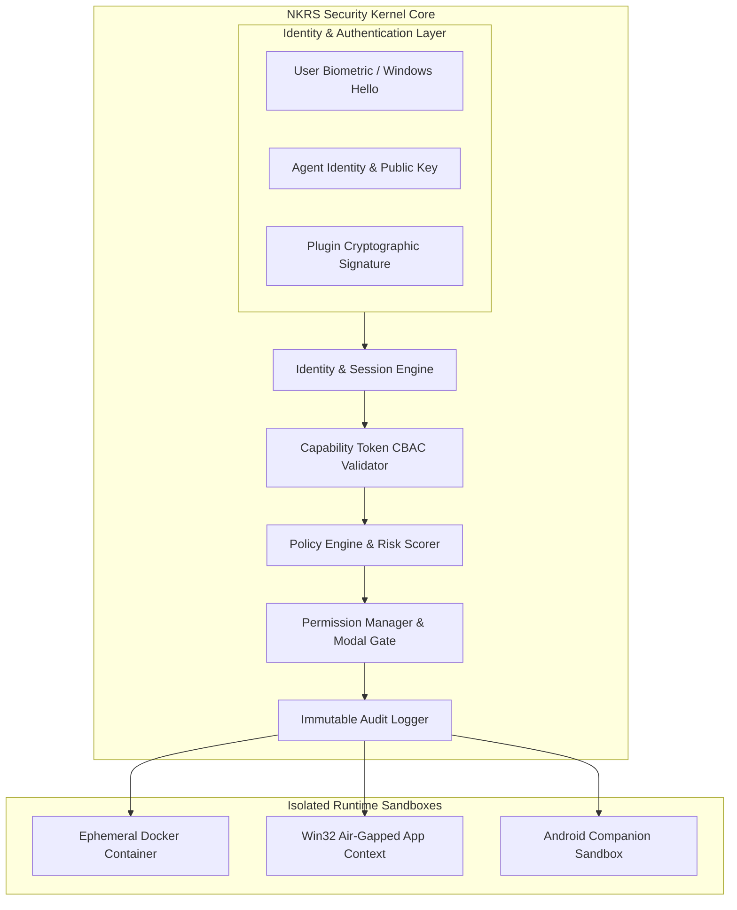

# NAINA OS — Zero Trust Security & Capability Framework
**Document Identifier:** NOS-SECURITY-001  
**Title:** Zero Trust Security & Capability Framework Architecture Specification  
**Version:** 1.0  
**Status:** Approved Engineering Specification  
**Classification:** Open Source Systems Standard  
**Authors:** Chief Systems Architect, Security Steering Committee & Cybersecurity Group  

---

## Document Revision History

| Date | Revision | Author | Description of Changes |
| :--- | :--- | :--- | :--- |
| **2026-07-31** | `1.0` | Chief Systems Architect | Initial Engineering Release of NOS-SECURITY-001 Specification |
| **2026-07-30** | `0.9` | Cybersecurity Group | Complete draft of Capability Tokens, 14-Threat Matrix, and TPM 2.0 Integration |

---

## SECTION 1: Security Philosophy & Core Principles

> **Core Security Principles**:  
> 1. **Never Trust. Always Verify.**  
> 2. **Least Privilege Enforcement.**  
> 3. **Human Approval for Sensitive Actions.**  
> 4. **Local-First Cryptography.**  
> 5. **Privacy by Design & Zero Telemetry.**  

Every request in NAINA OS is authenticated. Every action is authorized. Every event is audited. Every plugin is sandboxed.

```
Request Event ──> [Identity Check] ──> [Capability Validation] ──> [Policy Engine]
                                                                        │
[Runtime Execution] <── [Audit Logger] <── [Permission Manager] <───────┘
```

---

## SECTION 2: Zero Trust Architecture Topology



---

## SECTION 3: Identity & Authentication Framework

### 3.1 Multi-Tier Identity Domains
NAINA OS defines 7 distinct cryptographic identities:
1. **User Identity**: Bound to master biometric / passkey credential.
2. **Agent Identity**: Ed25519 keypair assigned to each domain agent.
3. **Plugin Identity**: Cryptographic developer signature verified against marketplace CA.
4. **Runtime Identity**: Microkernel process PID and container UUID.
5. **Device Identity**: Hardware-bound TPM 2.0 endorsement key.
6. **Session Identity**: Short-lived mTLS session token.
7. **Model Identity**: ARAL registered backend identifier.

### 3.2 Authentication Protocol
Supports **Windows Hello** (Fingerprint / Facial PIN), **Android Biometrics**, **FIDO2 Hardware Security Keys** (YubiKey), and offline password fallback.

---

## SECTION 4 & 5: Authorization Engine & Dynamic Policies

Combines **Role-Based Access Control (RBAC)**, **Attribute-Based Access Control (ABAC)**, and **Capability-Based Access Control (CBAC)**:

```python
# Policy Evaluation Engine (Python Specification)
from pydantic import BaseModel
from enum import Enum

class RiskLevel(Enum):
    LOW = 0       # Read-only search
    MEDIUM = 1    # Local file edit
    HIGH = 2      # System change / Package install
    CRITICAL = 3  # Partition modification / Credentials access

class SecurityPolicy(BaseModel):
    action: str
    target: str
    required_capability: str
    risk_level: RiskLevel

def evaluate_request(policy: SecurityPolicy, user_approved: bool) -> bool:
    if policy.risk_level == RiskLevel.CRITICAL and not user_approved:
        return False # Triggers interactive ask_permission modal
    return True
```

---

## SECTION 6: Capability Tokens Specification

All system capabilities require a cryptographically signed **Capability Token (CBAC)**:

```json
{
  "token_id": "tok_99182a3f",
  "issuer": "naina.kernel.security",
  "subject": "agent.coder",
  "issued_at": "2026-07-31T23:39:00Z",
  "expires_at": "2026-08-01T00:39:00Z",
  "scopes": [
    "CAP_FILE_READ",
    "CAP_FILE_WRITE",
    "CAP_GITHUB"
  ],
  "pid_binding": 4102,
  "signature": "3045022100a98f...d3092f"
}
```

---

## SECTION 7 & 8: Sandboxing & Runtime Isolation

- **Docker Container Sandboxing**: Third-party plugins run inside isolated, ephemeral Docker containers with `--read-only` root filesystems and disabled network routing by default.
- **Desktop Isolation**: Enforces Win32 Job Objects and AppContainer restrictions.
- **eBPF Network Filtering**: Restricts outbound network sockets to explicit whitelist destinations.

---

## SECTION 9 & 10: Secrets Management & Memory Protection

- **Secrets Storage**: Integrates with **Windows Credential Manager** and **Android Keystore** for hardware-backed AES-256 key encryption.
- **Memory Protection**: Obsidian notes and vector database embeddings are encrypted at rest using AES-256-GCM.

---

## SECTION 11 & 12: AI Model Security & Plugin Verification

- **Prompt Injection Firewall**: Sanitizes all incoming external text (emails, web scraped HTML) to strip prompt override instructions.
- **Cloud PII Anonymization Proxy**: Automatically redacts emails, phone numbers, and IP addresses before forwarding requests to cloud AI providers.
- **Plugin Marketplace Review**: Automated static code audit (`bandit` / `semgrep`) and mandatory developer signature checks.

---

## SECTION 13: COMPREHENSIVE 14-THREAT VECTOR MATRIX

| Threat Class | Attack Vector | Detection Trigger | Mitigation Strategy | Recovery Protocol |
| :--- | :--- | :--- | :--- | :--- |
| **1. Prompt Injection** | Adversarial override in text | Heuristic & LLM Guard check | Isolate prompt context; strip system tokens | Fallback to safe parser |
| **2. Malicious Plugin** | Untrusted code execution | Unexpected socket/file IO | Terminate Docker container; revoke CBAC token | Purge plugin sandbox |
| **3. Supply Chain Attack**| Compromised dependency | SHA-256 hash mismatch | Block installation via Marketplace CA check | Revert to previous release |
| **4. Memory Poisoning** | False vector injection | Anomaly in Knowledge Graph | Require user approval for structural edits | Revert Obsidian Git commit |
| **5. MCP Abuse** | Spoofed tool responses | Invalid HMAC signature | Disconnect MCP IPC socket immediately | Lock tool registration |
| **6. API Abuse** | High-frequency API calls | Token bucket overflow | Enforce 100 req/sec rate limits | Quarantine process PID |
| **7. Ransomware** | Bulk file encryption | >50 file writes/sec | Lock filesystem IO; trigger emergency halt | Restore from Shadow Copy |
| **8. Credential Theft**| Stealing API keys | Unauthorized Win32 memory read | Restrict access via Windows Hello / Keystore | Rotate exposed credentials |
| **9. Clipboard Hijack**| Modifying copied code | High-frequency clipboard edit| Validate clipboard diffs before pasting | Clear clipboard buffer |
| **10. ADB Abuse** | Unauthorized mobile debug| Remote ADB connection request | Require explicit QR pairing handshake | Terminate ADB socket |
| **11. Browser Exploits**| Malicious JS drive-by | Playwright process escape | Run browser inside isolated Chromium container| Kill browser process |
| **12. GPU VRAM Leak** | Stealing VRAM buffer | Cross-process memory read | Clear VRAM buffers between model context swaps| Flush CUDA allocations |
| **13. USB Attacks** | BadUSB HID injection | High-speed keystroke burst | Require explicit authorization for HID devices| Lock input focus |
| **14. Privilege Esc** | Exploiting Win32 service | Unauthorized token escalation| Strip administrative privileges via CBAC | Terminate parent process |

---

## SECTION 14 & 15: Incident Response & Observability

- **5-Stage Incident Response**: `Detection -> Containment -> Quarantine -> Audit Logging -> System Rollback`.
- **Immutable Audit Trail**: Logs every event to a local, append-only, tamper-evident log stream (`/naina-os/logs/audit.log`).

---

## SECTION 16 & 17: Compliance & Security Testing

- **Standards Adherence**: Complies with **OWASP LLM Top 10**, **NIST Cybersecurity Framework**, and **CIS Benchmarks**.
- **Red Team Exercises**: Regular automated fuzzing and penetration testing suites.

---

## SECTION 18: Future Post-Quantum Cryptography (PQC) Readiness

- **Hardware Root of Trust**: Full TPM 2.0 integration for hardware key storage.
- **Post-Quantum Cryptography**: Preparing key exchange algorithms for **CRYSTALS-Kyber** and **Dilithium** post-quantum standards.

---

## ARCHITECTURE DECISION RECORDS (ADRs)

### ADR-030: Cryptographically Signed Capability Tokens (CBAC) for All IPC
- **Status**: Approved.
- **Decision**: All subsystem IPC requests must present a valid Ed25519-signed Capability Token to execute host operations.

### ADR-031: Air-Gapped Ephemeral Docker Sandboxing for Untrusted Plugins
- **Status**: Approved.
- **Decision**: Run third-party plugins in read-only Docker containers with default network isolation to eliminate host system risk.

### ADR-032: Automated PII Anonymization Proxy for Cloud AI Adapters
- **Status**: Approved.
- **Decision**: Redact PII (names, emails, IPs) at the API Gateway layer before forwarding requests to external cloud model providers.

---
*End of NOS-SECURITY-001 — Zero Trust Security & Capability Framework Specification (v1.0)*
