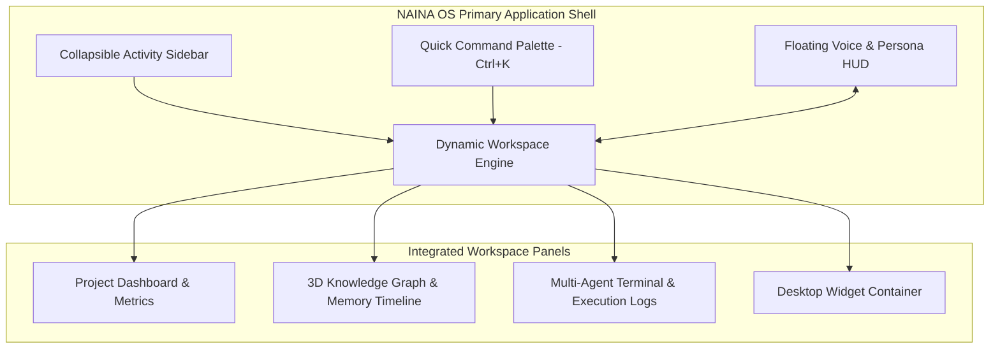

# NAINA OS — Design System, User Experience & Human Interface Framework
**Document Identifier:** NOS-UI-001  
**Title:** Design System, User Experience & Human Interface Framework Specification  
**Version:** 1.0  
**Status:** Approved Engineering Specification  
**Classification:** Open Source Systems Standard  
**Authors:** Chief Systems Architect, UI/UX Design Lead & Human Interface Engineering Group  

---

## Document Revision History

| Date | Revision | Author | Description of Changes |
| :--- | :--- | :--- | :--- |
| **2026-08-07** | `1.0` | Chief Systems Architect | Initial Engineering Release of NOS-UI-001 Specification |
| **2026-08-05** | `0.9` | UI/UX Human Interface Group | Complete draft of Design Tokens, Motion System, and Dual Persona Interaction Models |

---

## SECTION 1: Design Philosophy & Interface Vision

### 1.1 Beyond Traditional Desktop Applications
The **Design System, User Experience & Human Interface Framework** defines the complete visual language, interaction models, and ergonomic principles governing NAINA OS across Windows, Android, Web, and AR interfaces.

Under strict NAINA OS architectural guidelines:
- **Voice-First & Multimodal Ergonomics**: Designed for simultaneous input via Voice, Keyboard (`Ctrl+K`), Mouse, Touch, Stylus, and spatial gesture recognition.
- **Glassmorphism & Depth**: Multi-layered translucent panels with `backdrop-filter: blur(16px)` and high-contrast typography.
- **Dual Persona Visual Identities**:
  - 🌙 **NAINA**: High EQ companion. Visualized via a smooth, pulsing Teal/Cyan floating orb (`#0D9488`).
  - ⚡ **CENANI**: Precision operational engine. Visualized via a sharp, fast Amber/Gold HUD console (`#F59E0B`).

```
   [User Voice / Input] ──> [Persona Selector]
                                    │
    ┌───────────────────────────────┴───────────────────────────────┐
    ▼                                                               ▼
🌙 NAINA Persona HUD                                ⚡ CENANI Terminal HUD
 (Teal Glassmorphic Pulsing Orb)                     (Amber Sharp Precision Grid)
```

---

## SECTION 2: Human Interface Architecture Topology



---

## SECTION 3: Design System Tokens Specification

```json
{
  "name": "NAINA OS Design System Tokens",
  "version": "1.0.0",
  "colors": {
    "background": "#0F172A",
    "surface": "rgba(30, 41, 59, 0.75)",
    "border": "rgba(226, 232, 240, 0.15)",
    "primary": "#0D9488",
    "primary_light": "#14B8A6",
    "accent_cenani": "#F59E0B",
    "text_main": "#F8FAFC",
    "text_muted": "#94A3B8"
  },
  "typography": {
    "font_family_sans": "Inter, system-ui, sans-serif",
    "font_family_mono": "JetBrains Mono, Fira Code, monospace",
    "font_size_xs": "0.75rem",
    "font_size_base": "1.0rem",
    "font_size_xl": "1.25rem",
    "font_size_2xl": "1.75rem"
  },
  "radii": {
    "sm": "4px",
    "md": "8px",
    "lg": "16px",
    "full": "9999px"
  },
  "blur": {
    "glass": "blur(16px)"
  }
}
```

---

## SECTION 4 & 5: Component Library & Motion System

### 4.1 Reusable UI Component Example (React + Tailwind CSS)

```tsx
// NAINA OS Glassmorphic Card Primitive Component
import React from 'react';

interface GlassCardProps {
  title: string;
  badge?: string;
  children: React.ReactNode;
  activePersona?: 'naina' | 'cenani';
}

export const GlassCard: React.FC<GlassCardProps> = ({ title, badge, children, activePersona = 'naina' }) => {
  const borderColor = activePersona === 'naina' ? 'border-teal-500/30' : 'border-amber-500/30';
  
  return (
    <div className={`bg-slate-900/75 backdrop-blur-md rounded-2xl border ${borderColor} p-6 shadow-xl transition-all duration-300 hover:shadow-2xl hover:border-opacity-60`}>
      <div className="flex items-center justify-between mb-4">
        <h3 className="text-lg font-semibold text-slate-100">{title}</h3>
        {badge && (
          <span className={`px-2.5 py-1 text-xs rounded-full font-mono ${
            activePersona === 'naina' ? 'bg-teal-500/20 text-teal-300' : 'bg-amber-500/20 text-amber-300'
          }`}>
            {badge}
          </span>
        )}
      </div>
      <div className="text-slate-300 text-sm">{children}</div>
    </div>
  );
};
```

### 5.2 Motion & Animation Curves
- **Persona Pulse**: Continuous sine wave pulsing (`opacity: 0.7 -> 1.0`, `scale: 1.0 -> 1.05`) over 3.2s.
- **Spring Transition Curves**: `stiffness: 300, damping: 25` for responsive modal transitions.

---

## SECTION 6 & 7: Voice Interface & Workspace Layout

- **Voice Orb HUD**: Floating translucent widget displaying live audio waveforms, transcription streams, and latency feedback (`< 680 ms`).
- **Memory Timeline & Knowledge Graph**: 3D interactive force-directed graph visualizing connected notes, tasks, and historical user events.

---

## SECTION 8 & 9: Desktop Widgets & Accessibility (a11y)

- **System Widgets**: Real-time desktop cards for CPU/GPU load, VRAM allocation, OBS recording status, and GitHub event streams.
- **WCAG 2.2 AA Compliance**: Full keyboard focus rings, screen reader ARIA live region declarations for real-time text streaming, and high contrast toggle modes.

---

## SECTION 10 & 11: Theme Engine & Developer UI SDK (`@naina-os/ui-sdk`)

Developers can import standardized NAINA OS design primitives directly:

```typescript
import { NainaThemeProvider, GlassCard, VoiceOrbHUD } from '@naina-os/ui-sdk';

export default function PluginUI() {
  return (
    <NainaThemeProvider theme="dark" persona="naina">
      <GlassCard title="Custom Plugin Panel" badge="Active">
        <VoiceOrbHUD isListening={true} />
      </GlassCard>
    </NainaThemeProvider>
  );
}
```

---

## ARCHITECTURE DECISION RECORDS (ADRs)

### ADR-042: Tailwind CSS & Radix UI Primitives for Desktop App Interface
- **Status**: Approved.
- **Decision**: Standardize on Tailwind CSS v4 and accessible Radix UI unstyled primitives for building the NAINA OS desktop application shell.

### ADR-043: Framer Motion Engine for Persona State Animations
- **Status**: Approved.
- **Decision**: Use Framer Motion for hardware-accelerated 60 FPS persona orb transitions and panel layouts.

### ADR-044: WCAG 2.2 AA Accessibility & ARIA Live Streaming Standard
- **Status**: Approved.
- **Decision**: Mandate ARIA live regions (`aria-live="polite"`) for streaming LLM text output and maintain keyboard focus trapping across all modal dialogs.

---
*End of NOS-UI-001 — Design System, User Experience & Human Interface Framework Specification (v1.0)*
