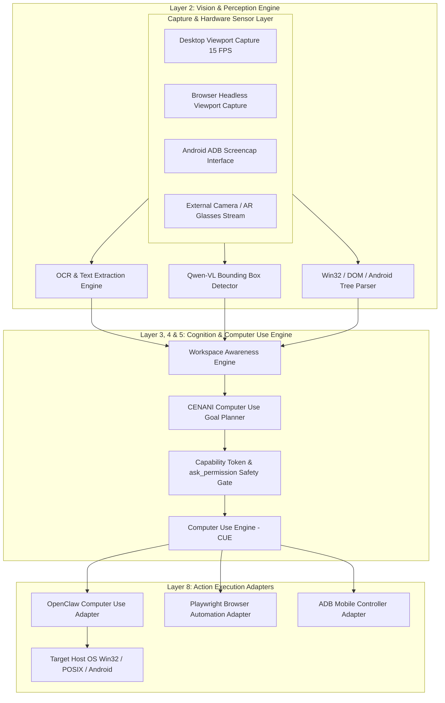
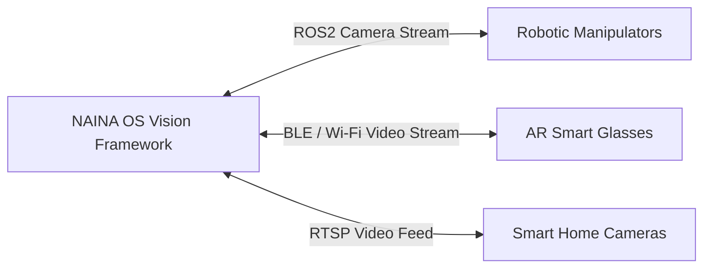

# NAINA OS — Vision & Computer Use Framework
**Document Identifier:** NOS-VISION-001  
**Title:** Vision & Computer Use Framework Architecture Specification  
**Version:** 1.0  
**Status:** Approved Engineering Specification  
**Classification:** Open Source Systems Standard  
**Authors:** Chief Systems Architect, Computer Vision Leads & HCI Engineering Group  

---

## Document Revision History

| Date | Revision | Author | Description of Changes |
| :--- | :--- | :--- | :--- |
| **2026-07-31** | `1.0` | Chief Systems Architect | Initial Engineering Release of NOS-VISION-001 Specification |
| **2026-07-28** | `0.9` | Computer Vision Group | Complete draft of OpenClaw Adapter, Desktop Vision, and WAE Integration |

---

## SECTION 1: Vision Philosophy & Perception Engine

### 1.1 Visual Perception Paradigm
Traditional AI operating systems rely exclusively on text or DOM trees. NAINA OS adopts a **Multimodal Visual Perception Paradigm**. Humans perceive computers through spatial vision—identifying windows, visual contrast, icons, and spatial layouts. 

NAINA OS merges visual spatial perception (Qwen-VL frame sampling) with underlying system APIs (Win32 HWND, Playwright DOM, Android Accessibility) to achieve true **Situational & Workspace Awareness**.

```
┌─────────────────────────────────────────────────────────────────────────┐
│                    NAINA OS VISUAL PERCEPTION STACK                     │
├─────────────────────────────────────────────────────────────────────────┤
│ SPATIAL VISION (Qwen-VL 7B / 15 FPS Viewport Sampler)                   │
│  • Identifies buttons, dialogs, visual contrast, icons & bounding boxes │
├─────────────────────────────────────────────────────────────────────────┤
│ STRUCTURAL API DATA (Win32 HWND, Playwright DOM, Android Accessibility) │
│  • Provides exact process titles, text strings & element DOM IDs        │
├─────────────────────────────────────────────────────────────────────────┤
│ FUSED PERCEPTION NODE (Workspace Awareness Engine - WAE)               │
│  • Synthesizes complete visual & structural awareness of workstation    │
└─────────────────────────────────────────────────────────────────────────┘
```

---

## SECTION 2: System Vision Architecture

### 2.1 Topology & Capture Layer Diagram



---

## SECTION 3: Computer Use Engine (CUE)

### 3.1 Purpose & Execution Cycle
The **Computer Use Engine (CUE)** is the core execution loop driving vision-guided desktop and web interaction. It operates under **CENANI** and follows a strict 7-stage cycle:

```
[1. Viewport Screenshot] ──> [2. Vision UI Recognition] ──> [3. Goal Action Planner]
                                                                  │
[7. Memory Update] <── [6. State Verification] <── [5. Mouse/KB Exec] <── [4. Security Check]
```

### 3.2 UI Element Shift & Recovery Protocol
If an application UI shifts (e.g., responsive window resize or dynamic popup overlay), CUE initiates an automated recovery loop:
1. **Detect Shift**: Action verification fails (expected target element missing at target coordinates).
2. **Re-Sample Frame**: Capture fresh viewport frame (`1920x1080`).
3. **Re-Compute Bounding Box**: Qwen-VL calculates new bounding box coordinates `[ymin, xmin, ymax, xmax]`.
4. **Retry Action**: Re-attempt mouse move/click (Maximum 3 retries before raising an exception).

---

## SECTION 4: OpenClaw Adapter Architecture

> **Architectural Rule**: OpenClaw is an *implementation* of the Computer Use Engine, NOT the architecture itself. NAINA OS interfaces with OpenClaw strictly via the `IComputerUseAdapter` contract.

```python
# OpenClaw Adapter Specification Interface (Python)
from pydantic import BaseModel
from typing import List, Tuple, Optional
from abc import ABC, abstractmethod

class BoundingBox(BaseModel):
    ymin: int
    xmin: int
    ymax: int
    xmax: int

class UIElement(BaseModel):
    label: str
    confidence: float
    bbox: BoundingBox

class IComputerUseAdapter(ABC):
    @abstractmethod
    async def capture_screen(self) -> bytes:
        """Captures active screen frame as PNG byte array."""
        pass

    @abstractmethod
    async def detect_ui_elements(self, frame_bytes: bytes) -> List[UIElement]:
        """Detects visual UI elements using Qwen-VL or OpenClaw vision backend."""
        pass

    @abstractmethod
    async def click_element(self, bbox: BoundingBox) -> bool:
        """Executes mouse move and click at bounding box centroid."""
        pass

    @abstractmethod
    async def type_text(self, text: str) -> bool:
        """Injects text keystrokes into active focused control."""
        pass
```

---

## SECTION 5: Desktop Vision Subsystem

### 1. Window Recognition & Z-Index Tracking
The Desktop Vision Subsystem interfaces with Win32 Desktop Window Manager (DWM) and X11/Wayland protocols:
- **Foreground Window Detection**: Tracks active HWND, process ID, and window bounding dimensions.
- **Visual Window Hierarchy**: Segmentates multi-monitor layouts (`Monitor 1: 3840x2160`, `Monitor 2: 1920x1080`), context menus, system tray notifications, and modal dialogs.
- **Natural Window Search**: Translates *"Switch to the Chrome window showing GitHub PR #42"* into HWND activation via spatial visual matching.

---

## SECTION 6: Browser Vision Subsystem

### 1. Dual Spatial & DOM Fusion
Browser Vision combines Playwright DOM element selection with spatial visual screenshot verification:

```
Playwright DOM Tree Inspection  ──┐
                                  ├──> Fused Element Selector -> Target Action
Qwen-VL Visual Frame Inspector ──┘
```

- **CAPTCHA & Security Detection**: Identifies CAPTCHA challenges or login prompts visually and pauses execution to request user interaction.
- **Multi-Tab Awareness**: Tracks tab titles, URLs, favicons, and active download streams across Chrome, Firefox, Edge, Brave, and Arc.

---

## SECTION 7: Android Vision Subsystem

The **Android Vision Subsystem** uses ADB (Android Debug Bridge) screencap streaming paired with Android Accessibility Node Trees:
- **Screen Understanding**: Captures 1080x2400 phone frames via ADB sockets.
- **UI Parsing**: Reads `uiautomator dump` XML trees to extract resource IDs, text labels, and clickable bounds `[xmin, ymin][xmax, ymax]`.
- **Notification Listener**: Ingests status bar notifications and matches app icons visually.

---

## SECTION 8: OCR & Text Extraction Engine

The **OCR Engine** processes unstructured visual text across image formats, PDFs, and screen clips:

```
Image / PDF Input ──> Pre-Processing (Binarization / Contrast) ──> Text Extraction
                                                                         │
Obsidian Frontmatter & Vector Index <── Confidence Threshold Check (< 0.70 Flagged)
```

- **Multilingual Support**: Supports 100+ languages via PaddleOCR / Qwen-VL.
- **Table & Structure Parsing**: Converts visual data tables into Markdown table structures for Obsidian storage.

---

## SECTION 9: Vision Model Cascade & Router Integration

The **Model Router** selects the vision inference model based on task demands:

| Vision Model | Primary Purpose | Latency Target | VRAM Footprint |
| :--- | :--- | :--- | :--- |
| **Qwen 2.5-VL 7B** | Local Spatial Bounding Box & Screen Reasoning | `< 410 ms` | `5.1 GB VRAM` |
| **OpenClaw Vision**| Fast UI Click Coordinate Calculation | `< 220 ms` | `2.8 GB VRAM` |
| **PaddleOCR / Tesseract**| Pure Character & Text Table Extraction | `< 80 ms` | `0.4 GB RAM` |
| **Cloud GPT-4o Vision**| High-Complexity Visual Document Analysis (Fallback) | `< 900 ms` | Cloud API |

---

## SECTION 10: Workspace Awareness Engine (WAE) Integration

WAE maintains real-time situational awareness across developer toolstacks:
- **VS Code Awareness**: Active file, git branch, cursor position, active linter errors.
- **Docker Awareness**: Container status, build logs, port bindings.
- **OBS Studio Awareness**: Active scene, streaming status, audio bitrate.
- **Browser Awareness**: Active GitHub repository, documentation tab, PR review state.

---

## SECTION 11: Memory & Knowledge Graph Integration

Every visual interaction updates the **MKIE Memory Core**:
1. **Screenshots & Clips**: Stored in Obsidian Vault (`/NainaMemory/12 Media/Screenshots/`).
2. **UI Bounding Box Nodes**: Added to Knowledge Graph as `(Photo)-[CONTAINS_UI]->(Button)` relations.
3. **Obsidian Sync**: Generates frontmatter tags (`entities: ["Photo:Screenshot_20260731"]`).

---

## SECTION 12: Security & Safety Confirmations

- **Dangerous Click Protection**: Clicking buttons labeled "Format", "Delete Account", "Pay Now", or "Transfer" automatically triggers the `ask_permission` UI modal.
- **Capability Tokens**: Requires `CAP_CAMERA` for camera frames and `CAP_BROWSER` for web automation.

---

## SECTION 13: Performance Benchmarks & Targets

| Benchmark Metric | Target SLA | Max Limit | Optimization Method |
| :--- | :--- | :--- | :--- |
| **Desktop Viewport Capture** | `15 FPS` | `30 FPS` | Win32 Desktop Duplication API (DXGI) |
| **Qwen-VL Bounding Box Inference**| `< 350 ms` | `600 ms` | TensorRT / CUDA int8 quantization |
| **OCR Text Extraction (Full HD)**| `< 70 ms` | `150 ms` | OpenCL GPU acceleration |
| **End-to-End Visual Click Latency**| `< 500 ms` | `900 ms` | Async parallel capture & inference |

---

## SECTION 14: Quality Assurance & Testing Matrix

- **Vision Unit Tests**: Verifies bounding box accuracy on standard GUI benchmarks (`ScreenSpot`).
- **OCR Accuracy Tests**: Guarantees `> 98%` character recognition accuracy on code screenshots.
- **Automation Regression Suite**: Executes 50 automated desktop tasks in a sandboxed Windows VM.

---

## SECTION 15: Future Vision & Edge Physical Expansion



- **AR Glasses Integration**: Projecting NAINA HUD onto smart eyewear with spatial object recognition.
- **Robotics ROS2 Physical Navigation**: Translating spatial vision coordinates into physical robotic arm trajectories.

---

## ARCHITECTURE DECISION RECORDS (ADRs)

### ADR-012: Adoption of Qwen 2.5-VL for Spatial Bounding Box UI Recognition
- **Status**: Approved.
- **Decision**: Standardize on Qwen 2.5-VL 7B for local spatial UI element detection due to its precise `[ymin, xmin, ymax, xmax]` coordinate output format.

### ADR-013: OpenClaw Decoupling via `IComputerUseAdapter`
- **Status**: Approved.
- **Decision**: Wrap OpenClaw inside a generic interface so alternative computer-use models can be hot-swapped without altering the kernel.

### ADR-014: Dual Spatial & DOM Fusion in Browser Vision
- **Status**: Approved.
- **Decision**: Combine Playwright DOM trees with Qwen-VL visual screenshots to ensure web automation succeeds even when DOM selectors are obfuscated.

---
*End of NOS-VISION-001 — Vision & Computer Use Framework Specification (v1.0)*
