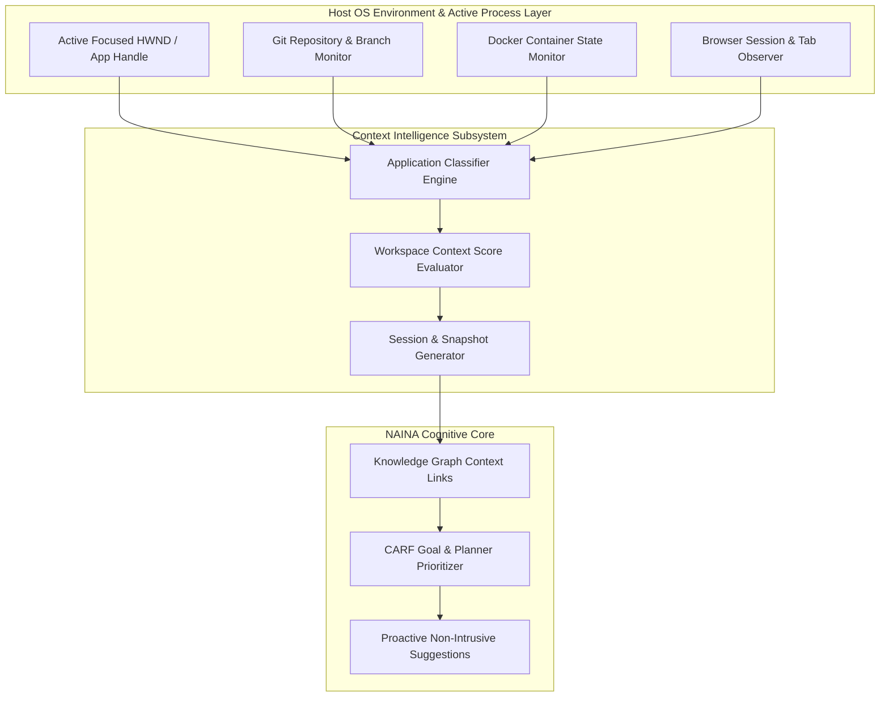

# NAINA OS — Workspace Awareness & Context Intelligence Framework
**Document Identifier:** NOS-WORKSPACE-001  
**Title:** Workspace Awareness & Context Intelligence Framework Specification  
**Version:** 1.0  
**Status:** Approved Engineering Specification  
**Classification:** Open Source Systems Standard  
**Authors:** Chief Systems Architect, Context Intelligence Team & Desktop Runtime Group  

---

## Document Revision History

| Date | Revision | Author | Description of Changes |
| :--- | :--- | :--- | :--- |
| **2026-08-07** | `1.0` | Chief Systems Architect | Initial Engineering Release of NOS-WORKSPACE-001 Specification |
| **2026-08-05** | `0.9` | Context Intelligence Team | Complete draft of Workspace Context Scoring Algorithm and Application Observers |

---

## SECTION 1: Workspace Philosophy & Privacy Guarantees

### 1.1 Situational Awareness Without Surveillance
The **Workspace Awareness & Context Intelligence Framework** enables NAINA OS to understand the user's active digital environment in real time to proactively assist without intrusive prompt engineering.

Under strict NAINA OS architectural guidelines:
- **Workspace Awareness is NOT Surveillance**: Observation is restricted to user-authorized processes, active window handles, and opt-in project directories.
- **Local-First & Zero Telemetry**: All context calculations and window state observations execute locally on the host machine.
- **User Control & Module Opt-Out**: Users can disable any workspace observer (e.g., Browser observer, Git branch tracker) at any time.

```
Active Host OS Windows ──> [Permission Gate] ──> [Workspace Observer Engine]
                                                        │
[CARF Planner Prioritization] <── [Workspace Context Score] <───┘
```

---

## SECTION 2: System Workspace Architecture Topology



---

## SECTION 3 & 4: Application & Project Awareness Subsystems

### 3.1 Application Classification Engine
Recognizes active tools and maps them to cognitive domains:
- **Development**: VS Code, Visual Studio, JetBrains IDEs, Terminal, Docker Desktop.
- **Browsing & Research**: Chrome, Edge, Firefox, Brave, Obsidian.
- **Creative & Media**: Photoshop, DaVinci Resolve, Premiere, Blender, OBS Studio.
- **Productivity & Communication**: Microsoft Office, Discord, Spotify.

### 4.2 Project & Repository Awareness
Monitors active root folder paths (`C:\naina-os\src`), current Git branch (`main`), active uncommitted diffs, open file buffers, and running local dev servers (`localhost:5173`).

---

## SECTION 5 & 6: Browser & Developer Context Engine

- **Browser Context Filter**: Captures active tab titles and URLs for opt-in research sessions (e.g., StackOverflow, GitHub, arXiv) while excluding private sessions.
- **Developer Context**: Synchronizes active compiler errors, pytest failures, and Docker container logs directly into the CARF Planner context window.

---

## SECTION 7: SPECIAL REQUIREMENT — Workspace Context Score Algorithm

The Context Engine computes a dynamic **Workspace Context Score ($S_{\text{context}}$)** normalized between `0.0` and `1.0` to prioritize memories, tool invocations, and proactive prompts:

$$\text{ContextScore} = w_1 \cdot A_{\text{proj}} + w_2 \cdot A_{\text{app}} + w_3 \cdot F_{\text{open}} + w_4 \cdot G_{\text{git}} + w_5 \cdot D_{\text{docker}} + w_6 \cdot B_{\text{session}} + w_7 \cdot C_{\text{cal}} + w_8 \cdot M_{\text{recent}}$$

Where:
- $w_1 \dots w_8$: Tunable weight coefficients ($\sum w_i = 1.0$).
- $A_{\text{proj}}$: Active project affinity score.
- $G_{\text{git}}$: Git branch activity relevance.
- $D_{\text{docker}}$: Running container health matching the project.

```python
# Workspace Context Score Calculation Engine (Python Specification)
from pydantic import BaseModel

class WorkspaceFactors(BaseModel):
    project_affinity: float    # 0.0 - 1.0
    app_relevance: float       # 0.0 - 1.0
    open_file_match: float     # 0.0 - 1.0
    git_activity: float        # 0.0 - 1.0
    docker_container_match: float # 0.0 - 1.0
    recent_memory_relevance: float # 0.0 - 1.0

def compute_workspace_context_score(factors: WorkspaceFactors) -> float:
    weights = {
        "project": 0.25,
        "app": 0.20,
        "files": 0.15,
        "git": 0.15,
        "docker": 0.10,
        "memory": 0.15
    }
    
    score = (
        factors.project_affinity * weights["project"] +
        factors.app_relevance * weights["app"] +
        factors.open_file_match * weights["files"] +
        factors.git_activity * weights["git"] +
        factors.docker_container_match * weights["docker"] +
        factors.recent_memory_relevance * weights["memory"]
    )
    return round(min(max(score, 0.0), 1.0), 4)
```

---

## SECTION 9 & 10: Workspace Timeline & Session Recovery

- **Automated Workspace Timeline**: Chronologically logs active work sessions (`09:00 - Coding: NAINA OS Kernel`, `11:30 - Research: Zero Trust Security`, `14:00 - Meeting: Architecture Review`).
- **1-Click Workspace Session Restoration**: Captures open IDE files, terminal directories, and browser research tabs into a JSON snapshot, allowing users to restore their complete workspace state in `< 1.8 seconds`.

---

## SECTION 11 & 12: Proactive Suggestions & Privacy Controls

- **Non-Intrusive Contextual Prompts**:
  - *"Detected 3 failing pytest cases in kernel/ipc.py. Would you like CENANI to run diagnostics?"*
  - *"Resume yesterday's Coding Session on branch feature/workspace-engine?"*
- **Privacy Enforcement**: Granular permission toggles for every observer module in `naina.config.yaml` (`workspace.observers.browser: false`).

---

## ARCHITECTURE DECISION RECORDS (ADRs)

### ADR-054: Workspace Context Scoring Algorithm for Cognitive Prioritization
- **Status**: Approved.
- **Decision**: Implement a weighted multi-factor Context Score algorithm ($S_{\text{context}}$) to dynamically rank memory relevance and tool suggestions.

### ADR-055: Local Privacy-First Application Window State Observer
- **Status**: Approved.
- **Decision**: Observe desktop window handles using native Win32 `GetForegroundWindow()` APIs locally without external data transmission.

### ADR-056: 1-Click Workspace Session Snapshot & Restoration Protocol
- **Status**: Approved.
- **Decision**: Serialize active IDE tabs, terminal paths, and Docker container states into JSON workspace snapshots for instant restoration.

---
*End of NOS-WORKSPACE-001 — Workspace Awareness & Context Intelligence Framework Specification (v1.0)*
